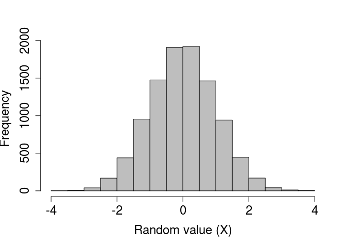
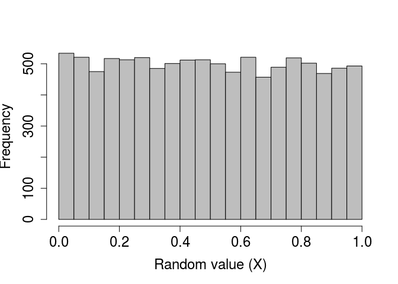
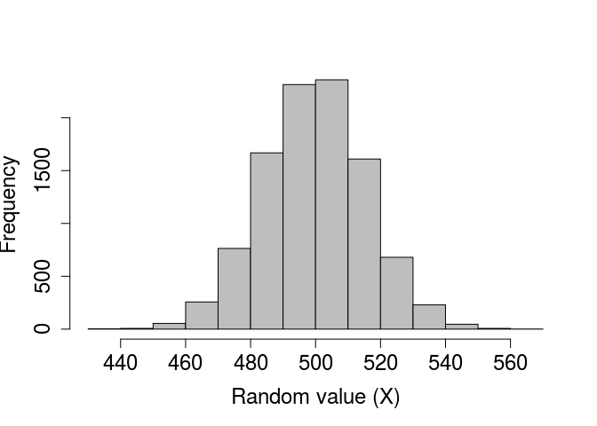
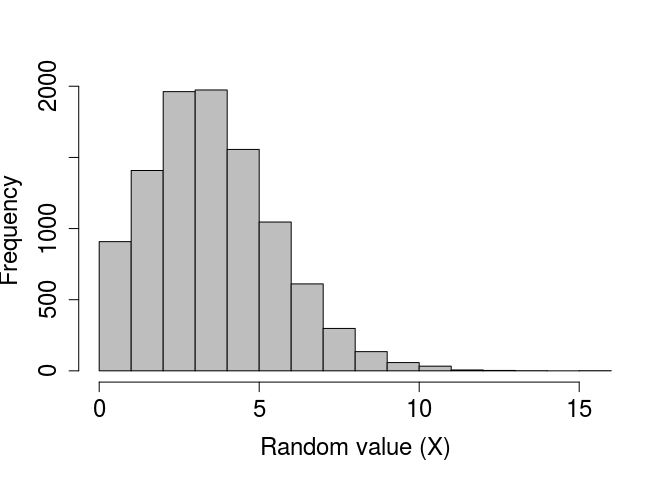
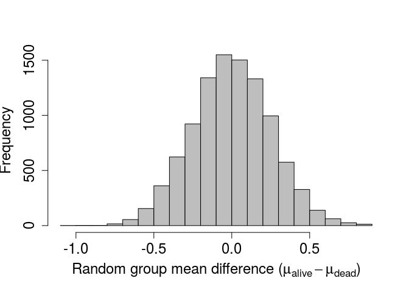
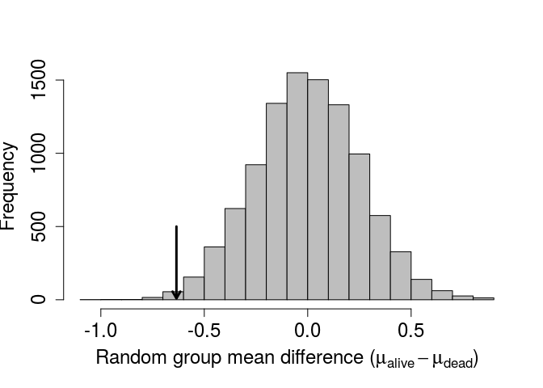
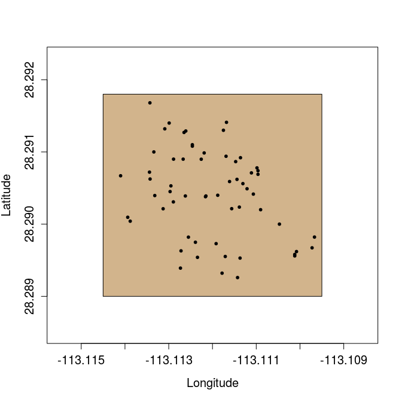
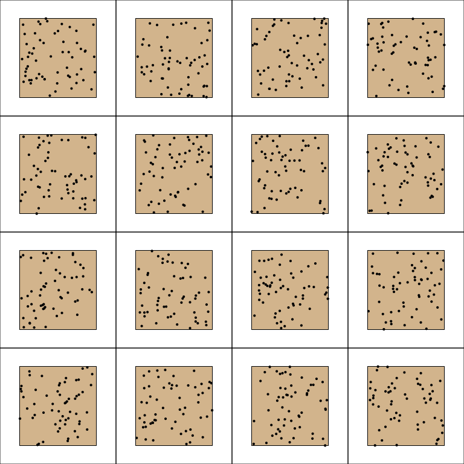
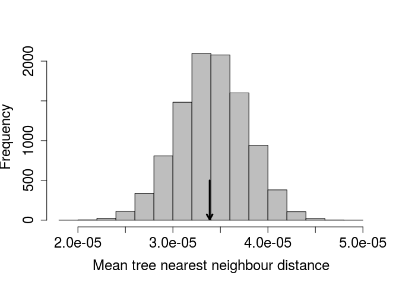

Here I introduce the use of (pseudo)random number generation, randomisation, bootstrap, and Monte Caro methods in R. Knowledge of these tools can be especially useful in statistical hypothesis testing and biological modelling (e.g., individual-based models). This introduction was originally written for an event in [Stirling Coding Club](https://stirlingcodingclub.github.io/studyGroup/), and a version of tis document is available [here](https://stirlingcodingclub.github.io/randomisation/randomisation_notes.html).

------------------------------------------------------------------------

-   [Introduction: Randomisation and Monte Carlo](#intro)
-   [Random number generation in R: key functions](#rand_r)
    -   [Random normal: `rnorm`](#rnorm)
    -   [Random uniform: `runif`](#runif)
    -   [Random binomial: `rbinom`](#rbinom)
    -   [Random poisson: `rpois`](#rpois)
    -   [Random sampled values: `sample`](#sample)
-   [Randomisation for hypothesis testing](#rand_h)
-   [Bootstrapping confidence intervals](#rand_b)
-   [Monte Carlo method for spatial data](#rand_m)
-   [Conclusions](#conclusions)

------------------------------------------------------------------------

<a name="intro">Introduction: Randomisation and Monte Carlo</a>
===============================================================

The R programming language has many built-in base functions for inferential statistics, and a growing library of [R packages](https://cran.r-project.org/web/packages/) continues to add to the list of functions available in R for performing specific statistical analyses. Users of R, however, need not be restricted to these functions; the flexibility of programming allows us to write our own code to address specific statistical questions and tailor our analyses to our own data. The freedom to code our own analyses makes it possible to apply statistical methods that would otherwise by very difficult to use.

In the preface to his book, "Randomization, Bootstrap, and Monte Carlo Methods in Biology", Manly (2007) emphasises how twentieth century advances in computation power have made the titular methods of his book possible for researchers. In these notes, I will introduce some basic examples of how to use randomisation, bootstrap, and Monte Carlo methods in the R programming language. Throughout these examples, I hope to also show how the process of randomisation and resampling applied in these methods can also make the logic of null hypothesis testing in frequentist statistics more intuitive. I have especially tried to do this with respect to p-values and confidence intervals, which are often misunderstood.

I will begin by explaining key R functions for generating random values. Next, I will show how a t-test can be performed using randomisation, followed by the generation of confidence intervals by sampling with replacement. Finally, I will show how a Monte Carlo test can be written in R to test whether or not a population of plants is aggregated within a fixed area.

<a name="rand_r">Random number generation in R: key functions</a>
=================================================================

There are several functions in R that generate random numbers from particular distributions, or sample elements from vectors or lists. Below, I introduce some of these functions and show how to use them.

<a name="rnorm">**Sampling from a normal distribution**</a>

The `rnorm` function returns some number (`n`) of (pseudo)randomly generated numbers given a set mean (*μ*; `mean`) and standard deviation (*σ*; `sd`), such that $X\\sim\\mathcal N(\\mu,\\sigma^2)$. The default is to draw from a standard [normal (a.k.a., "Gaussian") distribution](https://en.wikipedia.org/wiki/Normal_distribution) (i.e., *μ* = 0 and *σ* = 1).

``` r
rand_norms_10 <- rnorm(n = 10, mean = 0, sd = 1);
```

The above code stores a vector of ten numbers, shown below.

    ##  [1] -1.30841810  0.53686928 -0.99203361 -0.42239661 -0.13145230
    ##  [6] -0.16225737  0.35580234 -0.15651452  0.80059270  0.04467391

We can verify that a standard normal distribution is generated by plotting a histogram of a very large number of values created using `rnorm`.

``` r
rand_norms_10000 <- rnorm(n = 10000, mean = 0, sd = 1);
hist(rand_norms_10000, xlab = "Random value (X)", col = "grey",
     main = "", cex.lab = 1.5, cex.axis = 1.5);
``` 



<a name="runif">**Sampling from a uniform distribution**</a>

Like the `rnorm` function, the `runif` function returns some number (`n`) of random numbers, but from a [uniform distribution](https://en.wikipedia.org/wiki/Uniform_distribution_(continuous)) with a range from *a* (`min`) to *b* (`max`) such that $X\\sim\\mathcal U(a,b)$, where −∞&lt;*a* &lt; *b* &lt; ∞. The default is to draw from a standard uniform distribution (i.e., *a* = 0 and *b* = 1).

``` r
rand_unifs_10 <- runif(n = 10, min = 0, max = 1);
```

The above code stores a vector of ten numbers, shown below.

    ##  [1] 0.9245547 0.5320006 0.8059033 0.3607759 0.3672912 0.4559551 0.9070650
    ##  [8] 0.1924179 0.3067296 0.3031943

As with the randomly generated normally distributed numbers, we can verify that a standard uniform distribution is generated by plotting a histogram of a very large number of values created using `runif`.

``` r
rand_unifs_10000 <- runif(n = 10000, min = 0, max = 1);
hist(rand_unifs_10000, xlab = "Random value (X)", col = "grey",
     main = "", cex.lab = 1.5, cex.axis = 1.5);
``` 



<a name="rbinom">**Sampling from a binomial distribution**</a>

Like previous functions, the `rbinom` function returns some number (`n`) of random numbers, but the arguments and output can be slightly confusing at first. Recall that a [binomial distribution](https://en.wikipedia.org/wiki/Binomial_distribution) describes the number of 'successes' for some number of independent trials (Pr(*s**u**c**c**e**s**s*)=*p*). The `rbinom` function returns the number of successes after `size` trials, in which the probability of success in each trial is `prob`. For a concrete example, suppose we want to simulate the flipping of a fair coin 1000 times, and we want to know how many times that coin comes up heads ('success'). We can do this with the following code.

``` r
coin_flips <- rbinom(n = 1, size = 1000, prob = 0.5);
print(coin_flips);
```

    ## [1] 517

The above result shows that the coin came up heads 517 times. Note, however, the (required) argument `n` above. This allows the user to set the number of sequences to run. In other words, if we set `n = 2`, then this could simulate the flipping of a fair coin 1000 times once to see how many times heads comes up, then repeating the whole process to see how many times heads comes up again (or, if it is more intuitive, the flipping of two separate fair coins 1000 times).

``` r
coin_flips_2 <- rbinom(n = 2, size = 1000, prob = 0.5);
print(coin_flips_2);
```

    ## [1] 502 486

In the above, a fair coin was flipped 1000 times and returned 502 heads, and then another fair coin was flipped 1000 times and returned 486 heads. As with the `rnorm` and `runif` functions, we can check to see what the distribution of the binomial function looks like if we repeat this process. Suppose, in other words, that we want to see the distribution of times heads comes up after 1000 flips. We can, for example, simulate the process of flipping 1000 times in a row with 10000 different coins using the code below.

``` r
coin_flips_10000 <- rbinom(n = 10000, size = 1000, prob = 0.5);
```

I have not printed the above `coin_flips_10000` for obvious reasons, but we can use a histogram to look at the results.

``` r
hist(coin_flips_10000, xlab = "Random value (X)", col = "grey",
     main = "", cex.lab = 1.5, cex.axis = 1.5);
``` 



As would be expected, most of the time 'heads' occurs around 500 times out of 1000, but usually the actual number will be a bit lower or higher due to chance. Note that if we want to simulate the results of individual flips in a single trial, we can do so as follows.

``` r
flips_10 <- rbinom(n = 10, size = 1, prob = 0.5);
```

    ##  [1] 0 1 1 0 0 0 1 0 1 0

In the above, there are `n = 10` trials, but each trial consists of only a single coin flip (`size = 1`). But we can equally well interpret the results as a series of `n` coin flips that come up either heads (`1`) or tails (`0`). This latter interpretation can be especially useful to write code that randomly decides whether some event will happen (`1`) or not (`0`) with some probability `prob`.

<a name="rpois">**Sampling from a poisson distribution**</a>

Many processes in biology can be described by a [Poisson distribution](https://en.wikipedia.org/wiki/Poisson_distribution). A Poisson process describes events happening with some given probability over an area of time or space such that *X* ∼ *P**o**i**s**s**o**n*(*λ*), where the rate parameter *λ* is both the mean and variance of the Poisson distribution (note that by definition, *λ* &gt; 0). Sampling from a Poisson distribution can be done in R with `rpois`, which takes only two arguments specifying the number of values to be returned (`n`) and the rate parameter (`lambda`).

``` r
rand_poissons <- rpois(n = 10, lambda = 1);
print(rand_poissons);
```

    ##  [1] 1 0 1 2 0 0 2 0 0 0

There are no default values for `rpois`. We can plot a histogram of a large number of values to see the distribution when *λ* = 4 below.

``` r
rand_poissons_10000 <- rpois(n = 10000, lambda = 4);
hist(rand_poissons_10000, xlab = "Random value (X)", col = "grey",
     main = "", cex.lab = 1.5, cex.axis = 1.5);
``` 



<a name="sample">**Sampling values from a vector**</a>

Sometimes it is useful to sample a set of values from a vector or list. The R function `sample` is very flexible for sampling a subset of numbers or elements from some structure (`x`) in R according to some set probabilities (`prob`). Elements can be sampled from `x` some number of times (`size`) with or without replacement (`replace`), though an error will be returned if the `size` of the sample is larger than `x` but `replace = FALSE` (default). To start out simple, suppose we want to ask R to pick a random number from one to ten with equal probability.

``` r
rand_number_1 <- sample(x = 1:10, size = 1);
```

The above code will set `rand_number_1` to a randomly selected value, in this case 9. Because we have not specified a probability vector `prob`, the function assumes that every element in `1:10` is sampled with equal probability. We can increase the `size` of the sample to `10` below.

``` r
rand_number_10 <- sample(x = 1:10, size = 10);
print(rand_number_10);
```

    ##  [1]  9  6  4  8  7  2 10  3  5  1

Note that all numbers from 1 to 10 have been sampled, but in a random order. This is becaues the default is to sample with replacement, meaning that once a number has been sampled for the first element in `rand_number_10`, it is no longer available to be sampled again. To change this and allow for sampling with replacement, we can change the default.

``` r
rand_number_10_r <- sample(x = 1:10, size = 10, replace = TRUE);
print(rand_number_10_r);
```

    ##  [1] 10  4  1  2  6  1  2  7  5  4

Note that the numbers {1, 2, 4} are now repeated in the set of randomly sampled values above. We can also specify the probability of sampling each element, with the condition that these probabilities need to sum to 1. Below shows an example in which the numbers 1-5 are sampled with a probability of 0.05, while the numbers 6-10 are sampled with a probability of 0.15, thereby biasing sampling toward larger numbers.

``` r
prob_vec      <- c( rep(x = 0.05, times = 5), rep(x = 0.15, times = 5) );
rand_num_bias <- sample(x = 1:10, size = 10, replace = TRUE, prob = prob_vec);
print(rand_num_bias);
```

    ##  [1]  7  9  9  9  6  7  8  7 10  5

Note that `rand_num_bias` above contains more numbers from 6-10 than from 1-5.

This kind of sampling can be very useful. If, for example, we have a large data set and want to look at a random subset of rows, we can do it by inserting sampled values and telling R to print it. Consider the built-in R base data set `ChickWeight`, a table with data on the effect of diet on chick weights.

``` r
data("ChickWeight")
head(ChickWeight);
```

    ##   weight Time Chick Diet
    ## 1     42    0     1    1
    ## 2     51    2     1    1
    ## 3     59    4     1    1
    ## 4     64    6     1    1
    ## 5     76    8     1    1
    ## 6     93   10     1    1

The table continues on with 578 rows of data. But suppose instead of wanting to see the first six rows (as returned from using `head` above), we instead want to see a random assortment of rows. We can use `sample` to ask for a random sample of 10 rows as follows (note that `dim(ChickWeight)[1]` returns the length of the first dimension -- i.e., the total number of rows).

``` r
rand_rows <- sample(x = 1:dim(ChickWeight)[1], size = 10);
print(ChickWeight[rand_rows,]);
```

    ##     weight Time Chick Diet
    ## 401     39    0    36    3
    ## 247     61    4    23    2
    ## 348    138   14    31    3
    ## 340    150   21    30    2
    ## 141    185   18    12    1
    ## 398    332   18    35    3
    ## 57     197   16     5    1
    ## 362    263   18    32    3
    ## 388    341   21    34    3
    ## 32     138   14     3    1

The above now shows a random collection of rows, including 401, 247, 348, 340, 141, 398, 57, 362, 388, 32.

Finally, this kind of sampling does not need to be done only on subsets of numbers. Lists of characters can also be sampled using `sample`. We can take a look at this using the in-built data set `mtcars` in R, in which each row name is a different car. We can get the car names using the R function `rownames`, which will return a full list of all the cars in the data set.

``` r
data("mtcars");
head(mtcars);
```

    ##                    mpg cyl disp  hp drat    wt  qsec vs am gear carb
    ## Mazda RX4         21.0   6  160 110 3.90 2.620 16.46  0  1    4    4
    ## Mazda RX4 Wag     21.0   6  160 110 3.90 2.875 17.02  0  1    4    4
    ## Datsun 710        22.8   4  108  93 3.85 2.320 18.61  1  1    4    1
    ## Hornet 4 Drive    21.4   6  258 110 3.08 3.215 19.44  1  0    3    1
    ## Hornet Sportabout 18.7   8  360 175 3.15 3.440 17.02  0  0    3    2
    ## Valiant           18.1   6  225 105 2.76 3.460 20.22  1  0    3    1

``` r
car_names <- rownames(mtcars);
print(car_names);
```

    ##  [1] "Mazda RX4"           "Mazda RX4 Wag"       "Datsun 710"         
    ##  [4] "Hornet 4 Drive"      "Hornet Sportabout"   "Valiant"            
    ##  [7] "Duster 360"          "Merc 240D"           "Merc 230"           
    ## [10] "Merc 280"            "Merc 280C"           "Merc 450SE"         
    ## [13] "Merc 450SL"          "Merc 450SLC"         "Cadillac Fleetwood" 
    ## [16] "Lincoln Continental" "Chrysler Imperial"   "Fiat 128"           
    ## [19] "Honda Civic"         "Toyota Corolla"      "Toyota Corona"      
    ## [22] "Dodge Challenger"    "AMC Javelin"         "Camaro Z28"         
    ## [25] "Pontiac Firebird"    "Fiat X1-9"           "Porsche 914-2"      
    ## [28] "Lotus Europa"        "Ford Pantera L"      "Ferrari Dino"       
    ## [31] "Maserati Bora"       "Volvo 142E"

If we want to sample two of these cars, for whatever reason, we can use `sample` in the same way that we did when sampling numbers.

``` r
cars_sampled <- sample(x = car_names, size = 2, replace = FALSE);
print(cars_sampled);
```

    ## [1] "Toyota Corona"    "Pontiac Firebird"

With this procedure, we have therefore sampled Toyota Corona and Pontiac Firebird. There are even more types of structures `x` that can be sampled with `sample`, but for now I will move on to using `sample` for statistical hypothesis sampling.

<a name="rand_h">Randomisation for hypothesis testing</a>
=========================================================

The ability to generate random values and sample randomly from a vector of numbers can be used for statistical hypothesis testing. To demonstrate this, I will use the [Bumpus data set](https://www.fieldmuseum.org/blog/hermon-bumpus-and-house-sparrows) of House Sparrow (*Passer domesticus*) survival, which was also used in the Stirling Coding Club [notes on writing manuscripts in Rmarkdown](https://stirlingcodingclub.github.io/Manuscripts_in_Rmarkdown/Rmarkdown_notes.html). A version of it can be viewed and downloaded [on GitHub](https://github.com/StirlingCodingClub/randomisation/blob/master/data/Bumpus_data.csv). The data set comes from Hermon Bumpus, who collected House Sparrows after a particularly severe storm in Rhode Island, USA to measure the morphological traits of birds who survived and perished (Bumpus 1898).

``` r
birds <- read.csv("../data/Bumpus_data.csv");
```

The first few rows look like the below.

| sex  | surv  |  totlen|  wingext|   wgt|  head|  humer|  femur|  tibio|  skull|  stern|
|:-----|:------|-------:|--------:|-----:|-----:|------:|------:|------:|------:|------:|
| male | alive |     154|      241|  24.5|  31.2|  0.687|  0.668|  1.022|  0.587|  0.830|
| male | alive |     160|      252|  26.9|  30.8|  0.736|  0.709|  1.180|  0.602|  0.841|
| male | alive |     155|      243|  26.9|  30.6|  0.733|  0.704|  1.151|  0.602|  0.846|
| male | alive |     154|      245|  24.3|  31.7|  0.741|  0.688|  1.146|  0.584|  0.839|
| male | alive |     156|      247|  24.1|  31.5|  0.715|  0.706|  1.129|  0.575|  0.821|
| male | alive |     161|      253|  26.5|  31.8|  0.780|  0.743|  1.144|  0.607|  0.893|

Suppose we hypothesise surviving sparrows will have a lower mass than perishing sparrows. If we want to do a simple test to see whether or not the body mass (`wgt`) of living sparrows is lower than that of dead sparrows, then we could use the base R function `t.test` as follows.

``` r
bird_t_test <- t.test(birds[,5] ~ birds[,2], alternative = "less");
print(bird_t_test);
```

    ## 
    ##  Welch Two Sample t-test
    ## 
    ## data:  birds[, 5] by birds[, 2]
    ## t = -2.5161, df = 117.88, p-value = 0.006605
    ## alternative hypothesis: true difference in means is less than 0
    ## 95 percent confidence interval:
    ##        -Inf -0.2164464
    ## sample estimates:
    ## mean in group alive  mean in group dead 
    ##            25.22639            25.86094

In the above, `birds[,5]` specifies the column of the response variable (sparrow mass) as a function of `birds[,2]` (`alive` versus `dead`). Specifying `alternative = "less"` indicates that our alternative hypothesis is that the true difference in the means is less than zero (i.e., *μ*<sub>*a**l**i**v**e*</sub> − *μ*<sub>*d**e**a**d*</sub> &lt; 0). The difference between the estimated means is 25.2263889 − 25.8609375 = -0.6345486. As indicated from the p-value shown above, if we assume that the null hypothesis is true (i.e., sparrows that lived do *not* have less mass than sparrows that died), then the probability of getting a difference in mass this low or lower is 0.0066047.

The use of a t-test is sufficient for the above question; our data set is fairly large (72 living sparrows and 64 dead sparrows), and there is no reason to believe the statistical assumptions of the t-test are being violated. Nevertheless, we can use resampling to test the same null hypothesis in a slightly different way -- a way that does not make the same standard t-test assumptions (e.g., normality). Consider the null hypothesis again, that the true body mass of living sparrows is not less than the true body mass of dead sparrows. In the t-test, we assume this null hypothesis and ask what is the probability of getting a value of $\\hat\\mu\_{alive} - \\hat\\mu\_{dead}$ as low as we did (note the hats above *μ* are used to indicate the observed *estimate* of the mean rather than the *true* mean).

**A different way to state the null hypothesis of the t-test is that *observed membership to the groups 'alive' versus 'dead' has no effect on whether or not the difference between 'alive' and 'dead' sparrow body mass is negative*.** In other words, we can randomly shuffle group membership and not expect the difference between $\\hat\\mu\_{alive} - \\hat\\mu\_{dead}$ to be much lower than the difference in the actual observed data set. If we shuffle group membership many times, we can generate a distribution of differences between living and dead sparow body masses that would be expected *if group membership were random* (i.e., if sparrow status as alive or dead were in fact random with respect to body mass). We can then compare this distribution with the actual observed difference from the data set to test what the probability of getting such a low value of $\\hat\\mu\_{alive} - \\hat\\mu\_{dead}$ would be if group membership were random -- this comparison **is a p-value**, just derived in a different way with slightly different assumptions. It is, however, the probability of getting a value as extreme as the one observed *given that the null hypothesis is true*. Below is a simple example of how to recreate the null distribution and compare it to the observed difference between group means to get a p-value.

``` r
iter    <- 9999;          # Total iterations (+1 for observed data = 10k)
diff    <- NULL;          # To add difference between groups
N_birds <- dim(birds)[1]; # Total number of birds
for(i in 1:iter){   
    bird_samp   <- sample(x = birds[,2], size = N_birds, replace = FALSE);
    samp_alive  <- which(bird_samp == "alive");
    samp_dead   <- which(bird_samp == "dead");
    mn_samp_a   <- mean(birds[samp_alive, 5]);
    mn_samp_d   <- mean(birds[samp_dead, 5]);
    diff[i]     <- mn_samp_a - mn_samp_d;
}
```

Within the `for` loop above, what I have done is randomly shuffle the "alive" versus "dead" column from the `birds` data set. Hence, `bird_samp` is a vector of group membership that is random with respect to sparrow body mass in column 5 of `birds`. The `which` functions within the loop find which sparrows are randomly assigned to be "alive" and "dead". The following two lines get the mean values of body mass for each randomly generated group. And the last line within the `for` loop gets the difference between these means.

We could equally well calculate a t-statistic within the loop, or even the difference between group medians, rather than the difference between group means (Manly 2007). What matters is that we are comparing observed difference between groups with equivalent differences created from the randomly generated distribution. All of the randomly generated values are now stored in `diff`, so we can plot them with a histogram to see the null distribution.

``` r
xlabel <- expression( paste("Random group mean difference (", 
                            mu[alive] - mu[dead], ")" )
                      ); # Gets the Greek mu with subscripts
hist(diff, xlab = xlabel, col = "grey", main = "", cex.lab = 1.5, 
     cex.axis = 1.5, breaks = 20);
``` 



Recall that the actual observed difference was -0.6345486. This is quite far to the left of the above distribution. We can add an arrow indicating the observed value on the histogram using the code below.

``` r
obs_alive <- which(birds[,2] == "alive");
obs_dead  <- which(birds[,2] == "dead");
obs_diff  <- mean(birds[obs_alive,5]) - mean(birds[obs_dead,5]); 
arrows(x0 = obs_diff, x1 = obs_diff, y0 = 500, y1 = 10, lwd = 3, length = 0.1);
``` 



To get a p-value, we can simply count the number of values less than or equal to the observed `obs_diff` in our randomly generated distribution above, then divide by the total number of randomly generated (9999) and observed (1) differences.

``` r
less_or_equal_obs <- sum(diff <= obs_diff) + 1;
total_generated   <- length(diff) + 1;
new_p_value       <- less_or_equal_obs / total_generated;
```

Using the randomisation method, we get a value of *P*= 0.0057. Note that this p-value would change slightly if we were to re-run the analysis, but not by much if a the number of times we resample is sufficiently high[1]. Also note that the p-value we obtained after randomisation is quite close to the value obtained from the standard t-test, which was 0.0066047. Conceptually, the two tests are doing the same thing -- assuming that the mean value of one group is not less than the mean value of another group, and asking what the probability is of getting such a low difference in means would be if this assumption were in fact true. This was a very basic example of a randomisation test in R, but I hope that it illustrates how useful randomisation for hypothesis testing can be. Randomisation is a highly flexible tool, which allows researchers to test hypotheses that might be otherwise difficult to address due to restrictive stastical assumptions of standard tests or peculariarites of specific data sets. It is, of course, important to carefully consider what needs to be randomised for a particular question of interest to ensure that the appropriate null distribution is generated.

<a name="rand_b">Bootstrapping confidence intervals</a>
=======================================================

We can apply the randomisation method to generating confidence intervals around some parameter value by resampling data with replacement. Recall the somewhat confusing frequentist definition of a confidence interval, that is an interval within which the parameter mean would be expected to be contained with some confidence if the population were repeatedly resampled. For example, for a 95% confidence interval we would expect the mean to be observed within the lower and upper bounds 95% of the time if we were to go out and re-sample from our population and re-calculate the interval bounds. Verbally, this is challenging to state, but the idea is well-reflected in the process of bootsrapping using resampling with replacement. The idea is that the distribution of values in the data represent the best information available on the distribution of the whole population of interest. Hence, to see what would happen if we were to re-sample from the whole population itself, we can sample with replacement from the collected data (Manly 2007).

To show a simple example of bootstrapping 95% confidence intervals, I will again use the Bumpus data set. This time, however, I will focus on the whole data set of sparrows, not separating sparrows that are alive from those that are dead. The goal will be to generate 95% bootstrapped confidence intervals for bird total length (`totlen`), which is found in column 3 of `birds`.

The general idea will be to repeatedly resample a new column `totlen` from the already existing column of data, with replacement. In other words, with each resampling, we will make a new `totlen` column of the same length as the original `totlen`, but some of the values will be repeated while others will be ommitted due to the process of resampling with replacement. We then calculate the mean total sparrow length from the new column created by resampling. The standard deviation of the resampled means will estimate the standard error of the true mean, as if we were to have repeatedly gone back out into the field to collect multiple new sparrows and measured their lengths.

``` r
iter            <- 10000;
resampled_means <- NULL;
N_birds         <- dim(birds)[1]; # Total number of birds
for(i in 1:N_birds){
    resampled_totlen   <- sample(x = birds[,3], size = N_birds, replace = TRUE);
    resampled_means[i] <- mean(resampled_totlen);
}
sd_resampled_means <- sd(resampled_means);
```

In the above loop, 10<sup>4</sup> new data sets of 136 sparrow lengths are generated with replacement to create `resampled_totlen`. The mean of these resampled sparrow total lengths is calculated and appended to `resampled_means`. Outside of the loop, the standard deviation of the `resampled_means` is calculated to be 0.3044218. Again, this standard deviation estimates what the standard deviation of *estimated mean* values of sparrow length would be if we were to go out and re-collect the same number of sparrows that Bumpus did. The standard deviation of means is, by definition, a standard error, so we can use this standard deviation to calculate 95% confidence intervals just as we would with the standard error of the original data.

$$\\hat\\mu\_{len} - \\sigma z\_{\\alpha/2} &lt; \\mu\_{len} &lt; \\hat\\mu\_{len} - \\sigma z\_{\\alpha/2}$$

In the above, *μ*<sub>*l**e**n*</sub> is the true mean total sparrow length, *σ* is the standard deviation of the resampled means (`sd_resampled_means` in the code above), and *z*<sub>*α*/2</sub> is the corresponding *z* score from the standard normal distribution for which the probility exceeds *α*/2 (for a 95% confidence interval, this value is 1.96). Note again the hats above *μ* to differentiate the parameter estimate ($\\hat\\mu\_{len}$) from the true parameter (*μ*<sub>*l**e**n*</sub>). We can then simply substitute *z*<sub>*α*/2</sub> = 1.96, *σ*= `sd_resampled_means` = 0.3044218, and $\\hat\\mu\_{len} =$ `mean(birds[,3])` = 159.5441176 to get the following 95% confidence intervals.

``` r
lower_95CI <- mean(birds[,3]) - 1.96 * sd_resampled_means;
upper_95CI <- mean(birds[,3]) + 1.96 * sd_resampled_means;
```

This results in an estimated mean total bird length of 159.5441176 with a lower 95% confidence interval of 158.947451 and an upper 95% confidence interval of 160.1407843. We can compare this with 95% confidence intervals calculated in the standard way using standard errors from the song sparrow data set as follows.

$$\\hat\\mu\_{len} - \\frac{\\sigma}{\\sqrt{n}} z\_{\\alpha/2} &lt; \\mu\_{len} &lt; \\hat\\mu\_{len} - \\frac{\\sigma}{\\sqrt{n}} z\_{\\alpha/2}$$

In the above, all that has changed is the $\\sigma / \\sqrt{n}$, which now is the standard deviation of the observed sparrow total lengths (i.e., *not* the standard deviation of the means of all lengths from resampling, as above), divided by the square root of the total number of sparrows observed (i.e., `N_birds` in the code above). This results in the confidence intervals calculated below.

``` r
lower_95CI_std <- mean(birds[,3]) - 1.96 * ( sd( birds[,3] / sqrt(N_birds) ) );
upper_95CI_std <- mean(birds[,3]) + 1.96 * ( sd( birds[,3] / sqrt(N_birds) ) );
```

The standard method of bootsrapping results in the same estimated mean total bird length of 159.5441176, but with a lower 95% confidence interval of 158.9456536 and an upper 95% confidence interval of 160.1425817.

There are several different methods of using bootstrapping to generate confidence intervals (Manly 2007). My hope is that the above is enough to show the general logic of bootstrapping with resampling, along with a helpful example. **Note that means are not the only parameter values that can be bootstrapped to obtain confidence intervals**. By resampling data with replacement, confidence intervals can be generated around any number of parameter value estimates (e.g., variances, correlations, custom indices, etc.).

<a name="rand_m">Monte Carlo method for spatial data</a>
========================================================

The previous two examples of [hypothesis testing](#rand_h) and [bootstrapping](#rand_b) involved resampling from existing data sets to address a statistical question. Next, I will consider the case in which we address a null hypothesis with a distribution that cannot be derived by sampling from the observed data. **The goal will be to test whether or not plants of one species are randomly distributed across a fixed sampling area.**

The data set I will use includes locations of [Sonoran Desert rock fig](https://en.wikipedia.org/wiki/Ficus_petiolaris) trees (*Ficus petiolaris*) from a field site in Baja, Mexico. These trees were mapped in the lab of [John Nason](https://www.eeob.iastate.edu/faculty/nason/). Fig trees have a fascinating ecology, with mutualistic and antagonistic interactions with accompanying species of obligately pollinating and parasitising [fig wasps](https://en.wikipedia.org/wiki/Fig_wasp).


The locations of these fig trees were originally collected for a much different purpose from what I am using them for here, but they are useful for a simplified example of Monte Carlo methods as applied to spatial data. The data are available [on GitHub](https://github.com/StirlingCodingClub/randomisation/blob/master/data/FpetTrees.csv).

``` r
fpet <- read.csv("../data/FpetTrees.csv");
```

The first six rows are shown below.

| Site | Tree |  Latitude|  Longitude|  Elevation|
|:-----|:-----|---------:|----------:|----------:|
| S172 | T34  |  28.29021|  -113.1116|   718.2859|
| S172 | T01  |  28.29141|  -113.1117|   664.8726|
| S172 | T02  |  28.29130|  -113.1118|   652.8560|
| S172 | T03  |  28.29129|  -113.1126|   663.6709|
| S172 | T04  |  28.29127|  -113.1127|   653.3367|
| S172 | T05A |  28.29110|  -113.1125|   676.8889|

We can plot the latitude and longitude of each of the 59 trees below. The brown box shows the study plot at the field site, randomly set[2] from latitude 28.289 to 28.2918 and longitude -113.1145 to -113.1095.

``` r
lat1 <-  28.289;
lat2 <-  28.2918;
lon1 <- -113.1145;
lon2 <- -113.1095;
plot(x = fpet[,4], y = fpet[,3], xlab = "Longitude", ylab = "Latitude",
     pch = 20, cex.lab = 1.25, cex.axis = 1.25, 
     xlim = c(lon1 - 0.001,  lon2 + 0.001), 
     ylim = c(lat1 - 0.0005, lat2 + 0.0005));
polygon(x = c(lon1, lon1, lon2, lon2),  y = c(lat1, lat2, lat2, lat1),
        col = "tan");
points(x = fpet[,4], y = fpet[,3], pch = 20);
``` 



The focal question is whether or not these trees are randomly distributed within the brown box. This is not a question that can be answered by randomising the latitude and longitude coordinates of trees. What we need to do instead is compare the distribution of the trees above with that of trees with randomly placed latitude and longitude coordinates within the box. This is a job for a Monte Carlo test, which compares an observed test statistic with that derived from a theoretical null model (Manly 2007). In this case, the test statistic we will use is distance to the nearest neighbour (i.e., for a focal *F. petiolaris* tree, how close the nearest conspecific). The null model that we will assume is a set of randomly sampled latitude and longitude coordinates within the fixed study area (note that we would normally want to translate the latitude and longitude coordinates to the [Universal Transverse Mercator (UTM)](https://en.wikipedia.org/wiki/Universal_Transverse_Mercator_coordinate_system) coordinate system for calculating distance between trees. I am skipping this step to avoid making things unnecessary complicated, and because it is not directly related to the logic of the Monte Carlo test).

More formally, our null hypothesis will be that the mean nearest neighour distance for a focal tree in the observed data will not differ significantly from the mean nearest neighour distance obtained form the same number of trees randomly distributed within the sampling area (brown box). To test this null hypothesis, we can randomly place 59 trees on the sampling area and calculate the mean nearest neighbour distance for the randomly placed trees. If we repeat this procedure a large number of times, then we can build a null distribution of nearest neighbour distances for trees that are randomly placed within the study are (i.e., random latitude and longitude coordinates). First, we need to write a function that calculates the distance between two trees; the below will work (again, recognising that the coordinates should *realy* be translated to [UTM](https://en.wikipedia.org/wiki/Universal_Transverse_Mercator_coordinate_system)).

``` r
get_mean_nearest_neighbour <- function(trees, lat = 3, lon = 4){
    N_trees  <- dim(trees)[1];
    tree_lat <- trees[,lat];
    tree_lon <- trees[,lon];
    nearests <- rep(x = NA, times = N_trees);
    for(i in 1:N_trees){
        nearest_neigh <- Inf;
        for(j in 1:N_trees){
            if(i != j){
                diff_lat <- tree_lat[i] - tree_lat[j];
                diff_lon <- tree_lat[i] - tree_lat[j];
                sq_lat   <- diff_lat * diff_lat;
                sq_lon   <- diff_lon * diff_lon;
                neigh_d  <- sqrt(sq_lat + sq_lon);
                if(neigh_d < nearest_neigh){
                    nearest_neigh <- neigh_d;
                }
            }
        }
    nearests[i] <- nearest_neigh;
    }
    return(mean(nearests));
}
```

The arguments `lat` and `lon` specify the column locations for latitude and longitude coordinates, respectively. The details of the function are not important. I am just using the function to get some reasonable metric that can be calculated with the Monte Carlo test, which is shown with the code below. The idea of the code is to randomly sample real numbers for tree latitudes and longitudes within the defined study area (note the use of [`runif`](#runif) to do this). Given the random placement of these trees, the above function `get_mean_nearest_neighbour` returns the mean distance to the nearest neighbouring tree, calculated across all of the randomly placed trees. This mean nearest neighbour distance is then stored so that a null distribution can be built.

``` r
iteration    <- 9999;
N_trees      <- dim(fpet)[1];
simulated_NN <- NULL;
while(iteration > 0){
    rand_lat  <- runif(n = N_trees, min = lat1, max = lat2);
    rand_lon  <- runif(n = N_trees, min = lon1, max = lon2);
    fpet[,3]  <- rand_lat;
    fpet[,4]  <- rand_lon;
    mean_NN   <- get_mean_nearest_neighbour(trees);
    simulated_NN[iteration] <- mean_NN;
    iteration <- iteration - 1;
}
```

In the code above, a `while` loop is used to find the mean nearest neighbour of randomly placed trees 9999 times. Within the loop, trees are randomly placed with [`runif`](#runif), and the same number of trees are placed as were observed in the actual observed data set; `min` and `max` values in `rnorm` reflect the boundaries of the sampling area. We can see what these randomly placed trees look like by plotting some of the iterations below.



Below, the distribution of mean distance to the nearest neighbour is plotted for the 9999 randomly generated tree study areas. The arrow shows the actual observed mean distance between nearest neighbours, as calculated form the original data set.



It appears, from the position of the mean tree nearest neighbour distance in the observed data, that the *F. petiolaris* trees are no more or less spatially aggregated than would be expected by chance.

<a name="conclusions">Conclusions</a>
=====================================

I hope that the above introduction has been helpful for showing some different kinds of statistical methods that are possible in R. For further reading on randomisation, bootstrap, and Monte Carlo methods, I recommend the text of Manly (2007).

References
==========

Bumpus, Hermon C. 1898. “Eleventh lecture. The elimination of the unfit as illustrated by the introduced sparrow, Passer domesticus. (A fourth contribution to the study of variation.).” *Biological Lectures: Woods Hole Marine Biological Laboratory*, 209–25.

Manly, Bryan F J. 2007. *Randomization, Bootstrap and Monte Carlo Methods in Biology*. 3rd ed. Boca Raton, FL: Chapman & Hall/CRC.

[1] It is *not* acceptable, of course, to re-run a randomisation analysis until acheiving some p-value that is below a desired threshold.

[2] No, not really. The actual objective was not to randomly sample trees within a given area, but rather to map all of the trees that we could find for a variety of different purposes. But it is useful for illustration to pretend that we had instead sampled trees within a fixed area described by the brown box above.
