Linear models in statistics are often taught as a series of separate
tests to be run for data sets with different properties (e.g.,
categorical versus continuous independent variables). Here I generate a
simulated data set, then use it to show how these separate tests can be
better conceptualised as variants of a common underlying linear
modelling framework. This post has a slightly different focus from a
related [post by
Lindeløv](https://lindeloev.github.io/tests-as-linear/), which I
strongly recommend to readers interested in the logic underlying linear
models in statistics. This post is also available as a
[PDF](https://stirlingcodingclub.github.io/linear_modelling/notes.pdf)
and
[DOCX](https://stirlingcodingclub.github.io/linear_modelling/notes.docx).

------------------------------------------------------------------------

-   [Making up data for heights of two plant species](#makeup)
-   [Equivalence of `t.test` versus a linear model `lm` in R](#equiv1)
-   [Further equivalence of `t.test`, `lm`, and now `aov`](#equiv2)
-   [Testing for a difference between means using
    randomisation](#random)
-   [What about when there are more than two groups?](#moregroups)
-   [Okay, but what’s really happening with three groups?](#whatreally)
-   [Can we make this even more elegant, somehow?](#matrices)
-   [Some final thoughts](#final)
-   [Key bits of code underlying the simulated data](#code)
-   [Excercises for furthering learning](#exercises)
    -   [Exercise 1](#E1)
    -   [Exercise 2](#E2)
    -   [Exercise 3](#E3)
-   [Answers to Exercises 1-3](#answers)

------------------------------------------------------------------------

<a name = "makeup">Making up data for heights of two plant species</a>
======================================================================

Let’s first make up some data and put them into a data frame. To make
everything a bit more concrete, let’s just imagine that we’re sampling
the heights of individual plants from two different species. Hence,
we’ll have one categorical independent variable (species), and one
continuous dependent variable (plant height). The data frame below
includes plant height (`height`; since this is a made up example, the
units are not important, but let’s make them mm) and species ID
(`species_ID`). The first 10 plants are shown below (each plant is a
unique row).

<table>
<thead>
<tr class="header">
<th style="text-align: left;">height</th>
<th style="text-align: left;">species_ID</th>
</tr>
</thead>
<tbody>
<tr class="odd">
<td style="text-align: left;">110.87</td>
<td style="text-align: left;">species_1</td>
</tr>
<tr class="even">
<td style="text-align: left;">164.84</td>
<td style="text-align: left;">species_2</td>
</tr>
<tr class="odd">
<td style="text-align: left;">59.00</td>
<td style="text-align: left;">species_1</td>
</tr>
<tr class="even">
<td style="text-align: left;">191.07</td>
<td style="text-align: left;">species_2</td>
</tr>
<tr class="odd">
<td style="text-align: left;">128.74</td>
<td style="text-align: left;">species_1</td>
</tr>
<tr class="even">
<td style="text-align: left;">242.94</td>
<td style="text-align: left;">species_1</td>
</tr>
<tr class="odd">
<td style="text-align: left;">152.22</td>
<td style="text-align: left;">species_1</td>
</tr>
<tr class="even">
<td style="text-align: left;">135.51</td>
<td style="text-align: left;">species_1</td>
</tr>
<tr class="odd">
<td style="text-align: left;">147.22</td>
<td style="text-align: left;">species_2</td>
</tr>
<tr class="even">
<td style="text-align: left;">149.43</td>
<td style="text-align: left;">species_1</td>
</tr>
</tbody>
</table>

Using the linear modelling approach [described by
Lindeløv](https://lindeloev.github.io/tests-as-linear/), the above data
qualify as a simple regression with a discrete x (`species_ID`).
Assuming that both species have equal variances in height, we can use a
two-sample t-test in R to test the null hypothesis that the mean height
of `species_1` is equal to the mean height of `species_2`. To use
`t.test`, we can create two separate vectors of heights, the first one
called `species_1`.

    species_1 <- plant_data$height[plant_data$species_ID == "species_1"];

Below shows `species_1`, which includes the heights of all 57 plants
whose `species_ID == "species_1"`.

    ##  [1] 110.87  59.00 128.74 242.94 152.22 135.51 149.43 204.21 201.64 114.17
    ## [11] 135.29 190.16 180.01 164.01  87.64  88.70 173.92 141.07 147.46 167.84
    ## [21] 120.88 147.94 159.55 175.03 147.80 140.17 106.24 162.55  72.38 133.75
    ## [31] 152.92 136.65  59.27 158.46 149.35 158.55 159.19 166.76 163.18 151.63
    ## [41] 121.53 169.25 133.14 156.01 203.76 165.36 261.49 105.19 125.79 123.85
    ## [51] 205.07 174.09 101.43  95.86 123.67 122.73 115.86

We can make a separate vector for the remaining heights for the plants
of species 2 in the same way.

    species_2 <- plant_data$height[plant_data$species_ID == "species_2"];

These 43 plant heights are shown below.

    ##  [1] 164.84 191.07 147.22 214.99 167.62 102.71 166.38 201.49 181.14 163.15
    ## [11] 186.32 124.14  90.75 214.86 224.92 130.81 185.83 122.11 178.02 237.71
    ## [21] 125.58 190.06 228.53 188.00 161.11 188.29 150.85 144.75 148.07 135.19
    ## [31] 119.26 110.60 197.15 176.30 175.35 188.39 134.18 176.50 166.20 217.69
    ## [41] 182.25 179.63 111.92

It might help to plot a histogram of the two plant species heights side
by side.

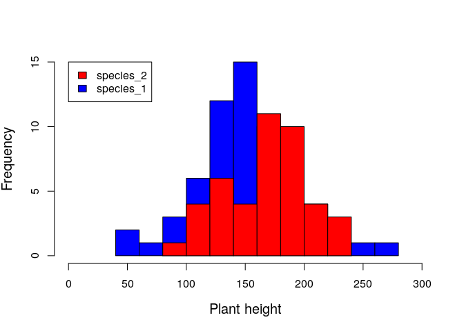

Visualising the histogram above, we already have a sense of whether or
not knowing species ID is useful for predicting plant height.

<a name="equiv1">Equivalence of `t.test` versus a linear model `lm` in R</a>
============================================================================

Using our two vectors `species_1` and `species_2`, we can run a t-test
as noted [by Lindeløv](https://lindeloev.github.io/tests-as-linear/).

    t.test(species_1, species_2, var.equal = TRUE);

    ## 
    ##  Two Sample t-test
    ## 
    ## data:  species_1 and species_2
    ## t = -2.8122, df = 98, p-value = 0.005945
    ## alternative hypothesis: true difference in means is not equal to 0
    ## 95 percent confidence interval:
    ##  -36.876256  -6.363344
    ## sample estimates:
    ## mean of x mean of y 
    ##  145.6344  167.2542

Reading the output above, we can get the t-statistic t = -2.8122. Given
the null hypothesis that the mean height of `species_1` equals the mean
height of `species_2`, the probability of getting such an exterme
difference between the two observed means is 0.00594 (i.e., the
p-value).

But this is not the only way that we can run a t-test. As
[Lindeløv](https://lindeloev.github.io/tests-as-linear/) points out, the
linear model structure works just fine as well. The variables used below
in `lm` are from the `plant_data` table shown above, with one column
named `height` and another named `species_ID`.

    lmod1 <- lm(height ~ 1 + species_ID, data = plant_data);
    summary(lmod1);

    ## 
    ## Call:
    ## lm(formula = height ~ 1 + species_ID, data = plant_data)
    ## 
    ## Residuals:
    ##     Min      1Q  Median      3Q     Max 
    ## -86.634 -23.204   3.011  21.058 115.856 
    ## 
    ## Coefficients:
    ##                     Estimate Std. Error t value Pr(>|t|)    
    ## (Intercept)          145.634      5.041  28.888  < 2e-16 ***
    ## species_IDspecies_2   21.620      7.688   2.812  0.00594 ** 
    ## ---
    ## Signif. codes:  0 '***' 0.001 '**' 0.01 '*' 0.05 '.' 0.1 ' ' 1
    ## 
    ## Residual standard error: 38.06 on 98 degrees of freedom
    ## Multiple R-squared:  0.07467,    Adjusted R-squared:  0.06523 
    ## F-statistic: 7.908 on 1 and 98 DF,  p-value: 0.005945

Note how the information in the above output matches that from the
`t.test` function. In using `lm`, we get a t value in the coefficients
table of 2.812, and a p-value of 0.00594. We can also see the mean
values for `species_1` and `species_2`, though in slightly different
forms. From the `t.test` function, we see an estimated mean of 145.6344
for species 1 and 167.2542 for species 2 (this is at the bottom of the
output, under `mean of x mean of y`). In the `lm`, we get the same
information in a slightly different form. The estimate in the
coefficients table for the intercept is listed as 145.634; this is the
value of the mean height for species 1.

Where is the value for the mean height of species 2? We get the value
for species 2 by adding the estimate of its effect on the line below,
such that 145.634 + 21.62 = 167.254. To understand why, think back to
that `lm` structure, `height ~ 1 + species_ID`. Recall from
[Lindeløv](https://lindeloev.github.io/tests-as-linear/) how this is a
short-hand for the familiar equation
*y* = *β*0 + *β*1*x*. In this equation, *y* is the
dependent variable plant height, while the value *x* is what we might
call a dummy variable. It indicates whether or not the plant in question
is a member of species 2. If yes, then *x* = 1. If no, then *x* = 0.

Now think about the coefficients *β*0 and *β*1.
Because *x* = 0 whenever `species_ID = species_1`, the predicted plant
height *y* for species 1 is simply
*y* = *β*0 + (*β*1 × 0), which simplifies to
*y* = *β*0. This is why our `Estimate` of the `(Intercept)`
row in the `summary(lmod1)` output equals the mean plant height of
species 1. Next, because *x* = 1 whenever `species_ID = species_2`, the
predicted plant height *y* for species 2 is
*y* = *β*0 + (*β*1 × 1), which simplifies to
*y* = *β*0 + *β*1. This is why our `Estimate` of
the `species_IDspecies_2` row in the `summary(lmod1)` equals 21.62. It
is the amount that needs to be added to the prediction for species 1 to
get the prediction for species 2.

To <a name="bintab">further clarify</a> the concept, we can re-write
that original two column table from above, but instead of having
`species_1` or `species_2` for the `species_ID` column, we can replace
it with a column called `is_species_2`. A value of `is_species_2 = 0`
means the plant is species 1, and a value of `is_species_2 = 1` means
the plant is species 2.

<table>
<thead>
<tr class="header">
<th style="text-align: left;">height</th>
<th style="text-align: left;">is_species_2</th>
</tr>
</thead>
<tbody>
<tr class="odd">
<td style="text-align: left;">110.87</td>
<td style="text-align: left;">0</td>
</tr>
<tr class="even">
<td style="text-align: left;">164.84</td>
<td style="text-align: left;">1</td>
</tr>
<tr class="odd">
<td style="text-align: left;">59.00</td>
<td style="text-align: left;">0</td>
</tr>
<tr class="even">
<td style="text-align: left;">191.07</td>
<td style="text-align: left;">1</td>
</tr>
<tr class="odd">
<td style="text-align: left;">128.74</td>
<td style="text-align: left;">0</td>
</tr>
<tr class="even">
<td style="text-align: left;">242.94</td>
<td style="text-align: left;">0</td>
</tr>
<tr class="odd">
<td style="text-align: left;">152.22</td>
<td style="text-align: left;">0</td>
</tr>
<tr class="even">
<td style="text-align: left;">135.51</td>
<td style="text-align: left;">0</td>
</tr>
<tr class="odd">
<td style="text-align: left;">147.22</td>
<td style="text-align: left;">1</td>
</tr>
<tr class="even">
<td style="text-align: left;">149.43</td>
<td style="text-align: left;">0</td>
</tr>
</tbody>
</table>

If we now plot `is_species_2` on the x-axis, and `height` on the y-axis,
we reproduce those same icons as in
[Lindeløv](https://lindeloev.github.io/tests-as-linear/).

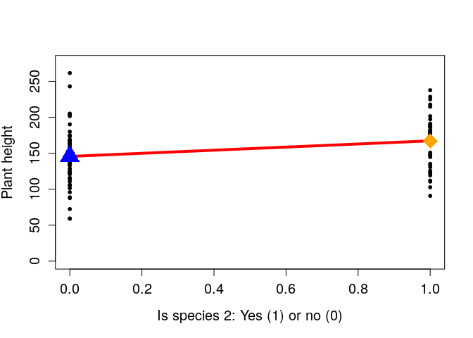

The blue triangle shows the mean height of species 1 (i.e., the
intercept of the linear model, *β*0), and the orange diamond
shows the mean height of species 2 (i.e.,
*β*0 + *β*1). Since the distance between these two
points is one, the slope of the line (rise over run) is identical to the
difference between the mean species heights. Hence the reason for why
*β*1, which we often think about only as the ‘slope’ is also
the difference between means.

<a name="equiv2">Further equivalence of `t.test`, `lm`, and now `aov`</a>
=========================================================================

Analysis of variance (ANOVA) tests the null hypothesis that the mean
values of groups are all equal. We often think of this being used for
group numbers of three or more, but it is worth showing that ANOVA is
equivalent to a t-test when the number of groups is two. A one-way ANOVA
can be run using the `aov` function in R. Below, I do this for the same
`plant_data` table as used for `t.test` and `lm`.

    aov_1 <- aov(height ~ species_ID, data = plant_data);
    summary(aov_1);

    ##             Df Sum Sq Mean Sq F value  Pr(>F)   
    ## species_ID   1  11456   11456   7.908 0.00594 **
    ## Residuals   98 141967    1449                   
    ## ---
    ## Signif. codes:  0 '***' 0.001 '**' 0.01 '*' 0.05 '.' 0.1 ' ' 1

Note the `F value` and the `Pr(>F)` (i.e., the p-value) in the table
above. The value 7.908 matches the `F-statistic` produced from using
`lm` in the previous section, and 0.0059 is the same p-value that we
calculated earlier. The methods are effectively the same.

<a name="random">Testing for a difference between means using randomisation</a>
===============================================================================

An alternative approach to the `t.test`, `lm`, and `aov` options above
is to use randomisation. Randomisation approaches make fewer assumptions
about the data, and I believe that they are often more intuitive. For a
full discussion of randomisation techniques, see my [previous notes for
Stirling Coding
Club](https://stirlingcodingclub.github.io/randomisation/randomisation_notes.html),
which go into much more detail on the underlying logic of randomisation,
bootstrap, and Monte Carlo methods. For now, I just want to illustrate
how a randomisation approach can get be used for the same null
hypothesis testing as shown in the previous methods above. Let us look
back at the first ten rows of the data set that I made up again.

<table>
<thead>
<tr class="header">
<th style="text-align: left;">height</th>
<th style="text-align: left;">species_ID</th>
</tr>
</thead>
<tbody>
<tr class="odd">
<td style="text-align: left;">110.87</td>
<td style="text-align: left;">species_1</td>
</tr>
<tr class="even">
<td style="text-align: left;">164.84</td>
<td style="text-align: left;">species_2</td>
</tr>
<tr class="odd">
<td style="text-align: left;">59.00</td>
<td style="text-align: left;">species_1</td>
</tr>
<tr class="even">
<td style="text-align: left;">191.07</td>
<td style="text-align: left;">species_2</td>
</tr>
<tr class="odd">
<td style="text-align: left;">128.74</td>
<td style="text-align: left;">species_1</td>
</tr>
<tr class="even">
<td style="text-align: left;">242.94</td>
<td style="text-align: left;">species_1</td>
</tr>
<tr class="odd">
<td style="text-align: left;">152.22</td>
<td style="text-align: left;">species_1</td>
</tr>
<tr class="even">
<td style="text-align: left;">135.51</td>
<td style="text-align: left;">species_1</td>
</tr>
<tr class="odd">
<td style="text-align: left;">147.22</td>
<td style="text-align: left;">species_2</td>
</tr>
<tr class="even">
<td style="text-align: left;">149.43</td>
<td style="text-align: left;">species_1</td>
</tr>
</tbody>
</table>

When we use null hypothesis testing, what we are asking is this:

> If the true difference between group means is the same (null
> hypothesis), then what is the probability of sampling a difference
> between groups as or more extreme than the difference that we observe
> in the data?

We might phrase the null hypothesis slightly differently:

> If the true difference between group means is random with respect to
> group identity (null hypothesis), then what is the probability of
> sampling a difference between groups as or more extreme than the
> difference that we observe in the data?

In other words, what if we were to randomly re-shuffle species IDs, so
that we *knew* any difference between mean species heights was
attributable to chance? The logic behind randomisation here is to
re-shuffle group identity (species), then see what the difference is
between groups after shuffling (i.e., mean species 1 height minus mean
species 2 height). After doing this many times, we can thereby build a
distribution for differences between randomly generated groups. We can
do this with a bit of code below. First let’s get the actual difference
between mean heights of species 1 and species 2, i.e.,
`species[1] - species[2]`. We can use the `tapply` function in R to do
this easily.

    species <- tapply(X = plant_data$height, INDEX = plant_data$species_ID, 
                      FUN = mean);
    height_diffs <- as.numeric( species[1] - species[2] );
    print(height_diffs);

    ## [1] -21.6198

Using a [for
loop](https://stirlingcodingclub.github.io/using_loops/loop_notes.html)
in R, we can shuffle `species_ID`, then build a distribution showing
what the difference between species means would be just due to random
chance.

    null_diff  <- NULL;  # Place where the random diffs will go
    iterations <- 99999; # Number of reshuffles
    iter       <- 1;     # Start with the first
    while(iter < iterations){
      new_species_ID  <- sample(x    = plant_data$species_ID, 
                                size = length(plant_data$species_ID));
      new_species     <- tapply(X = plant_data$height, INDEX = new_species_ID,
                                FUN = mean);
      new_diffs       <- as.numeric( new_species[1] - new_species[2] );
      null_diff[iter] <- new_diffs;
      iter            <- iter + 1;
    }

Each element in the vector `null_diff` is now a difference between the
mean of species 1 and the mean of species 2, given a random shuffling of
species IDs. We can look at the distribution of `null_diff` in the
histogram below.

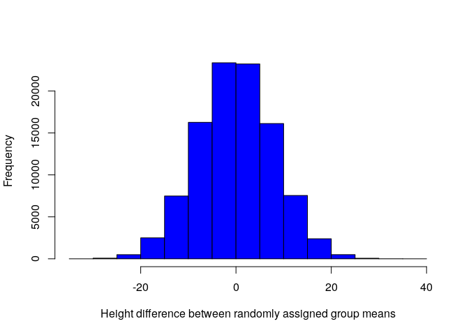

As expected, most differences between randomly assigned species height
means are somewhere around zero. Our actual value of -21.62, which we
have calculated several times now, is quite low, and on the extreme tail
of the distribution above. What then is the probability of getting a
value this extreme if species ID has nothing to do with plant height?
The answer is just the total number of values equal or more extreme to
the one we observed (-21.62), divided by the total number of values that
we tried (99999 + 1 = 100000; the plus one is for the actual value).

    p_value <- sum(abs(null_diff) > abs(height_diffs)) / 100000;

We get `p_value =` 0.00631. Notice how close this value is to the
p-value that we obtained using `t.test`, `lm`, and `aov`. This is
because the concept is the same; given that the null hypothesis is true,
what is the probability of getting a value as or more extreme than the
one actually observed?

<a name="moregroups">What about when there are more than two groups?</a>
========================================================================

I want to briefly touch on what happens when there are more than two
groups; for example, if we had three species instead of two. Of course,
a t-test is now not applicable, but we can still use the linear model
and ANOVA approaches. Let’s make up another data set, but with three
species this time.

<table>
<thead>
<tr class="header">
<th style="text-align: left;">height</th>
<th style="text-align: left;">species_ID</th>
</tr>
</thead>
<tbody>
<tr class="odd">
<td style="text-align: left;">150.42</td>
<td style="text-align: left;">species_2</td>
</tr>
<tr class="even">
<td style="text-align: left;">150.56</td>
<td style="text-align: left;">species_3</td>
</tr>
<tr class="odd">
<td style="text-align: left;">217.97</td>
<td style="text-align: left;">species_2</td>
</tr>
<tr class="even">
<td style="text-align: left;">133.03</td>
<td style="text-align: left;">species_2</td>
</tr>
<tr class="odd">
<td style="text-align: left;">153.67</td>
<td style="text-align: left;">species_1</td>
</tr>
<tr class="even">
<td style="text-align: left;">117.23</td>
<td style="text-align: left;">species_2</td>
</tr>
<tr class="odd">
<td style="text-align: left;">126.27</td>
<td style="text-align: left;">species_2</td>
</tr>
<tr class="even">
<td style="text-align: left;">194.60</td>
<td style="text-align: left;">species_3</td>
</tr>
<tr class="odd">
<td style="text-align: left;">199.22</td>
<td style="text-align: left;">species_1</td>
</tr>
<tr class="even">
<td style="text-align: left;">107.87</td>
<td style="text-align: left;">species_1</td>
</tr>
</tbody>
</table>

As already mentioned, `t.test` will not work. But we can run both `lm`
and `aov` with the exact same code as before with three groups. I will
show `aov` first.

    aov_2 <- aov(height ~ species_ID, data = plant_data);
    summary(aov_2);

    ##             Df Sum Sq Mean Sq F value Pr(>F)  
    ## species_ID   2  12042    6021   3.795 0.0259 *
    ## Residuals   97 153882    1586                 
    ## ---
    ## Signif. codes:  0 '***' 0.001 '**' 0.01 '*' 0.05 '.' 0.1 ' ' 1

The F-statistic calculated above is 3.795, and the p-value is 0.0259.
The p-value in this case tests the null hypothesis that all groups
(i.e., species) have the same mean values (i.e., heights). We can now
use the `lm` function to run the same analysis with three groups.

    lmod2 <- lm(height ~ 1 + species_ID, data = plant_data);
    summary(lmod2);

    ## 
    ## Call:
    ## lm(formula = height ~ 1 + species_ID, data = plant_data)
    ## 
    ## Residuals:
    ##     Min      1Q  Median      3Q     Max 
    ## -80.567 -28.155  -3.952  32.665 109.006 
    ## 
    ## Coefficients:
    ##                     Estimate Std. Error t value Pr(>|t|)    
    ## (Intercept)          148.457      7.041  21.085   <2e-16 ***
    ## species_IDspecies_2   26.144     10.037   2.605   0.0106 *  
    ## species_IDspecies_3    5.457      9.615   0.568   0.5717    
    ## ---
    ## Signif. codes:  0 '***' 0.001 '**' 0.01 '*' 0.05 '.' 0.1 ' ' 1
    ## 
    ## Residual standard error: 39.83 on 97 degrees of freedom
    ## Multiple R-squared:  0.07258,    Adjusted R-squared:  0.05345 
    ## F-statistic: 3.795 on 2 and 97 DF,  p-value: 0.02588

We can find the F-statistic and p-value at the very bottom of the
output, and note that they are the same as reported by `aov`. But look
at what is going on with the `Estimate` values in the table (ignore the
`Pr(>|t|)` values in the table). There are now three rows. Again, we can
think back to the equation predicting plant height *y*, but now we need
another coefficient. The equation can now be expressed as,
*y* = *β*0 + *β*1*x*1 + *β*2*x*2.
Note that subscripts have been added to *x*. This is because we now have
two dummy variables; is the plant species 1 (if so, *x*1 = 0
and *x*2 = 0), species 2 (*x*1 = 1 and
*x*2 = 0), or species 3 (*x*1 = 0 and
*x*2 = 1)? With these dummy variables, we can now predict the
height of species 1,

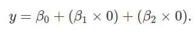

The above reduces to *y* = *β*0, as with our two species
case. The height of species 2 can be predicted as below,

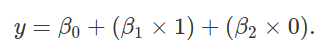

 The above reduces to *y* = *β*0 + *β*1, again, as
with the two species case. Finally, we can use the linear model to
predict the height of species 3 plants,

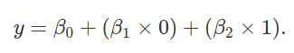

The above reduces to *y* = *β*0 + *β*2. Let’s use
the `tapply` function to see what the mean values of each species are in
the new data set.

    tapply(X = plant_data$height, INDEX = plant_data$species_ID, FUN = mean);

    ## species_1 species_2 species_3 
    ##  148.4566  174.6010  153.9135

Now look at that output `summary(lmod2)` again. Notice that the estimate
of the intercept `(Intercept)` is the same as the mean height of species
1 (148.4565625). Similarly, add the intercept (*β*0) to the
coefficient in the second row, `species_IDspecies_2` (i.e.,
*β*1); this value equals the mean estimate for species 2.
Finally, add the intercept to the coefficient in the third row
`species_IDspecies_3` (i.e., *β*2); this value equals the
mean estimate for species 3. Once again, we see how the linear model is
equivalent to the ANOVA.

<a href="whatreally">Okay, but what’s really happening with three groups?</a>
=============================================================================

How does this *really* work? We have given R a single column with three
different categorical values (species) and somehow ended up with an
intercept and two regression coefficients. How can we understand this
more clearly? Think back to the table [from earlier](#bintab) where we
had a column for `is_species_2` with a simple zero or one. We can do the
same, but with a new column, to include the ID of species 3.

<table>
<thead>
<tr class="header">
<th style="text-align: left;">height</th>
<th style="text-align: left;">is_species_2</th>
<th style="text-align: left;">is_species_3</th>
</tr>
</thead>
<tbody>
<tr class="odd">
<td style="text-align: left;">150.42</td>
<td style="text-align: left;">1</td>
<td style="text-align: left;">0</td>
</tr>
<tr class="even">
<td style="text-align: left;">150.56</td>
<td style="text-align: left;">0</td>
<td style="text-align: left;">1</td>
</tr>
<tr class="odd">
<td style="text-align: left;">217.97</td>
<td style="text-align: left;">1</td>
<td style="text-align: left;">0</td>
</tr>
<tr class="even">
<td style="text-align: left;">133.03</td>
<td style="text-align: left;">1</td>
<td style="text-align: left;">0</td>
</tr>
<tr class="odd">
<td style="text-align: left;">153.67</td>
<td style="text-align: left;">0</td>
<td style="text-align: left;">0</td>
</tr>
<tr class="even">
<td style="text-align: left;">117.23</td>
<td style="text-align: left;">1</td>
<td style="text-align: left;">0</td>
</tr>
<tr class="odd">
<td style="text-align: left;">126.27</td>
<td style="text-align: left;">1</td>
<td style="text-align: left;">0</td>
</tr>
<tr class="even">
<td style="text-align: left;">194.60</td>
<td style="text-align: left;">0</td>
<td style="text-align: left;">1</td>
</tr>
<tr class="odd">
<td style="text-align: left;">199.22</td>
<td style="text-align: left;">0</td>
<td style="text-align: left;">0</td>
</tr>
<tr class="even">
<td style="text-align: left;">107.87</td>
<td style="text-align: left;">0</td>
<td style="text-align: left;">0</td>
</tr>
</tbody>
</table>

In fact, for even more clarity, we can add a column for the intercept
too.

<table>
<thead>
<tr class="header">
<th style="text-align: left;">height</th>
<th style="text-align: left;">the_intercept</th>
<th style="text-align: left;">is_species_2</th>
<th style="text-align: left;">is_species_3</th>
</tr>
</thead>
<tbody>
<tr class="odd">
<td style="text-align: left;">150.42</td>
<td style="text-align: left;">1</td>
<td style="text-align: left;">1</td>
<td style="text-align: left;">0</td>
</tr>
<tr class="even">
<td style="text-align: left;">150.56</td>
<td style="text-align: left;">1</td>
<td style="text-align: left;">0</td>
<td style="text-align: left;">1</td>
</tr>
<tr class="odd">
<td style="text-align: left;">217.97</td>
<td style="text-align: left;">1</td>
<td style="text-align: left;">1</td>
<td style="text-align: left;">0</td>
</tr>
<tr class="even">
<td style="text-align: left;">133.03</td>
<td style="text-align: left;">1</td>
<td style="text-align: left;">1</td>
<td style="text-align: left;">0</td>
</tr>
<tr class="odd">
<td style="text-align: left;">153.67</td>
<td style="text-align: left;">1</td>
<td style="text-align: left;">0</td>
<td style="text-align: left;">0</td>
</tr>
<tr class="even">
<td style="text-align: left;">117.23</td>
<td style="text-align: left;">1</td>
<td style="text-align: left;">1</td>
<td style="text-align: left;">0</td>
</tr>
<tr class="odd">
<td style="text-align: left;">126.27</td>
<td style="text-align: left;">1</td>
<td style="text-align: left;">1</td>
<td style="text-align: left;">0</td>
</tr>
<tr class="even">
<td style="text-align: left;">194.60</td>
<td style="text-align: left;">1</td>
<td style="text-align: left;">0</td>
<td style="text-align: left;">1</td>
</tr>
<tr class="odd">
<td style="text-align: left;">199.22</td>
<td style="text-align: left;">1</td>
<td style="text-align: left;">0</td>
<td style="text-align: left;">0</td>
</tr>
<tr class="even">
<td style="text-align: left;">107.87</td>
<td style="text-align: left;">1</td>
<td style="text-align: left;">0</td>
<td style="text-align: left;">0</td>
</tr>
</tbody>
</table>

Now we can see the equivalence with the linear model expressed in R from
above, `lm(height ~ 1 + species_ID, data = plant_data)`. The formula in
`lm` is predicting `height` for individual plants using a linear model
that includes the intercept (always 1), plus species ID. This relates
now more easily to the equation
*y* = *β*0 + *β*1*x*1 + *β*2*x*2.
The four terms are reflected in the four columns above. Plant height
(*y*) is predicted in the left-most column. The second column is all
ones, by which we multipy the intercept (*β*0). Columns two
and three define the `species_ID` in R, and the
*β*1*x*1 + *β*2*x*2 terms of
the equation. Note that either *x*1 = 0 and
*x*2 = 0 (the row is species 1), *x*1 = 1 and
*x*2 = 0 (species 2), or *x*1 = 0 and
*x*2 = 1 (species 3). Hence, the coefficients *β*1
and *β*2 apply only for species 2 and 3, repsectively (and
the absence of both occurs for species 1). You should now be able to
connect this concept with the output of `summary(lmod2)` above.

Now if we want to predict the height of any plant (rows), we can do so
just by multiplying the values in columns 2-4 (always 1 or 0) by the
corresponding regression coefficients. For example, where
`is_species_2 = 0` and `is_species_3 = 0`, we have
*y* = (*β*0 × 1) + (*β*1 × 0) + (*β*2 × 0).
Substituting the regression coefficients from the `summary(lmod2)`
above, we have,

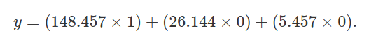

Note that the above simplifies to 148.457, the predicted height of
species 1. We can do the same for species 2.

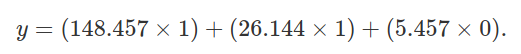

The above simplifies to *y* = 148.457 + 26.144, which equals 174.601,
the predicted height of species 2. I will leave the predicted height of
species 3 to the reader.

Note that we have been working with categorical variables, species.
These are represented by ones and zeroes. But we can also imagine that
some other continuous variable might be included in the model. For
example, perhaps the altitude at which the plant was collected is also
potentially important for predicting plant height. The common name for
this model would be ‘ANCOVA’, but all that we would really be doing is
adding one more column to the table above. The column would be
‘altitude’, and would perhaps include values expressing metres above sea
level (e.g., `altitude = 23.42, 32.49, 10.02`, and so forth; one for
each plant). This value would be multiplied by a new coefficient
*β*3 to predict plant height, and be represented as an `lm`
in R with `lm(height ~ 1 + species_ID + altitude, data = plant_data)`.
Its equation would be
*y* = *β*0 + *β*1*x*1 + *β*2*x*2 + *β*3*x*3,
where altitude is *x*3.

<a name="matrices">Can we make this even more elegant, somehow?</a>
===================================================================

I hope that all of this has further illustrated some of the mathematics
and code underlying linear models. Readers who are satisfied can skip
this section, but I want to go just one step further and demonstrate how
linear model prediction really boils down to **just one equation**. This
equation is a generalisation of the by now familiar
*y* = *β*0 + *β*1*x*. We can represent independent
and dependent variables in the table above using columns of two
matrices, *Y* and *X*. *Y* is just a vector of 100 plant heights
(matching column 1 from the table above),

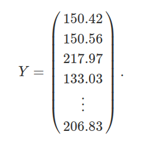

Similarly, *X* is just a matrix with 100 rows and 3 columns indicating
the intercept and species identities, as in columns 2-4 above,

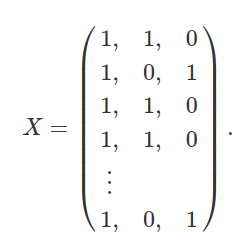

What we want to figure out now are the coefficients for predicting
values in *Y* (i.e., its matrix elements) from values in each of the
columns of *X*. In other words, what are the values of *β*0,
*β*1, *β*2, which were explained in the last
section? We can also represent these values in a matrix *β*,

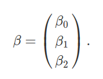

We have already figured out what these values are using `lm` in R. They
are just the `Estimate` values from the output of `summary(lmod2)` in
[an earlier section](#moregroups). But we can also predict them using a
bit of matrix algebra, solving for *β* given the values in *Y* and *X*.
The generalisation of *y* = *β*0 + *β*1*x* is the
compact equation below,

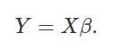

For our data, we could therefore substute for *Y* and *X* matrices,

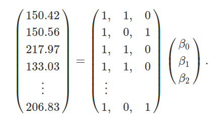

Given this equation, we now only need to solve for *β* to get our
coefficients predicting *Y* from *X*. This requires some knowledge of
[matrix
multiplication](https://en.wikipedia.org/wiki/Matrix_multiplication) and
[matrix inversion](https://en.wikipedia.org/wiki/Invertible_matrix).
These topics are a lesson in themselves, so I will not go into any
detail as to what these matrix operations do. The point is that we are
trying to isolate *β* in the equation *Y* = *X**β*. My hope is that a
rough idea of what is going on is possible even for those unfamiliar
with matrix algebra, but feel free to [skip ahead](#betapred).

**Isolating *β* with matrix algebra**

I should note that all of the matrix algebra that you have seen here is
thanks to [Dean Adams](https://www.eeob.iastate.edu/people/dean-adams)
at Iowa State University (but if you notice any errors, they are mine,
not his). The first thing that we need to isolate *β* is to multiply
both sides of the equation *Y* = *β**X* by the
[transpose](https://en.wikipedia.org/wiki/Transpose) of *X*,
*X**t*,

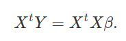

Next, we multiply both sides by the
[inverse](https://en.wikipedia.org/wiki/Invertible_matrix) of
(*X**t**X*), (*X**t**X*) − 1,

Notice now that on the right side of the equation, we have
(*X**t**X*) − 1*X**t**X*. In other
words, we multiply the inverse of (*X**t**X*) by itself,
thereby cancelling itself out (getting the [identity
matrix](https://en.wikipedia.org/wiki/Identity_matrix), the matrix
algebra equivalent of 1). That leaves us only with *β* on the right hand
side of the equation, which is exactly what we want. We can flip this
around and put *β* on the left side of the equation,

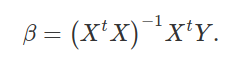

Hence, we have isolated *β*, and can use the right side of the above
equation (where the data are located) to get our predictors.

<a name="betapred">**Using one equation to get predictions of
coefficients**</a>.

We now have our equation for getting our prediction coefficients *β*,

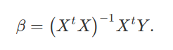

Now I will use this equations to rederive our regression coefficients.
**Do not worry about the details here**. What I want to show is that the
above equation really does get us the same regression coefficents that
we got from the output of `summary(lmod2)` [earlier](#moregroups). Here
is that output again.

    ## 
    ## Call:
    ## lm(formula = height ~ 1 + species_ID, data = plant_data)
    ## 
    ## Residuals:
    ##     Min      1Q  Median      3Q     Max 
    ## -80.567 -28.155  -3.952  32.665 109.006 
    ## 
    ## Coefficients:
    ##                     Estimate Std. Error t value Pr(>|t|)    
    ## (Intercept)          148.457      7.041  21.085   <2e-16 ***
    ## species_IDspecies_2   26.144     10.037   2.605   0.0106 *  
    ## species_IDspecies_3    5.457      9.615   0.568   0.5717    
    ## ---
    ## Signif. codes:  0 '***' 0.001 '**' 0.01 '*' 0.05 '.' 0.1 ' ' 1
    ## 
    ## Residual standard error: 39.83 on 97 degrees of freedom
    ## Multiple R-squared:  0.07258,    Adjusted R-squared:  0.05345 
    ## F-statistic: 3.795 on 2 and 97 DF,  p-value: 0.02588

Now let’s use the data in `plant_data` to calculate *β* manually
instead. Here are the first ten rows of `plant_data` again.

<table>
<thead>
<tr class="header">
<th style="text-align: right;">height</th>
<th style="text-align: right;">the_intercept</th>
<th style="text-align: right;">is_species_2</th>
<th style="text-align: right;">is_species_3</th>
</tr>
</thead>
<tbody>
<tr class="odd">
<td style="text-align: right;">150.42</td>
<td style="text-align: right;">1</td>
<td style="text-align: right;">1</td>
<td style="text-align: right;">0</td>
</tr>
<tr class="even">
<td style="text-align: right;">150.56</td>
<td style="text-align: right;">1</td>
<td style="text-align: right;">0</td>
<td style="text-align: right;">1</td>
</tr>
<tr class="odd">
<td style="text-align: right;">217.97</td>
<td style="text-align: right;">1</td>
<td style="text-align: right;">1</td>
<td style="text-align: right;">0</td>
</tr>
<tr class="even">
<td style="text-align: right;">133.03</td>
<td style="text-align: right;">1</td>
<td style="text-align: right;">1</td>
<td style="text-align: right;">0</td>
</tr>
<tr class="odd">
<td style="text-align: right;">153.67</td>
<td style="text-align: right;">1</td>
<td style="text-align: right;">0</td>
<td style="text-align: right;">0</td>
</tr>
<tr class="even">
<td style="text-align: right;">117.23</td>
<td style="text-align: right;">1</td>
<td style="text-align: right;">1</td>
<td style="text-align: right;">0</td>
</tr>
<tr class="odd">
<td style="text-align: right;">126.27</td>
<td style="text-align: right;">1</td>
<td style="text-align: right;">1</td>
<td style="text-align: right;">0</td>
</tr>
<tr class="even">
<td style="text-align: right;">194.60</td>
<td style="text-align: right;">1</td>
<td style="text-align: right;">0</td>
<td style="text-align: right;">1</td>
</tr>
<tr class="odd">
<td style="text-align: right;">199.22</td>
<td style="text-align: right;">1</td>
<td style="text-align: right;">0</td>
<td style="text-align: right;">0</td>
</tr>
<tr class="even">
<td style="text-align: right;">107.87</td>
<td style="text-align: right;">1</td>
<td style="text-align: right;">0</td>
<td style="text-align: right;">0</td>
</tr>
</tbody>
</table>

We want to set the first column as a matrix *Y*, and the remaining
columns as a matrix *X*.

    Y <- as.matrix(plant_data[,1]);
    X <- as.matrix(plant_data[,2:4]);

Here are the first five elements of `Y`.

    ## [1] 150.42 150.56 217.97 133.03 153.67

Here are the first five rows of `X`.

    ##      the_intercept is_species_2 is_species_3
    ## [1,]             1            1            0
    ## [2,]             1            0            1
    ## [3,]             1            1            0
    ## [4,]             1            1            0
    ## [5,]             1            0            0

Let’s do the matrix algebra now below to get values of *β*. Note that in
R, [matrix
multiplication](https://en.wikipedia.org/wiki/Matrix_multiplication) is
denoted by the operation `%*%`. [Matrix
inversion](https://en.wikipedia.org/wiki/Invertible_matrix) of `X` is
written as `solve(X)`, and matrix
[transpose](https://en.wikipedia.org/wiki/Transpose) of `X` is written
as `t(X)`. Our expression of
*β* = (*X**t**X*) − 1*X**t**Y* in R is
therefore as follows.

    betas <- solve( t(X) %*% X ) %*% t(X) %*% Y;

We can now print `betas` to reveal our coefficients, just as they were
reported by `lm`.

    print(betas);

    ##                     [,1]
    ## the_intercept 148.456563
    ## is_species_2   26.144405
    ## is_species_3    5.456951

We have just produced our regression coefficients manually, with matrix
algebra.

<a name="final">Some final thoughts</a>
=======================================

The reason that I have gone through this step by step is to build on our
earlier exploration of common statistical tests as linear models. All
linear models can be expressed using this common framework. In the above
matrix example, note that we could have added as many columns as we
wished to *X*. Perhaps we also collected data on the altitude at which
we found the plants in our hypothetical example. We could add this
information in as an additional column of numbers in *X*, then
calculated a new *β*4 in exactly the same way. In our new
model, this would result in a discrete group predictor (species, in our
case), and a continuous variable (altitude). The associated statistical
test would commonly be called an ANCOVA, but all that would really have
happened is that we would be adding a new column to the list of
independent variables. **As an exercise**, think about how we would add
interaction terms in *X*. Interaction terms are demonstrated in
[Exercise 3](#E3) below.

But wait, there’s more. There is no reason why *Y* needs to be
represented by a single column. Maybe we want to predict not just plant
height, but plant seed production too. In other words, perhaps we have
more than one dependent variable and we need a
[multivariate](https://en.wikipedia.org/wiki/Multivariate_statistics)
approach (e.g.,
[MANOVA](https://en.wikipedia.org/wiki/Multivariate_analysis_of_variance)).
The same equation for getting *β* works here too. We can think of
multivariate linear models in the exact same way as univariate models;
we are just adding more columns to *Y*.

I hope that this has been a useful supplement to the already very useful
introduction by
[Lindeløv](https://lindeloev.github.io/tests-as-linear/). There are
details that I have left out for the sake of time, but my goal has been
to further simplify the logic and mathematics underying linear models in
statistics.

This document is entirely reproducible. Because the data are simulated,
if you Knit it in Rstudio, you will get different numbers each time. I
encourage you to try this, and explore the code for yourself. I have
cheated in a few places just to avoid making a simulated data set that
is too extreme, by chance. All of the code for generating simulated data
is posted below, with some notes.

<a name="code">Key bits of code underlying the simulated data</a>
=================================================================

The code below can be used to generate a CSV file with simulated data as
shown here. Note that you can change the significance of different
regression coefficients, and their magnitudes and signs, by changing how
`height` is defined within the `while` loops below.

    # The code below creates plant heights with an intercept of roughly 150
    # and a beta_1 coefficient of roughly 20, with some error added into it.
    # The while loop just does this to avoid any non-significant results or 
    # very highly significant results that arise due to chance.
    species_n <- c("species_1", "species_2");
    sim_pval  <- 0;
    while(sim_pval > 0.05 | sim_pval < 0.001){
        species_eg  <- sample(x = species_n, size = 100, replace = TRUE);
        species1    <- as.numeric(species_eg == "species_1");
        species2    <- as.numeric(species_eg == "species_2");
        error       <- rnorm(n = 100, mean = 0, sd = 40);
        height      <- round(150 + (species2 * 20) + error, digits = 2);
        species_ID  <- as.factor(species_eg);
        plant_data  <- data.frame(height, species_ID);
        sim_mod     <- lm(plant_data$height ~ 1 + plant_data$species_ID);
        sim_pval    <- summary(sim_mod)$coefficients[2,4];
    }
    write.csv(plant_data, file = "two_discrete_x_values.csv", row.names = FALSE);

    # Below does the same job as above, just with three species instead of two
    species_n <- c("species_1", "species_2", "species_3");
    sim_pval  <- 0;
    while(sim_pval > 0.05 | sim_pval < 0.001){
        species_eg  <- sample(x = species_n, size = 100, replace = TRUE);
        species1    <- as.numeric(species_eg == "species_1");
        species2    <- as.numeric(species_eg == "species_2");
        species3    <- as.numeric(species_eg == "species_3");
        error       <- rnorm(n = 100, mean = 0, sd = 40);
        height      <- round(150 + (species2 * 20) + error, digits = 2);
        species_ID  <- as.factor(species_eg);
        plant_data  <- data.frame(height, species_ID);
        sim_mod     <- lm(plant_data$height ~ 1 + plant_data$species_ID);
        sim_pval    <- summary(sim_mod)$coefficients[2,4];
    }
    write.csv(plant_data, file = "three_discrete_x_values.csv", row.names = FALSE);

<a name="exercises">Excercises for furthering learning</a>
==========================================================

I have included some exercises below that involve simulating data and
using it to build linear models. One benefit of using simulated data is
that it allows us to know *a priori* what the relationships are between
different variables, and to adjust these relationships to see how they
affect model prediction and statistical hypothesis tests. As done above
in the [code for simulating the examples](#code), the exercises below
will make up some for use in a linear model.

------------------------------------------------------------------------

<a name ="E1">**Exercise 1**</a>

Create a single dependent variable *Y* and independent variable *X*,
with the relationship between these two variables predicted using a
linear model as below,

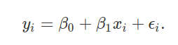

In the above, *y**i* and *x**i* are data collected
on the random variables *Y* and *X*, respectively, for individual
observed values *i*. Values of *β*0 and *β*1
define regression coefficients, and *ϵ**i* reflects an error
attributable to unobserved noise. **As an exercise, simulate 100
observations from a population in which *X* is a random normal variable
with a mean of *μ**X* = 20 and standard deviation of
*σ**X* = 5, *β*0 = 10, and
*β*1 =  − 1/2. Assume that *ϵ**i* is sampled from
a normal distribution with a mean of 0 and standard deviation of 4**.
[Here is some code if you get stuck](#aE1).

-   Plot a histogram of *x* and *y*, then a scatter-plot of *y* against
    *x*.
-   Use the R function `lm`, find estimates for *β*0 and
    *β*1; how do these estimate relate to the code you used
    to generate your simulated data?
-   Use the R function `summary` to test the significance of
    *β*0 and *β*1. Is this what you expected?
-   Re-run your code several times to simulate different numbers of
    observations, then see how this affects estimates of regression
    coefficients and signifiance tests of *β*0 and
    *β*1.
-   Re-run your code several times with different standard deviations
    for *ϵ*, then see how this affects estimates of regression
    coefficients and signifiance tests of *β*0 and
    *β*1.
-   Make a table such as those shown in the notes above, which could be
    used to predict *y**i* from *x**i* (see [this
    table](#aE1) for an answer).

------------------------------------------------------------------------

<a name ="E2">**Exercise 2**</a>

Create a single dependent variable *Y* as in [Exercise 1](#E1), but now
make *X* categorical rather than continuous. If *X* is “Group\_1”, then
make its effect on *Y* half that predicted given *X* is “Group 2”. The
code for doing this is a bit more challenging than simply randomly
sampling from a normal distribution, so [here is the code](#aE2) if you
get stuck.

------------------------------------------------------------------------

<a name ="E3">**Exercise 3**</a>

We have ignored statistical interactions until now. Finally, let’s model
some interactions with simulated data. To do this, create a new model
with a dependent variable *Y*, as predicted by the continuous variable
*X* and the categorical variable *Z*. Include an interaction term, in
the linear model `lm`. Finally, build a table such as the the ones in
the notes and previous two exercises to predict a value
*y**i* from *x**i*, *z**i* and the
appropriate coefficients (*β*0, *β*1, and
*β*2). This is challenging, so first try to think
conceptually about what you need to do, then try to write the code for
it. If you get stuck, [here is the code](#aE3).

------------------------------------------------------------------------

<a name="answers">Answers to exercises for learning</a>
=======================================================

Help for writing the code to simulate data and run linear models is
shown below.

------------------------------------------------------------------------

<a name = "aE1">**Code for completing Exercise 1**</a>

    x  <- rnorm(n = 1000, mean = 20, sd = 5);
    b0 <- 10;
    b1 <- -1/2;
    ep <- rnorm(n = 1000, mean = 0, sd = 4);
    y  <- b0 + (b1 * x) + ep;

    # Plot histograms of x and y below
    hist(x);
    hist(y);

    # Scatter-plot of x versus y
    plot(x = x , y = y);

    # Get estimate of the coefficients
    mod1 <- lm(y ~ x);
    print(mod1);
    summary(mod1);

To change the number of observations, set `n = 1000` to something else
when generating data for `x` and `ep`. To get a different standard
deviation for *ϵ**i* (i.e., the error), set `sd = 4` to
something else. You can also change the values of `b0` and `b1` to see
how this affects regression coefficients. Your predictions will be
different than mine, but here is my output for `summary(mod1)`.

    ## 
    ## Call:
    ## lm(formula = y ~ x)
    ## 
    ## Residuals:
    ##      Min       1Q   Median       3Q      Max 
    ## -12.0881  -2.7571  -0.0336   2.7232  14.7384 
    ## 
    ## Coefficients:
    ##             Estimate Std. Error t value Pr(>|t|)    
    ## (Intercept)  9.74268    0.52116   18.69   <2e-16 ***
    ## x           -0.49001    0.02559  -19.15   <2e-16 ***
    ## ---
    ## Signif. codes:  0 '***' 0.001 '**' 0.01 '*' 0.05 '.' 0.1 ' ' 1
    ## 
    ## Residual standard error: 4.001 on 998 degrees of freedom
    ## Multiple R-squared:  0.2687, Adjusted R-squared:  0.268 
    ## F-statistic: 366.7 on 1 and 998 DF,  p-value: < 2.2e-16

To get a table from which *y**i* could be predicted from
*x**i*, see the code below.

    ones      <- rep(x = 1, times = 1000); # For the intercept
    the_table <- cbind(y, ones, x, ep);
    print(the_table[1:5,]); # Just show the first five rows

    ##               y ones        x        ep
    ## [1,] -2.5919216    1 23.13335 -1.025248
    ## [2,] -8.8967486    1 20.89131 -8.451092
    ## [3,]  1.6624291    1 20.84183  2.083344
    ## [4,] -0.6475704    1 23.46337  1.084117
    ## [5,] -4.2942120    1 18.43439 -5.077017

To predict the `y` value in the left-most column, we multiply the second
column `ones` by our estimated *β*0, then add the third
column `x` times our estimated *β*1, then add the error `ep`.
Try this for a few of the rows. You will find that the predicted `y` is
still not exact. Why? And what could you multiply `ones` and `x` by to
exactly predict `y` (hint: think about the numbers that you used to
simulate the data).

------------------------------------------------------------------------

<a name = "aE2">**Code for completing Exercise 2**</a>

Help for writing the code to simulate data given *X* as a categorical
rather than a continuous variable is shown below.

    x_groups <- c("Group_1", "Group_2"); # All the possible groups
    x        <- sample(x = x_groups, size = 1000, replace = TRUE); # Sample groups
    b0       <- 10;
    b1       <- -1/2;
    ep       <- rnorm(n = 1000, mean = 0, sd = 4);

    # Now is a challenging part -- we need to set X to a binary, is_group_2
    is_group_2 <- as.numeric( x == "Group_2" );
    y          <- b0 + (b1 * is_group_2) + ep;

    # Try plotting the below
    plot(x = is_group_2, y = y);

    #Now we can use a linear model as before. 
    mod1 <- lm(y ~ x);
    print(mod1);
    summary(mod1);

As before, your predictions will be different than mine, but here is my
output for `summary(mod2)`.

    ## 
    ## Call:
    ## lm(formula = y ~ x)
    ## 
    ## Residuals:
    ##      Min       1Q   Median       3Q      Max 
    ## -13.0290  -2.7171  -0.1086   2.7838  14.3833 
    ## 
    ## Coefficients:
    ##             Estimate Std. Error t value Pr(>|t|)    
    ## (Intercept)   9.8581     0.1837  53.655   <2e-16 ***
    ## xGroup_2     -0.2880     0.2598  -1.108    0.268    
    ## ---
    ## Signif. codes:  0 '***' 0.001 '**' 0.01 '*' 0.05 '.' 0.1 ' ' 1
    ## 
    ## Residual standard error: 4.108 on 998 degrees of freedom
    ## Multiple R-squared:  0.001229,   Adjusted R-squared:  0.0002284 
    ## F-statistic: 1.228 on 1 and 998 DF,  p-value: 0.268

As with [Excercise 1](#aE1), to get a table from which *y**i*
could be predicted from *x**i*, see the code below.

    ones        <- rep(x = 1, times = 1000); # For the intercept
    the_table_2 <- cbind(y, ones, is_group_2, ep);
    print(the_table_2[1:5,]); # Just show the first five rows

    ##              y ones is_group_2          ep
    ## [1,]  9.956974    1          0 -0.04302598
    ## [2,]  3.257018    1          0 -6.74298183
    ## [3,] 10.852740    1          1  1.35273957
    ## [4,] 10.501532    1          1  1.00153176
    ## [5,]  7.874239    1          1 -1.62576137

Think again about how the left-most column `y` relates to the columns
`ones` and `x`, and what the error column `ep` (not something that we
know given real data) represents. Try again to predict `y` for a few
rows given these values. Think about how this example with a categorical
*X* relates to the example with a continuous *X* in [Exercise 1](#E1).

------------------------------------------------------------------------

<a name = "aE3">**Code for completing Exercise 3**</a>

Here is the code for completing [Exercise 3](#E3). Because there is a
lot happening, I have broken it down a bit more line by line to show how
the continuous `x` and categorical `z` are created, then used to build a
model with a statistical interaction.

    # Here is the continuous variable x
    x        <- rnorm(n = 1000, mean = 20, sd = 5);

    # Now to make the categorical variable z
    z_groups <- c("Group_1", "Group_2"); # All the possible groups
    z        <- sample(x = x_groups, size = 1000, replace = TRUE); # Sample groups

    # Let's have intercepts beta0 = 10, beta1 = -1/2, and beta2 = 3
    b0       <- 10;
    b1       <- -1/2;
    b2       <- 3;
    ep       <- rnorm(n = 1000, mean = 0, sd = 4); # Error, as with earlier exaples

    # As with example 2 -- we need to set X to a binary, is_group_2
    is_group_2 <- as.numeric( z == "Group_2" );

    # So where does the interaction come in? Find it below, set to 0.8
    y  <- b0 + (b1 * x) + (b2 * is_group_2) + (0.8 * x * is_group_2) + ep;

See how the interaction of 0.8 is now set in the term
`(0.8 * x * is_group_2)`. Now let’s run the linear model below, as we
would if we had collected *y**i*, *x**i*, and
*z**i* data for *N* = 1000 samples.

    mod3 <- lm(y ~ x * z);
    summary(mod3);

    ## 
    ## Call:
    ## lm(formula = y ~ x * z)
    ## 
    ## Residuals:
    ##      Min       1Q   Median       3Q      Max 
    ## -11.5465  -2.5193   0.0437   2.4760  11.4333 
    ## 
    ## Coefficients:
    ##             Estimate Std. Error t value Pr(>|t|)    
    ## (Intercept)  8.96607    0.67223  13.338  < 2e-16 ***
    ## x           -0.45851    0.03299 -13.897  < 2e-16 ***
    ## zGroup_2     4.06942    0.96127   4.233 2.51e-05 ***
    ## x:zGroup_2   0.77108    0.04699  16.409  < 2e-16 ***
    ## ---
    ## Signif. codes:  0 '***' 0.001 '**' 0.01 '*' 0.05 '.' 0.1 ' ' 1
    ## 
    ## Residual standard error: 3.727 on 996 degrees of freedom
    ## Multiple R-squared:  0.8757, Adjusted R-squared:  0.8753 
    ## F-statistic:  2338 on 3 and 996 DF,  p-value: < 2.2e-16

Look at the output above from `summary(mod3)`, then go back and find the
coefficient values in the simulated data. Think about how the two are
related. Finally, let’s create a table for predicting *y**i*
values from *x**i* and *z**i*.

    ones                 <- rep(x = 1, times = 1000); # For the intercept
    x_group2_interaction <- x * is_group_2; 
    the_table_3          <- cbind(y, ones, x, is_group_2, x_group2_interaction, ep);
    print(the_table_3[1:5,]); # Just show the first five rows

    ##              y ones        x is_group_2 x_group2_interaction        ep
    ## [1,]  1.133767    1 23.79600          0              0.00000  3.031769
    ## [2,] 23.977328    1 20.81403          1             20.81403  4.733119
    ## [3,] -5.961936    1 21.21396          0              0.00000 -5.354956
    ## [4,] 24.806149    1 20.84408          1             20.84408  5.552926
    ## [5,] 22.246094    1 26.02925          1             26.02925  1.437320

Now go through again and predict `y` from each of these columns, as
before. Let’s do it once with the estimated coefficients from the linear
model. As with previous examples in [Exercise 1](#E1) and [Exercise
2](#E2), predictions will not be perfect. Here is the first row of the
table above.

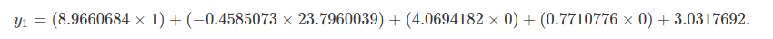

If you calculate the above, you get a value of *y*1=
1.087196. Again, this is a close estimate – closer than we would
typically be able to get because when we collect real data, we cannot
see the actual value of `ep` (*ϵ*, the error). But it isn’t exact for
the same reason as in [Exercise 1](#E1) and [Exercise 2](#E2). Our
coefficients from the `lm` are *estimates*. We can predict `y` *exactly*
if we instead use the values that we parameterised the model with above.

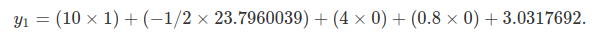

With the above, we return the exact value (differences due to rounding)
in the table, *y*1= 1.1337672.

I hope that this helps clarify the relationship among model coefficients
for different types of variables and interactions. I encourage you to
simulate your own data with different structures and explore linear
model predictions.
