Ordination is a useful tool for visualising [multivariate
data](https://en.wikipedia.org/wiki/Multivariate_analysis). This post
focuses on explaining and demonstrating [principal component
analysis](https://en.wikipedia.org/wiki/Principal_component_analysis) in
the R programming language. Examples will use [morphological
data](https://github.com/StirlingCodingClub/ordination/master/wing_loadings.csv)
from [six
species](http://bradduthie.github.io/DuthieEtAl2015_Appendix.pdf#page=3)
of fig wasps in a community associated with the Sonoran Desert Rock Fig
(*Ficus petiolaris*). These notes are also available as
[PDF](https://stirlingcodingclub.github.io/ordination/index.pdf) and
[DOCX](https://stirlingcodingclub.github.io/ordination/index.docx)
documents.

Contents
========

-   [Introduction: What is ordination?](#intro)
-   [Principal Component Analysis: key concepts](#pca)
-   [Fig wasp morphological data](#wasps)
-   [Principal Component Analysis in R](#Rcode)
-   [Principal Component Analysis: matrix algebra](#maths)
-   [Conclusions](#conclusions)
-   [Literature Cited](#refs)

<a name="intro">Introduction: What is ordination?</a>
=====================================================

Ordination is a method for investigating and visualising multivariate
data. It allows us to look at and understand variation in a data set
when there are too many dimensions to see everything at once. Imagine a
data set with four different variables. I have [simulated
one](https://StirlingCodingClub.github.io/simulating_data/index.html)
below.

<table>
<thead>
<tr class="header">
<th></th>
<th style="text-align: right;">Variable_1</th>
<th style="text-align: right;">Variable_2</th>
<th style="text-align: right;">Variable_3</th>
<th style="text-align: right;">Variable_4</th>
</tr>
</thead>
<tbody>
<tr class="odd">
<td>Sample_1</td>
<td style="text-align: right;">-2.5451133</td>
<td style="text-align: right;">-3.9500749</td>
<td style="text-align: right;">7.8464975</td>
<td style="text-align: right;">2.766672</td>
</tr>
<tr class="even">
<td>Sample_2</td>
<td style="text-align: right;">3.2477675</td>
<td style="text-align: right;">3.4760625</td>
<td style="text-align: right;">-2.3995023</td>
<td style="text-align: right;">-1.182870</td>
</tr>
<tr class="odd">
<td>Sample_3</td>
<td style="text-align: right;">-0.6877629</td>
<td style="text-align: right;">-0.7397931</td>
<td style="text-align: right;">-2.8111469</td>
<td style="text-align: right;">-3.116167</td>
</tr>
<tr class="even">
<td>Sample_4</td>
<td style="text-align: right;">6.3051664</td>
<td style="text-align: right;">7.0353541</td>
<td style="text-align: right;">3.9846948</td>
<td style="text-align: right;">5.041556</td>
</tr>
<tr class="odd">
<td>Sample_5</td>
<td style="text-align: right;">6.9313623</td>
<td style="text-align: right;">8.8022411</td>
<td style="text-align: right;">2.1824629</td>
<td style="text-align: right;">7.325775</td>
</tr>
<tr class="even">
<td>Sample_6</td>
<td style="text-align: right;">7.4017102</td>
<td style="text-align: right;">7.1630883</td>
<td style="text-align: right;">2.7586905</td>
<td style="text-align: right;">6.200012</td>
</tr>
<tr class="odd">
<td>Sample_7</td>
<td style="text-align: right;">3.9459543</td>
<td style="text-align: right;">2.8963153</td>
<td style="text-align: right;">-2.7180588</td>
<td style="text-align: right;">4.393387</td>
</tr>
<tr class="even">
<td>Sample_8</td>
<td style="text-align: right;">4.8989947</td>
<td style="text-align: right;">4.4714217</td>
<td style="text-align: right;">-1.7286940</td>
<td style="text-align: right;">-2.151782</td>
</tr>
<tr class="odd">
<td>Sample_9</td>
<td style="text-align: right;">4.6288730</td>
<td style="text-align: right;">5.5138444</td>
<td style="text-align: right;">-0.1728121</td>
<td style="text-align: right;">-0.386828</td>
</tr>
<tr class="even">
<td>Sample_10</td>
<td style="text-align: right;">5.4347918</td>
<td style="text-align: right;">6.3799012</td>
<td style="text-align: right;">-0.7839551</td>
<td style="text-align: right;">-1.398544</td>
</tr>
<tr class="odd">
<td>Sample_11</td>
<td style="text-align: right;">-3.6442131</td>
<td style="text-align: right;">-3.0109710</td>
<td style="text-align: right;">-1.4224157</td>
<td style="text-align: right;">1.325423</td>
</tr>
<tr class="even">
<td>Sample_12</td>
<td style="text-align: right;">5.8615931</td>
<td style="text-align: right;">4.1594303</td>
<td style="text-align: right;">1.3349006</td>
<td style="text-align: right;">-3.609531</td>
</tr>
</tbody>
</table>

We could look at the distribution of each variable in columns 1-4
individually using a histogram. Or we could use a scatterplot to look at
two variables at the same time, with one variable plotted in one
dimension (horizontal x-axis) and a second variable plotted
[orthogonally](https://en.wikipedia.org/wiki/Orthogonality) (i.e., at a
right angle) in another dimension (y-axis). I have done this below with
a histogram for `Variable_1`, and with a scatterplot of `Variable_1`
versus `Variable_2`. The numbers in the scatterplot points correspond to
the sample number (i.e., rows 1-12).

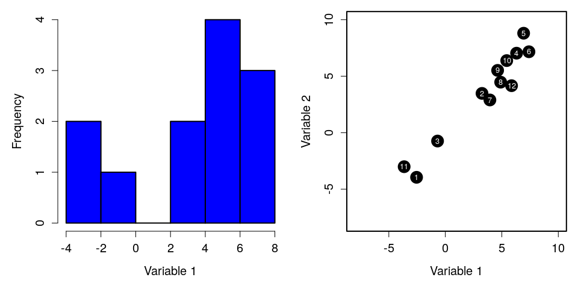

Since we do not have four dimensions of space for plotting, we cannot
put all four variables on a scatterplot that we can visualise with an
axis for each variable. Hence, in the scatterplot to the right above, we
are ignoring `Variable_3` and `Variable_4`.

For variables 1 and 2, we can see that Sample\_1 is similar to
Sample\_11 because the points are close together, and that Sample\_1 is
different from Sample\_5 because the points are relatively far apart.
But it might be useful to see the distance between Sample\_1,
Sample\_11, and Sample\_5 while simultaneously taking into account
Variables 3 and 4. More generally, it would be useful to see how distant
different points are from one another given all of the dimensions in the
data set. Ordination methods are a tools that try to do this, allowing
us to visualise high-dimensional variation in data in a reduced number
of dimensions (usually two).

It is important to emphasise that ordination is a tool for exploring
data and reducing dimensionality; it is not a method of hypothesis
testing (i.e., not a type of [linear
model](https://stirlingcodingclub.github.io/linear_modelling/index.html)).
Variables in ordinations are interpreted as response variables (i.e.,
*y* variables in models where
*y**i* = *β*0 + *β*1*x**i* + *ϵ**i*).
Ordinations visualise the total variation in these variables, but do not
test relationships between dependent (*x*) and independent (*y*)
variables.

These notes will focus entirely on Principal Component Analysis (PCA),
which is just one of many ordination methods (perhaps the most commonly
used). After reading these notes, you should have a clear [conceptual
understanding](#pca) of how a PCA is constructed, and how to read one
when you see one in the literature. You should also be able to [build
your own PCA](#Rcode) in R using the code below. For most biologists and
environmental sciences, this should be enough knowledge to allow you use
PCA effectively in your own research. I have therefore kept the maths to
a minimum when explaining the key ideas, putting all of the [matrix
algebra](#maths) underlying PCA into a single section toward the end.

<a name="pca">Principal Component Analysis: key concepts</a>
============================================================

Imagine a scatterplot of data, with each variable getting its own axis
representing some kind of measurement. If there are only two variables,
as with the scatterplot above, then we would only need an x-axis and a
y-axis to show the *exact* position of each data point in data space. If
we add a third variable, then we would need a z-axis, which would be
orthogonal to the x-axis and y-axis (i.e., three dimensions of data
space). If we need to add a fourth variable, then we would need yet
another axis along which our data points could vary, making the whole
data space extremely difficult to visualise. As we add yet more
variables and more axes, the position that our data points occupy in
data space becomes impossible to visualise.

Principal Component Analysis (PCA) can be interpreted as a rotation of
data in this multi-dimensional space. The distance between data points
does not change at all; the data are just moved around so that the total
variation in the data set is easier to see. If this verbal explanation
is confusing, that is okay; a visual example should make the idea easier
to understand. To make everything easy to see, I will start with only
two dimensions using Variable\_1 and Variable\_2 from earlier (for now,
just ignore the existence of Variables 3 and 4). Notice from the
scatterplot that there is variation in both dimensions of the data; the
variance of Variable\_1 is 13.89, and the variance of Variable\_2 is
16.73. But these variables are also clearly correlated. A sample for
which Variable\_1 is measured to be high is also very likely measure a
high value of Variable\_2 (perhaps these are measurements of animal
length and width).

What if we wanted to show as much of the total variation as possible
just on the x-axis? In other words, rotate the data so that the
maximimum amount of variance in the full data set (i.e., in the
scatterplot) falls along the x-axis, with any variation remaining being
left to fall along the y-axis? To do this, we need to draw a line that
cuts through our two dimensions of space in the direction where the data
are most stretched out (i.e., have the highest variance); **this
direction is our first Principal component, PC1**. I have drawn it below
in red (left panel).

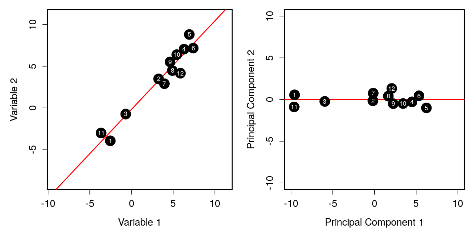

To build our PCA, all that we need to do is take this red line and drag
it to the x-axis so that it overlaps with *y* = 0 (right panel). As we
move Principal Component 1 (PC1) to the x-axis, we bring all of the data
points with it, preserving their distances from PC1 and each other.
Notice in the panel to the right above that the data have the same shape
as they do in the panel to the left. The distances between points have
not changed at all; everything has just been moved. Sample\_1 and
Sample\_11 are just as close to each other as they were in the original
scatterplot, and Sample\_1 and Sample\_5 are just as far away.

Principal Component 1 shows that maximum amount of variation that is
possible to show in one dimension while preserving these distances
between points. What little variation that remains is in PC2. Since we
have maximised the amount of variation on PC1, there can be no
additional covariation left between the x-axis and the y-axis. If any
existed, then we would need to move the line again because it would mean
that more variation could be still placed along the x-axis (i.e., more
variation could be squeezed out of the covariation between variables).
Hence, PC1 and PC2 are, by definition, uncorrelated. Note that this does
not mean that Variable 1 and Variable 2 are not correlated (they
obviously are!), but PC1 and PC2 are not. This is possible because PC1
and PC2 represent a mixture of Variables 1 and 2. They no longer
represent a specific variable, but a linear combination of multiple
variables.

This toy example with two variables can be extended to any number of
variables and principal components. PCA finds the axis along which
variation is maximised in any number of dimensions and makes that line
PC1. In our example with two variables, this completed the PCA because
we were only left with one other dimension, so all of the remaining
variation had to go in PC2. But when there are more variables and
dimensions, the data are rotated again around PC1 so that the maximum
amount of variation is shown in PC2 after PC1 is fixed. For three
variables, imagine a cloud of data points; first put a line through the
most elonated part of the cloud and reorient the whole thing so that
this most elongated part is the width of the cloud (x-axis), then spin
it again along this axis so that the next widest part is the height of
the cloud (y-axis). The same idea applies for data in even higher
dimensional space; the data are rotated orthogonally around each
additional Principal Component so that the amount of variation explained
with each gets progressively smaller (in practice, however, all of this
rotating is done simultaneously by the [matrix algebra](#maths)).

There are a few additional points to make before moving on to some real
data. First, PCA is not useful if the data are entirely uncorrelated. To
see why, take a look at the plot of two hypothetical (albeit ridiculous)
variables in the lower left panel. The correlation between the two
variables is zero, and there is no way to rotate the data to increase
the amount of variation shown on the x-axis. The PCA on the lower right
is basically the same figure, just moved so that the centre is on the
origin.

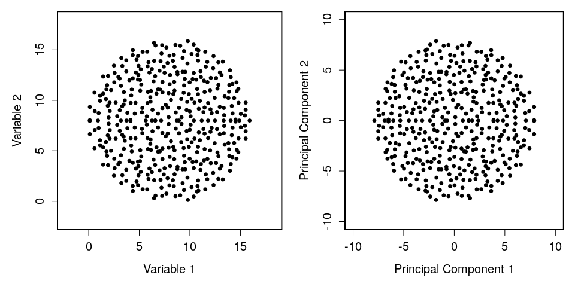

Second, if two variables are completely correlated, the maths underlying
PCA does not work because a [singluar
matrix](https://mathworld.wolfram.com/SingularMatrix.html) is created
(this is the matrix algebra equivalent of dividing by zero). Here is
what it looks like visually if two variables are completely correlated.

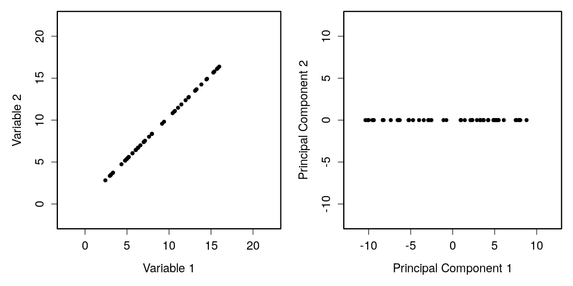

The panel on the left shows two perfectly correlated variables. The
panel on the right shows what the PCA would look like. Note that there
is no variation on PC2. One hundred percent of the variation can be
described using PC1, meaning that if we know the value of Variable\_1,
then we can certain about the value of Variable\_2.

I will now move on to introduce a morphological data set collected in
2010 from a fig wasp community surrounding the Sonoran Desert rock fig
(*Ficus petiolaris*). These data were originally published in Duthie,
Abbott, and Nason ([2015](#ref-Duthie2015b)), and they are publicly
available [on
GitHub](https://github.com/StirlingCodingClub/ordination/tree/master/data).

<a name="wasps">Fig wasp morphological data</a>
===============================================

The association between fig trees and their pollinating and seed-eating
wasps is a classic example of mutualism. The life-histories of figs and
pollinating fig wasps are well-known and fascinating (Janzen
[1979](#ref-Janzen1979); Weiblen [2002](#ref-Weiblen2002)), but less
widely known are the species rich communities of non-pollinating
exploiter species of fig wasps (Borges [2015](#ref-Borges2015)). These
non-pollinating fig wasps make use of resources within figs in a variety
of ways; some lay eggs into developing fig ovules without pollinating,
while others are parasitoids of other wasps. All of these wasps develop
alongside the pollinators and seeds within the enclosed inflorescence of
figs, and emerge as adults typically after several weeks. Part of my
doctoral work focused on the community of fig wasps that lay eggs in the
figs of *F. petiolaris* in Baja, Mexico (Duthie, Abbott, and Nason
[2015](#ref-Duthie2015b); Duthie and Nason [2016](#ref-Duthie2016)).

The community of non-pollinators associated with *F. petiolaris*
includes five species of the genera *Idarnes* (3) and *Heterandrium*
(2). Unlike pollinators, which climb into a small hole of the enclosed
infloresence and pollinate and lay eggs from inside, these
non-pollinators drill their ovipositors directly into the wall of the
fig. The left panel below shows a fig sliced in half (which often
results in hundreds of fig wasps emerging from the inside). The right
panel shows a fig on a branch.

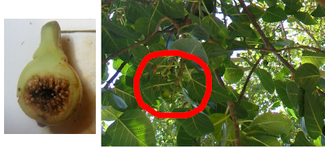

The whole fig wasp community is shown below. The pollinator is in panel
‘a’, while, panels ‘b-h’ show the non-pollinators (panels ‘g’ and ‘h’
show a host-parasitoid pair).

As part of a test for evidence of a dispersal-fecundity tradeoff in the
fig wasps in panels ‘b-f’, I estimated the mean wing loading of each
species using body volume (body volume divided by wing surface area).
This included 11 morphological measurements in total.

    fig_wasps    <- read.csv("../data/wing_loadings.csv", header = TRUE);
    fig_cols     <- colnames(fig_wasps);
    print(fig_cols);

    ##  [1] "Species"              "Site"                 "Tree"                
    ##  [4] "Fruit"                "Head_Length_mm"       "Head_Width_mm"       
    ##  [7] "Thorax_Length_mm"     "Thorax_Width_mm"      "Abdomen_Length_mm"   
    ## [10] "Abdomen_Width_mm"     "Ovipositor_Length_mm" "Ovipositor_Width_mm" 
    ## [13] "Forewing_Area_mm.2"   "Hindwing_Area_mm.2"   "Forewing_Length_mm"

Below, I will run a PCA in R to look at the total variation in
non-pollinating fig wasp morphology. To keep things simple, I will focus
just on the two species of *Heterandrium* (panels ‘e, f’ in the image
above).

<a name="Rcode">Principal Component Analysis in R</a>
=====================================================

First, I will trim down the data set in `fig_wasps` that I read in above
to remove all species that are not in the genus *Heterandrium*. There
are two species of *Heterandrium* that I will put into a single data
set.

    het1 <- fig_wasps[fig_wasps[,1] == "Het1",] # Species in panel 'f' above
    het2 <- fig_wasps[fig_wasps[,1] == "Het2",] # Species in panel 'e' above
    het  <- rbind(het1, het2);

This leaves us with a data frame with 32 rows and 15 columns. In total,
there are 16 measurements from samples of ‘Het1’ and 16 measurements
from samples of ‘Het2’.

Because PCA requires matrix manipulations, we need the R object holding
the data to be a matrix. To do this, we can get rid of the first four
columns of data. These columns include the species names, and the site,
tree, and fruit from which the fig wasp was collected.

    dat <- het[,-(1:4)]; # Remove columns 1 through 4

We now need to define `dat` as a matrix.

    dat <- as.matrix(dat);

This leaves us with the final version of the data set that we will use.
It includes 11 columns of morphological measurements.

    head(dat);

    ##      Head_Length_mm Head_Width_mm Thorax_Length_mm Thorax_Width_mm
    ## [1,]          0.566         0.698            0.767           0.494
    ## [2,]          0.505         0.607            0.784           0.527
    ## [3,]          0.511         0.622            0.769           0.511
    ## [4,]          0.479         0.601            0.766           0.407
    ## [5,]          0.545         0.707            0.828           0.561
    ## [6,]          0.525         0.651            0.852           0.590
    ##      Abdomen_Length_mm Abdomen_Width_mm Ovipositor_Length_mm
    ## [1,]             1.288            0.504                0.376
    ## [2,]             1.059            0.430                0.274
    ## [3,]             1.107            0.504                0.359
    ## [4,]             1.242            0.446                0.331
    ## [5,]             1.367            0.553                0.395
    ## [6,]             1.408            0.618                0.350
    ##      Ovipositor_Width_mm Forewing_Area_mm.2 Hindwing_Area_mm.2
    ## [1,]               0.098              1.339              0.294
    ## [2,]               0.072              0.890              0.195
    ## [3,]               0.062              0.975              0.214
    ## [4,]               0.065              0.955              0.209
    ## [5,]               0.081              1.361              0.361
    ## [6,]               0.085              1.150              0.308
    ##      Forewing_Length_mm
    ## [1,]              2.122
    ## [2,]              1.765
    ## [3,]              1.875
    ## [4,]              1.794
    ## [5,]              2.130
    ## [6,]              1.981

These 11 columns are our variables 1-11. Our fly measurements thereby
occupy some position in 11-dimensional space on 11 orthogonal axes,
which is way too complex to visualise all at once. We can first take a
look at all of the possible scatterplots using `pairs`.

    pairs(x = dat, gap = 0, cex.labels = 0.5);

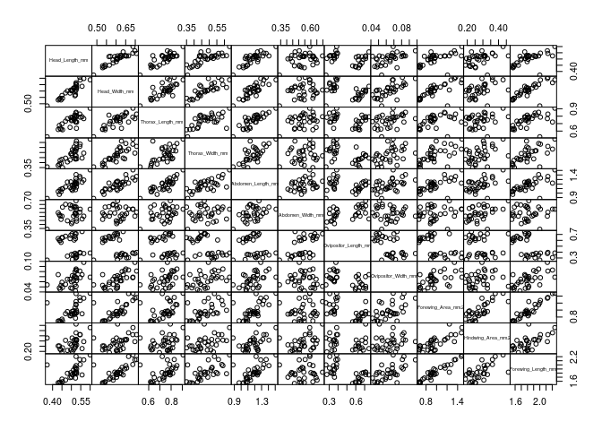

There is not much that we can infer from this, except that most of the
variables appear to be highly correlated. A PCA is therefore likely to
be useful. Before building the PCA, it is probably a good idea to scale
all of our variables. This would be especially important if we had
variables measured in different units. If we do not scale the variables
to have the same mean and standard deviation, then the PCA could
potentially be affected by the units in which variables were measured,
which does not make sense. If, for example, we had measured thorax
length and width in *m**m*2, but abdomen length and width in
*c**m*2, then we would get thorax measurements contributing
more to PC1 just because the measured values would be larger (if you do
not believe me, try multiplying all values in one column of the data by
10 or 100, then re-run the PCA below). For data sets that include
measurements with much different unit scales (e.g., pH versus elevation
in metres above sea level), this is especially problematic. I will
therefore scale the data below.

    dat <- scale(dat);

Now every variable has a mean of zero and a standard deviation of one.
We are finally ready to build our PCA, using only one line of code.

    pca_dat <- prcomp(dat);

That is it. Here is what the output looks like when printed out. Do not
worry about the details. I will come back to explain it later.

    ## Standard deviations (1, .., p=11):
    ##  [1] 2.5247440 1.3801063 1.0554983 0.7327957 0.5851569 0.5002464 0.4027246
    ##  [8] 0.3451656 0.3368968 0.2424040 0.1538419
    ## 
    ## Rotation (n x k) = (11 x 11):
    ##                              PC1          PC2         PC3         PC4
    ## Head_Length_mm       -0.34140280  0.163818591 -0.28767452  0.12186387
    ## Head_Width_mm        -0.37329512  0.009539983 -0.18750714 -0.02689984
    ## Thorax_Length_mm     -0.31043223  0.212467054 -0.34643613  0.07575953
    ## Thorax_Width_mm      -0.32914664 -0.026143927 -0.12608860  0.52180693
    ## Abdomen_Length_mm    -0.35080667  0.215792603 -0.12967361 -0.02261804
    ## Abdomen_Width_mm     -0.09942693  0.628750876  0.20976550 -0.20080986
    ## Ovipositor_Length_mm  0.18174394  0.587847182 -0.03746881 -0.21192676
    ## Ovipositor_Width_mm  -0.26652653 -0.260592830 -0.19455961 -0.77915529
    ## Forewing_Area_mm.2   -0.34255769 -0.133512606  0.39772561 -0.03554531
    ## Hindwing_Area_mm.2   -0.25340037  0.132093495  0.65445796  0.05921015
    ## Forewing_Length_mm   -0.34758221 -0.191325254  0.24411693 -0.09382015
    ##                              PC5          PC6         PC7          PC8
    ## Head_Length_mm       -0.08112505  0.505176595 -0.01398414  0.364561108
    ## Head_Width_mm        -0.17070577  0.120110305  0.03774836  0.474486398
    ## Thorax_Length_mm      0.54292261 -0.176608183 -0.42642232 -0.304654846
    ## Thorax_Width_mm      -0.56028055 -0.113250947  0.14497291 -0.500898934
    ## Abdomen_Length_mm     0.22638163 -0.196597233  0.12804621  0.005214056
    ## Abdomen_Width_mm     -0.25555292 -0.542657091  0.10605929  0.215945914
    ## Ovipositor_Length_mm  0.01296918  0.530782226  0.27984207 -0.397709709
    ## Ovipositor_Width_mm  -0.32473973 -0.002741201 -0.17249250 -0.261382659
    ## Forewing_Area_mm.2    0.21024273  0.065140892  0.23416076 -0.001060866
    ## Hindwing_Area_mm.2   -0.10607059  0.258514312 -0.57477991 -0.078216349
    ## Forewing_Length_mm    0.27922395  0.020406736  0.52403579 -0.137734836
    ##                               PC9        PC10         PC11
    ## Head_Length_mm       -0.225828822  0.54868461 -0.109825693
    ## Head_Width_mm         0.053630473 -0.71589314  0.197911013
    ## Thorax_Length_mm     -0.328182916 -0.15625131 -0.002758449
    ## Thorax_Width_mm      -0.022217714 -0.03937269 -0.045797240
    ## Abdomen_Length_mm     0.815797870  0.20281032 -0.007815979
    ## Abdomen_Width_mm     -0.285403216  0.10473716 -0.019244867
    ## Ovipositor_Length_mm  0.051323247 -0.23210236 -0.014135669
    ## Ovipositor_Width_mm  -0.003649773  0.09266248 -0.063094898
    ## Forewing_Area_mm.2   -0.094481435 -0.16839713 -0.751543357
    ## Hindwing_Area_mm.2    0.141382511  0.02013088  0.227054769
    ## Forewing_Length_mm   -0.243686582  0.13097688  0.570684702

If we want to plot the first two principle components, we can do so with
the following code. Note that `pca_dat$x` is a matrix of the same size
as our original data set, but with values that plot the data on the PC
axes.

    par(mar = c(5, 5, 1, 1));
    plot(x = pca_dat$x[,1], y = pca_dat$x[,2], asp = 1, cex.lab = 1.25, 
         cex.axis = 1.25, xlab = "PC1", ylab = "PC2");

Ignore the arguments that start with `cex`; these are just plotting
preferences. But the argument `asp = 1` is important; it ensures that
one unit along the x-axis is the same distance as one unit along the
y-axis. If this were not set, then the distance between any two points
might be misleading. If, for example, moving 100 pixels on the x-axis
corresponded to one unit on PC1, but moving 100 pixels on the y-axis
corresponded to two units in PC2, then the variation in PC1 would look
larger relative to PC2 than it should.

Note that we are not at all restricted to comparing PC1 and PC2. We can
look at any of the 11 PCs that we want. Below compares PC1 with PC3.

    par(mar = c(5, 5, 1, 1));
    plot(x = pca_dat$x[,1], y = pca_dat$x[,3], asp = 1, cex.lab = 1.25, 
         cex.axis = 1.25, xlab = "PC1", ylab = "PC3");

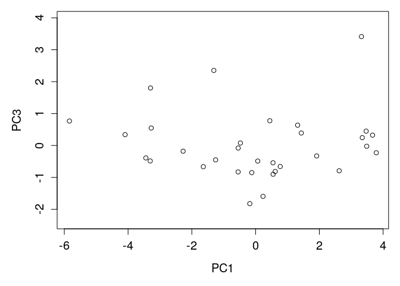

Note that the points are in the same locations on the x-axis (PC1) as
before, but not the y-axis (now PC3). We have just rotated 90 degrees in
our 11-dimensional space and are therefore looking at our cloud of data
from a different angle.

Recall that we had two groups in these data; two species of the genus
*Heterandrium*. Now that we have plotted the position of all wasp
measurements, we can also fill in the PCA with colours representing each
species. This allows us to visualise how individuals in different groups
are separated in our data.

    par(mar = c(5, 5, 1, 1));
    plot(x = pca_dat$x[,1], y = pca_dat$x[,2], asp = 1, cex.lab = 1.25, 
         cex.axis = 1.25, xlab = "PC1", ylab = "PC2");
    h1_rw <- which(het[,1] == "Het1"); # Recall the original data set
    h2_rw <- which(het[,1] == "Het2"); # Recall the original data set
    points(x = pca_dat$x[h1_rw,1], y = pca_dat$x[h1_rw,2], pch = 20, col = "red");
    points(x = pca_dat$x[h2_rw,1], y = pca_dat$x[h2_rw,2], pch = 20, col = "blue");
    legend("topleft", fill = c("red", "blue"), cex = 1.5, 
           legend = c( expression(paste(italic("Heterandrium "), 1)), 
                       expression(paste(italic("Heterandrium "), 2))));

From the groups overlaid onto the PCA, it is clear that these two
species of *Heterandrium* differ in their morphological measurements.
Often groups are not so clearly distinguished (i.e., data are usually
more messy), and it is important to again remember that the PCA is not
actually testing any statistical hypothesis. It is just plotting the
data. If we wanted to test whether or not the difference between species
measurements was statistically significant, then we would need to use
some sort of appropriate multivariate test, such as a
[MANOVA](https://en.wikipedia.org/wiki/Multivariate_analysis_of_variance)
(that is, a [linear
model](https://stirlingcodingclub.github.io/linear_modelling/) with
multiple continuous dependent variables and a single categorical
independent variable), or an appropriate [randomisation
approach](https://stirlingcodingclub.github.io/randomisation/randomisation_notes.html).

We can look at the amount of variation explained by each PC by examining
`pca_dat$sdev`, which reports the standard deviations of the principal
components.

    pca_variance      <- (pca_dat$sdev) * (pca_dat$sdev); # Get variance
    print(pca_variance);

    ##  [1] 6.37433235 1.90469347 1.11407673 0.53698949 0.34240864 0.25024647
    ##  [7] 0.16218711 0.11913928 0.11349942 0.05875972 0.02366733

To make it more easy to interpret the variances along each PC, we can
use a [screeplot](https://en.wikipedia.org/wiki/Scree_plot). There is a
function for this in base R, which takes the direct output of the
`prcomp` function.

    screeplot(pca_dat, npcs = 11, main = "", type = "lines", cex.lab = 1.5);

The screeplot above provides a useful indication of how much variation
explained decreases per PC (or how much variation is explained by the
first *n* axes). To make things even easier to visualise, it might help
to present the above in terms of per cent of the variance explained on
each axis.

    pca_pr_explained  <- pca_variance / sum(pca_variance);
    print(pca_pr_explained);

    ##  [1] 0.579484759 0.173153952 0.101279703 0.048817227 0.031128058 0.022749679
    ##  [7] 0.014744282 0.010830844 0.010318129 0.005341792 0.002151575

Note that all of the values above sum to 1. It appears that about 75.26
per cent of the total variation is explained by PC1 and PC2, so we are
looking at a lot of variation in the PCA showed above. We can plot the
proportion of the variation explained by each PC in a bar plot.

    pc_names <- paste("PC", 1:length(pca_pr_explained), sep = "");
    barplot(height = pca_pr_explained * 100, names = pc_names, cex.names = 0.8,
            ylab = "Per cent of total variation explained", cex.lab = 1.25);

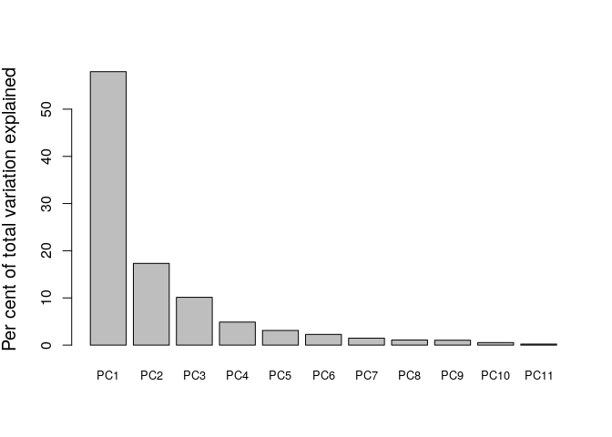

Notice that the general pattern of the barplot above is the same as the
screeplot.

We can also look at a biplot (i.e., a loading plot). The biplot below
shows the first two principal components (data points are now numbers 1
to 32, indicating the sample or row number of the fig wasp from the
original scaled data set, `dat`), but also the direction of each of our
original variables (morphological measurements) in relation to these
principal components.

    biplot(pca_dat, cex = 0.8, asp = 1);

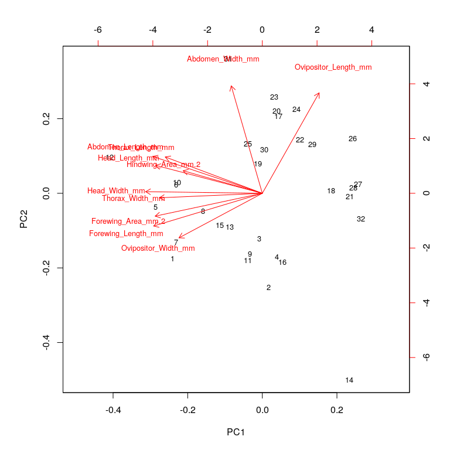

The direction of the red arrows shows the relationships among the 11
different variables. Intuitively, variables with arrows pointing in
similar directions are positively correlated, while those pointing in
opposite directions are negatively correlated (more technically, the
cosine of the angle between arrows, in radians, actually equals the
correlation between them; e.g., cos(0) = 1 and cos(*π*) = -1; recall
that *π* radians equals 180 degrees). In the above example, wasp head
width and thorax width are highly correlated because the two arrows are
pointing in very similar directions. In contrast, ovipositor length and
ovipositor width appear to be pointing in very different directions on
PC1 and PC2, suggesting that the two variables are negatively
correlated.

The direction of these arrows is determined by the loading of each
variable on PC1 and PC2. The loading is the value that you would need to
multiply each variable by to get the score of a data point on the
principal component. The loadings can be found in the `pca_dat` results
as `pca_dat$rotation`. I will just show the loadings for the first two
principle components below.

    print(pca_dat$rotation[,1:2]); # Note: 11 total columns; one for each PC

    ##                              PC1          PC2
    ## Head_Length_mm       -0.34140280  0.163818591
    ## Head_Width_mm        -0.37329512  0.009539983
    ## Thorax_Length_mm     -0.31043223  0.212467054
    ## Thorax_Width_mm      -0.32914664 -0.026143927
    ## Abdomen_Length_mm    -0.35080667  0.215792603
    ## Abdomen_Width_mm     -0.09942693  0.628750876
    ## Ovipositor_Length_mm  0.18174394  0.587847182
    ## Ovipositor_Width_mm  -0.26652653 -0.260592830
    ## Forewing_Area_mm.2   -0.34255769 -0.133512606
    ## Hindwing_Area_mm.2   -0.25340037  0.132093495
    ## Forewing_Length_mm   -0.34758221 -0.191325254

We can see how the loadings of each variable match up with each arrows
by going back to the output of `pca_dat`. To get the direction of the
arrows, we need to multiply the loadings in `pca_dat$rotation` above by
the standard deviation of each principle component in `pca_dat$sdev`. I
do this below to show how we can manually reproduce the position of the
red arrows from the `pca_dat` output.

    biplot(pca_dat, cex = 0.8, asp = 1);
    # Note that the arrows are scaled by a factor of ca 4.5, hence the scaling below
    points(x = 4.5 * pca_dat$sdev[1] * pca_dat$rotation[,1],
           y = 4.5 * pca_dat$sdev[2] * pca_dat$rotation[,2],
           col = "blue", pch = 20, cex = 1.5);

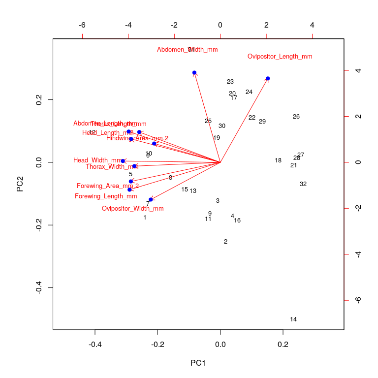

I hope that this clarifies how to produce and interpret a PCA, a
screeplot, and a biplot in R. I also hope that the output that I showed
earlier generated generated from `prcomp(dat)` is now clear. For one
last illustration to further connect this output with the PCA, I will
reproduce a PCA just from the original data points in `dat` and the
loadings for PC1 and PC2 found in the output of `prcomp(dat)`,
`pca_dat`. For each fly, we take the sum of each measurement times its
corresponding loading on PC1 and PC2. Hence, the position of the first
wasp in `dat` (first row) on PC1 would be found by multipling `dat[1,]`
times `pca_dat$rotation[,1]`. Here is a reminder of what `dat[1,]` looks
like.

    ##       Head_Length_mm        Head_Width_mm     Thorax_Length_mm 
    ##            1.3692840            1.7033618            0.3158512 
    ##      Thorax_Width_mm    Abdomen_Length_mm     Abdomen_Width_mm 
    ##            0.2036821            0.8331580           -0.4356985 
    ## Ovipositor_Length_mm  Ovipositor_Width_mm   Forewing_Area_mm.2 
    ##           -0.7493047            2.4779288            1.5324901 
    ##   Hindwing_Area_mm.2   Forewing_Length_mm 
    ##            0.1659505            1.6125831

Here are the loadings for PC1 (`pca_dat$rotation[,1]`).

    ##       Head_Length_mm        Head_Width_mm     Thorax_Length_mm 
    ##          -0.34140280          -0.37329512          -0.31043223 
    ##      Thorax_Width_mm    Abdomen_Length_mm     Abdomen_Width_mm 
    ##          -0.32914664          -0.35080667          -0.09942693 
    ## Ovipositor_Length_mm  Ovipositor_Width_mm   Forewing_Area_mm.2 
    ##           0.18174394          -0.26652653          -0.34255769 
    ##   Hindwing_Area_mm.2   Forewing_Length_mm 
    ##          -0.25340037          -0.34758221

We calculate the sum of each element multiplied together: (1.369284 ×
-0.3414028) + (1.7033618 × -0.3732951) + ... + (1.6125831 × -0.3475822).
This gives a value of -3.4415217, which is the location of the first
data point on PC1. When we do this calculation for PC1 and PC2 for all
of the data, we can get the coordinates to plot on our PCA. I do this
with the code below. Note that the `for`
[loop](https://stirlingcodingclub.github.io/using_loops/loop_notes.html)
is just cycling through each individual wasp sample (do not worry about
this if the code is unfamiliar).

    plot(x = 0, y = 0, type = "n", xlim = c(-6.2, 4.2), ylim = c(-4, 3), asp = 1,
         xlab = "PC1", ylab = "PC2", cex.axis = 1.25, cex.lab = 1.25);
    for(i in 1:dim(dat)[1]){ # Take the sum of the measurements times PC loadings
      pt_PC1 <- sum(dat[i,] * pca_dat$rotation[,1]); # measurements times loadings 1
      pt_PC2 <- sum(dat[i,] * pca_dat$rotation[,2]); # measurements times loadings 2
      points(x = pt_PC1, y = pt_PC2, cex = 4, col = "black", pch = 20);
      text(x = pt_PC1, y = pt_PC2, col = "white", labels = i, cex = 0.8);
    }

Those who are satisfied with their conceptual understanding of PCA, and
the ability to use PCA in R, can stop here. In the next section, I will
explain how PCA works mathematically.

<a name="maths">Principal Component Analysis: matrix algebra</a>
================================================================

A Principal Component Analysis is basically just an
[eigenanalysis](https://en.wikipedia.org/wiki/Eigenvalues_and_eigenvectors)
of a [covariance
matrix](https://en.wikipedia.org/wiki/Covariance_matrix). I will present
the maths underlying this and show the calculations in some detail, but
a full explanation of matrix algebra, and [eigenvalues and
eigenvectors](https://en.wikipedia.org/wiki/Eigenvalues_and_eigenvectors)
is beyond the scope of these notes. Following my approach in the [key
concepts](#pca) section above, I am going to try to present the key
calculations and some of the key mathematical ideas using two dimensions
to make everything easier to calculate and visualise. First, a reminder
of what our simulated data look like from the first section.

    ##           Variable_1 Variable_2 Variable_3 Variable_4
    ## Sample_1  -2.5451133 -3.9500749  7.8464975   2.766672
    ## Sample_2   3.2477675  3.4760625 -2.3995023  -1.182870
    ## Sample_3  -0.6877629 -0.7397931 -2.8111469  -3.116167
    ## Sample_4   6.3051664  7.0353541  3.9846948   5.041556
    ## Sample_5   6.9313623  8.8022411  2.1824629   7.325775
    ## Sample_6   7.4017102  7.1630883  2.7586905   6.200012
    ## Sample_7   3.9459543  2.8963153 -2.7180588   4.393387
    ## Sample_8   4.8989947  4.4714217 -1.7286940  -2.151782
    ## Sample_9   4.6288730  5.5138444 -0.1728121  -0.386828
    ## Sample_10  5.4347918  6.3799012 -0.7839551  -1.398544
    ## Sample_11 -3.6442131 -3.0109710 -1.4224157   1.325423
    ## Sample_12  5.8615931  4.1594303  1.3349006  -3.609531

Again, I am just going to use the first two columns of data, so I will
create a truncated data set `eg_m` using just two of the columns from
above.

    eg_m <- eg_mat[,1:2]; # Now we have an R object with just two columns

We can start by just running a PCA as we did in the [section
above](#Rcode) with `pr_comp`.

    prcomp(eg_m);

    ## Standard deviations (1, .., p=2):
    ## [1] 5.4884709 0.7028355
    ## 
    ## Rotation (n x k) = (2 x 2):
    ##                  PC1        PC2
    ## Variable_1 0.6724162  0.7401733
    ## Variable_2 0.7401733 -0.6724162

Here is our starting point, with standard deviations and loadings for
each PC that we know are correct. Now we can attempt to do this whole
analysis manually, without the `prcomp` function. To start, we need to
get the covariance matrix of the data. A covariance matrix is just a
square matrix in which off-diagonal elements hold the covariance between
variable *X**i* and *X**j* in row *i* and column
*j*. Diagonal elements (upper left to lower right) hold the variance of
variable *X**i* (i.e., the covariance between
*X**i* and itself, where *i* is both the row and column),

$$
V = \begin{array}\left(
  Var(X_{1}), & Cov(X_{1}, X_{2}) \\
  Cov(X_{2}, X_{1}), & Var(X_{2}) \right) \\
\end{array}.
$$

[Covariance](https://en.wikipedia.org/wiki/Covariance) and
[variance](https://en.wikipedia.org/wiki/Variance) are calculated as
usual. In R, we can easily get the covariance matrix using the `cov`
function.

    V <- cov(eg_m); # Variance covariance matrix of two simulated measurements
    print(V);

    ##            Variable_1 Variable_2
    ## Variable_1   13.89069   14.74665
    ## Variable_2   14.74665   16.72660

Note that the matrix is
[symmetric](https://en.wikipedia.org/wiki/Symmetric_matrix), meaning
that the **V** equals its own transpose (i.e., we can swap the elements
in row *i* column *j* for the elements in row *j* column *i* and get the
same matrix). What we need now are the eigenvalues and eigenvectors of
**V**. R will calculate these with the function `eigen`, which I will do
below.

    eigen(V); # Eigenvalues and eigenvectors of V

    ## eigen() decomposition
    ## $values
    ## [1] 30.1233128  0.4939777
    ## 
    ## $vectors
    ##           [,1]       [,2]
    ## [1,] 0.6724162 -0.7401733
    ## [2,] 0.7401733  0.6724162

Notice that the eigenvectors are identical to the loadings from our
`prcomp(eg_m)` above. This is because our principle components are just
the eigenvectors of the covariance matrix. Similarly, the eigenvalues
printed above are just the variances of each principal component, equal
to the standard deviations output from `prcomp(eg_m)` squared. If we
take the square root of them, we get the standard devations back.

What are eigenvectors and eigenvalues, really? I will try to explain
without being too formal with the mathematics. First, a very quick
review of vectors. We can imagine a vector **x** as an arrow pointing to
some point in multidimensional space, and represented by a list of
numbers that indicate how far from the origin it points in each
dimension. For a really simple example, we can take the vector
**x** = (2, 1), and visualise it on a plane.

    u <- c(2, 1);
    plot(x = 0, y = 0, type = "n", xlim = c(-1, 3), ylim = c(-1, 3), xlab = "",
         ylab = "");
    arrows(x0 = 0, y0 = 0, x1 = u[1], y1 = u[2], length = 0.1, lwd = 3);
    abline(h = 0, lty = "dotted", lwd = 0.8);
    abline(v = 0, lty = "dotted", lwd = 0.8);

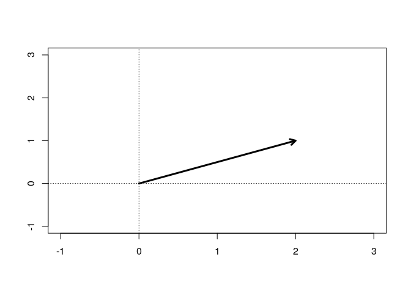

An *eigenvector* (*u*) is a vector that can be multiplied by its
corresponding *eigenvalue* (*λ*) to give the same vector as you would
get by multiplying a matrix **V** by the same eigenvector,

**Vu** = *λ***u**.

It is important to remember that matrix multiplication is different from
scalar multiplication. When we multiply two matrices, we do not just
multiply the element in row *i* and column *j* in one matrix by row *i*
and column *j* in the other matrix. Matrix multiplication is a series of
multiplying row elements of one matrix by the column elements of
another, and summing these products between elements. It will be easier
to illustrate with an example. Take our covariance matrix **V** and the
example vector **x**. By multiplying row 1 by the column vector **x**,
then row 2 by the column vector **x**, we get the following vector,

$$
\\begin{bmatrix}
  13.89, & 14.75 \\\\
  14.75, & 16.73
\\end{bmatrix}
\\begin{bmatrix}
  2 \\\\
  1
\\end{bmatrix} = 
\\begin{bmatrix}
  42.53 \\\\
  46.22
\\end{bmatrix}
$$

We can confirm this the long way by getting the first element of the
product, (13.89 × 2) + (14.75 × 1)= 42.53. Likewise, we get the second
element, (14.75 × 2) + (16.73 × 1)= 46.23. Now, note that if we take our
covariance matrix **V** and multiply it by one of our eigenvectors
calculated with `eigen` above (**Vu**), we get the same answer as if we
mutliplied our single eigenvalue by the eigenvector,

$$
\\begin{bmatrix}
  13.89, & 14.75 \\\\
  14.75, & 16.73
\\end{bmatrix} 
\\begin{bmatrix}
  0.67 \\\\
  0.74
\\end{bmatrix} = 30.12
\\begin{bmatrix}
  0.67 \\\\
  0.74
\\end{bmatrix}
$$

Try confirming for yourself that the two sides of this equation are in
fact equal (note that for the right side, you just multiply the scalar
30.12 to each element as normal, so the first element in the product
vector would be (30.12 × 0.67) = 20.1804. Mathematically, multiplying
the covariance matrix by one of its eigenvectors changes the size of
that vector (but, critically, *not* its direction) by the same amount as
multiplying it by its corresponding eigenvalue. The eigenvector
associated with the leading eigenvalue (i.e., the largest eigenvalue) is
therefore the direction along which most of the total variation lies in
multidimensional space (PC1), and the eigenvalue itself is the variance
in this direction.

I will not go through the algebra of solving for the eigenvalues and
eigenvectors here (but I could probably be convinced to do given
sufficient demand). But I will point out one more equation that might
help clarify the mathematics a bit further. Note that we can recreate
the the covariance matrix (**V**) just using the eigenvalues and
eigenvectors,

**V** = **U***Λ***U** − 1.

In the above, **V** is our covariance matrix, **U** is a matrix of our
eigenvectors, and *Λ* is a [diagonal
matrix](https://en.wikipedia.org/wiki/Diagonal_matrix) of our
eigenvalues (i.e., a matrix where all off-diagonal elements are zero).
The negative one exponent at the end tells us to find the inverse of
**U**; this is just the matrix that we need to multiply **U** by to get
back to the identity matrix (a matrix with ones in the diagonal and
zeros everywhere else). We can see what this looks like using the
eigenvalues that we calculated above from `eigen(V)`.

    U <- eigen(V)$vectors;
    print(U);

    ##           [,1]       [,2]
    ## [1,] 0.6724162 -0.7401733
    ## [2,] 0.7401733  0.6724162

We can get the inverse using `solve` in R.

    U_inv <- solve(U);
    print(U_inv);

    ##            [,1]      [,2]
    ## [1,]  0.6724162 0.7401733
    ## [2,] -0.7401733 0.6724162

Matrix multiplication in R is performed using `%*%` instead of `*`, so
we can see the relationship between `U` and `U_inv` below.

    U %*% U_inv; # Identity matrix, with a bit of a rounding error.

    ##      [,1] [,2]
    ## [1,]    1    0
    ## [2,]    0    1

Mathematically, here is what that looks like.

$$
\\begin{bmatrix}
  1, & 0 \\\\
  0, & 1
\\end{bmatrix}
 =  
\\begin{bmatrix}
  0.67, & -0.74 \\\\
  0.74, & 0.67 
\\end{bmatrix} 
\\begin{bmatrix}
  0.67, & 0.74 \\\\
  -0.74, & 0.67
\\end{bmatrix} 
$$

Hence, the inverse of a matrix is the scalar equivalent of
1 = *x*(1/*x*). We just have a value of one in each dimension. Putting
this all together, we can get back to our original covariance matrix by
inserting our eigenvalues into the right side of the equation.

$$
\\begin{bmatrix}
  13.89, & 14.75 \\\\
  14.75, & 16.73  
\\end{bmatrix}
\\begin{bmatrix}
  0.67, & -0.74 \\\\
  0.74, & 0.67  
\\end{bmatrix} 
\\begin{bmatrix}
  30.12, & 0 \\\\
  0, & 0.49  
\\end{bmatrix} 
\\begin{bmatrix}
  0.67, & 0.74 \\\\
  -0.74, & 0.67  
\\end{bmatrix}
$$

We can confirm all of this in R using our matrices `V`, `U`, and
`U_inv`, and creating a new square diagonal matrix holiding the
eigenvalues, `L`.

    L       <- matrix(data = 0, nrow = 2, ncol = 2);
    L[1, 1] <- eigen(V)$values[1];
    L[2, 2] <- eigen(V)$values[2];
    # We can print these matrices below.
    print(V); print(U); print(U_inv); print(L);

    ##            Variable_1 Variable_2
    ## Variable_1   13.89069   14.74665
    ## Variable_2   14.74665   16.72660

    ##           [,1]       [,2]
    ## [1,] 0.6724162 -0.7401733
    ## [2,] 0.7401733  0.6724162

    ##            [,1]      [,2]
    ## [1,]  0.6724162 0.7401733
    ## [2,] -0.7401733 0.6724162

    ##          [,1]      [,2]
    ## [1,] 30.12331 0.0000000
    ## [2,]  0.00000 0.4939777

Finally, we can replicate the right hand side of the equation above to
get back our original covariance matrix from the eigenvalues and
eigenvectors.

    U %*% L %*% U_inv;

    ##          [,1]     [,2]
    ## [1,] 13.89069 14.74665
    ## [2,] 14.74665 16.72660

We have now shown the mathematical relationship between our covariance
matrix and its associated eigenvectors and eigenvalues.

<a name="conclusions">Conclusions</a>
=====================================

Ordination is a useful tool for visualising and thinking about the
variation of multivariate data. Principal Components Analysis is one
method of ordination, but there are others such as Non-metric
Multidimensional Scaling (NMDS), Principal Coordinates Analysis (PCoA),
and Canonical Variates Analysis (CVA). These different types of
ordination are useful for different purposes and different data sets, so
it is worth learning a bit about them before deciding what type of
ordination is most appropriate for your own data. My hope is that this
detailed breakdown of PCA will help you understand the general
objectives of ordination, give you the ability to use PCA in your own
research, and make it easier to learn new ordination methods.

<a name="refs">Literature cited</a>
===================================

Borges, Renee M. 2015. “How to be a fig wasp parasite on the fig-fig
wasp mutualism.” *Current Opinion in Insect Science* 8. Elsevier Inc:
1–7. <https://doi.org/10.1016/j.cois.2015.01.011>.

Duthie, A Bradley, Karen C Abbott, and John D Nason. 2015. “Trade-offs
and coexistence in fluctuating environments: evidence for a key
dispersal-fecundity trade-off in five nonpollinating fig wasps.”
*American Naturalist* 186 (1): 151–58. <https://doi.org/10.1086/681621>.

Duthie, A Bradley, and John D Nason. 2016. “Plant connectivity underlies
plant-pollinator-exploiter distributions in Ficus petiolaris and
associated pollinating and non-pollinating fig wasps.” *Oikos*, In
press. <https://doi.org/10.1111/oik.02629>.

Janzen, Daniel H. 1979. “How to be a fig.” *Annual Review of Ecology and
Systematics* 10 (1): 13–51.
<https://doi.org/10.1146/annurev.es.10.110179.000305>.

Weiblen, George D. 2002. “How to be a fig wasp.” *Annual Review of
Entomology* 47: 299–330.
