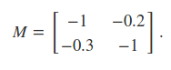

This document is a practical guide for getting started using for and while loops in R. My goal is to help readers who are familiar with R, but *unfamiliar* with using loops in R, get started coding with loops. This guide was original written for an event in Stirling Coding Club, and a version of this document (formatted slightly differently) is available [here](https://stirlingcodingclub.github.io/using_loops/loop_notes.html).

********************************************************************************

- [Introduction: What is a loop?](#what_is_loop)
- [The for loop in R: getting started](#for_gs)
- [The for loop in R: a real example](#for_re)
- [The for loop in R: nested loops](#for_more)
- [The while loop in R](#while_loop)
- [Practice problems](#practice)
- [Additional resources](#whatelse)

********************************************************************************

<a name="what_is_loop">Introduction: What is a loop?</a>
================================================================================

Being able to use loops is a critical skill in programming and working with large arrays of data. Loops make it possible to repeat a set of instructions (i.e., code) `for` a particular set of conditions (e.g., for a range of numbers from 1 to 1000), or `while` a set of conditions still applies (e.g., while a value is still greater than zero). Hence, the use of [for loops](https://en.wikipedia.org/wiki/For_loop) and [while loops](https://en.wikipedia.org/wiki/While_loop) are fundamental for writing and running code efficiently (note that [other types](https://en.wikipedia.org/wiki/Do_while_loop) of loops also exist, but I will not focus on them now). Here I will introduce the key concepts of programming with loops, with particular emphasis on getting started with some practical uses of loops in the R programming language for scientific researchers.

The R programming language includes many base level functions to perform tasks that would otherwise require loops (e.g., functions such as [apply](https://www.rdocumentation.org/packages/base/versions/3.5.2/topics/apply) and [tapply](https://www.rdocumentation.org/packages/base/versions/3.5.2/topics/tapply), which effectively repeat a set of instructions to summarise values in an array). Tens of thousands of downloadable [packages](https://cran.r-project.org/) (code, data, and documentation bundled together, written by and for R users) are available in R, most of which include their own functions that can perform specific tasks required in scientific research (e.g., [vegan](https://github.com/vegandevs/vegan), [dplyr](https://dplyr.tidyverse.org/), and [shiny](https://github.com/rstudio/shiny)). Hence, successful data analysis in R can often just be a matter of finding and using an appropriate and reliable package for a given task. Nevertheless, unique data sets and models often require unique code, so base and package functions cannot always be found to do custom tasks. In many situations, the ability to use loops to repeat tasks will make it possible to quickly and confidently develop reproducible code in data analysis. In the long term, this will likely save time; in the short term, it creates an opportunity to develop and practice coding skills.

Below I will demonstrate how to use [for loops](https://en.wikipedia.org/wiki/For_loop) and [while loops](https://en.wikipedia.org/wiki/While_loop).

- A **for loop** iterates a set of instructions *for* a predetermined set of conditions (i.e., when you know how many times you need to iterate the same set of instructions)
- A **while loop** iterates a set of instructions *while* some condition(s) remains satisfied (i.e., when you might not know how many times you need to iterate the same set of instructions, but you do know when the iterations need to stop)

It is not important to completely understand the two definitions above before getting started, just as it is not important to understand a verbal definition of 'multiplication' before learning to multiply two numbers. Seeing examples of loops in practice will make it clear how they work and when to use them. In the next section, I will therefore start with some key examples to show how for loops can be used in R. I will then do the same with while loops. Finally, I will provide some practice problems and additional resources for using loops in programming.

<a name="for_gs">The for loop in R: getting started</a>
================================================================================

Different languages have differ syntaxes for writing for loops. In R, the syntax is as follows:

```{r, eval = FALSE}
for(index in set_of_conditions){
  # Code that gets repeated for each condition
}
```

In the above, anything within the bracketed `{` `}` gets repeated with `index` being substituted, sequentially, for all possible conditions `in` the `set_of_conditions`. A more concrete example will help:

```{r, eval = FALSE}
for(i in 1:10){
  print(i);
}
```

We can interpret the line `for(i in 1:10)` verbally to explain what is going on in plain English:

> Substitute the index `i` for each value from 1 to 10 (i.e., 1, 2, 3, ..., 8, 9, 10), and run the following bracketed code with each value in sequence. In other words, run the bracketed code first with `i = 1`, then with `i = 2`, and so forth until finishing the loop with `i = 10`. 

Given the above explanation, we can predict what will happen with the example code above, which I now run below.

```{r, eval = TRUE}
for(i in 1:10){
  print(i);
}
```

The code has printed integers from 1 to 10. This is obviously a very simple example of using a loop, but it highlights the basic idea. **There are three key points that I want to note with this example before moving on**

**1. the above for loop is effectively doing the same as the code below**

```{r, eval = FALSE}
print(1);
print(2);
print(3);
print(4);
print(5);
print(6);
print(7);
print(8);
print(9);
print(10);
```

```{r, eval = TRUE, echo = FALSE}
for(i in 1:10){
  print(i);
}
```

In the above, I have [unrolled](https://en.wikipedia.org/wiki/Loop_unrolling) the for loop that printed off integers from 1 to 10. But the result is the same. The advantage of using the loop is that it avoids the need to repeat the same code more times than is necessary (consider if we wanted to print values from 1 to 10000 -- much less needs to be changed when using the for loop, and much fewer lines of code need to be written). There is no hard rule for when to use a loop versus when to repeat the same line(s) of code multiple times; it is generally best to use whichever method is most readable to (future) you. In practice, when getting started, it might help to think about what the loops would look like if unrolled -- or even write them both ways to confirm that a loop is working as intended.

**2. There is nothing special about `i`**

In a lot of books and online examples introducing loops, the index `i` is used as it is in my above example. But there is nothing special about `i`, just as there is nothing special about the variable `x` in algebra. The index `i` just serves as a placeholder for whatever actual value is going to be substituted from the set of conditions (i.e., values from 1 to 10 in the above example). We get the exact same result with the following code:

```{r, eval = TRUE}
for(value_to_be_printed in 1:10){
  print(value_to_be_printed);
}
```

The above use of the long `value_to_be_printed` instead of the shorter `i` seems unnecessary at first, but it is actually often helpful to give indices specific names like this to make code more readable. Doing so becomes especially helpful when working with multiple indices and loops within loops (an example of this later), or when the number of lines between the starting `{` and ending `}` brackets becomes larger than can be viewed on a computer screen.

**3. There is nothing special about `1:10`**

A lot of introductions to for loops in R will show the set of values to be iterated in this way, but there are equally acceptable ways to write it. For example, consider the below:

```{r, eval = TRUE}
for(i in c(1, 2, 3, 4, 5, 6, 7, 8, 9, 10)){
  print(i);
}
```

Or even the below, where I first define the set of values with its own variable named `the_set`:

```{r, eval = TRUE}
the_set <- c(1, 2, 3, 4, 5, 6, 7, 8, 9, 10);
for(i in the_set){
  print(i);
}
```

The order of numbers **does** matter. For example, we could reverse the order in which numbers are printed by reversing the set of values:

```{r, eval = TRUE}
for(i in 10:1){
  print(i);
}
```

We could even print off the numbers in a random order with the below:

```{r, eval = TRUE}
random_vec <- sample(x = 1:10, size = 10);
for(i in random_vec){
  print(i);
}
```

It is unlikely that there would ever be a need to reverse the order of a set, and for most for loops, the simple `1:N` format will usually be all that that is needed. The point is that there is no reason to feel *constrained* to using this format when writing loops.

<a name="for_re">The for loop in R: a real example</a>
================================================================================

The examples above were intended only to introduce the general idea of using for loops, and their specific syntax in R. In coding, there is rarely such a need to use for loops to simply print off values. More often, for loops are used to repeat the same set of (often complex) instructions for a set of values. As a real example, I will use use the `nhtemp` data set in R.

```{r}
data(nhtemp); # Reads in the data set
```

The `nhtemp` data set includes a vector that stores the mean annual temperature in degrees Fahrenheit in [New Haven](https://www.google.com/maps/place/New+Haven,+CT,+USA/@40.5046762,-74.5979605,6.75z/data=!4m5!3m4!1s0x89e7d8443a8070e5:0xf6a354c659b264ed!8m2!3d41.308274!4d-72.9278835), Connecticut (USA), from 1912 to 1971.

```{r}
print(nhtemp);
```

In the above data, the first value `r nhtemp[1]` is therefore the mean temperature from 1912, and the last value `r nhtemp[60]` is the mean temperature from 1971. We can print these off by using the indices `nhtemp[1]` and `nhtemp[60]` (as there are `length(nhtemp)` = `r length(nhtemp)` temperature years in `nhtemp`).

```{r}
print(nhtemp[1]);
print(nhtemp[60]);
```

We might want to use these data to analyse how the temperature in New Haven has changed over the years from 1912-1972. The first task would likely be to convert the temperatures from Fahrenheit to Celsius. The formula for conversion is as follows,


To get T<sub>Celsius</sub>, it is not actually necessary to use a for loop in R; this can be done in one line of code:

```{r}
T_Celsius <- (5/9) * (nhtemp - 32);
print(T_Celsius);
```

But if we know in advance that we will be doing some more complex data manipulation later, in might make sense to start out doing the conversion within a loop instead. To use a loop, we can first define the vector `T_Celsius`, then apply the conversion for each value in `nhtemp`.

```{r}
T_Celsius <- NULL;
for(year in 1:length(nhtemp)){
  T_Celsius[year] <- (5/9) * (nhtemp[year] - 32);
}
print(T_Celsius);
```

There are a few things to note here.

- In the first line of the above, using the `rep` function, I have defined `T_Celsius` to be a null vector.
- I have used the index `year` rather than `i` to make it easier to remember what I am looping over.
- The loop goes from 1 to the length of `nhtemp` (`length(nhtemp)` = `r length(nhtemp)`). I could have instead just written `1:60`, but the above has the advantage that if the length of `nhtemp` changes for some reason, the loop will still work. As a exercise, try running the above code for `1:40` or `1:80` to see what happens when the number of years to loop over does not match the number of years in `nhtemp`.

Now say that we actually want to know the *change* in temperature from one year to the next, and to make a new vector `Temp_ch` that stores the difference in degrees Celsius from `year` to `year - 1`. While there are ways to make such a vector in R without a loop, using a for loop is probably most intuitive way to do it.

```{r}
T_Celsius <- NULL;
Temp_ch   <- NULL;
for(year in 1:length(nhtemp)){
  T_Celsius[year] <- (5/9) * (nhtemp[year] - 32);
  Temp_ch[year]   <- T_Celsius[year] - T_Celsius[year - 1];
}
print(T_Celsius);
```

In the new line of code added within the above loop, the temperature in degrees Celsius from the previous year `T_Celsius[year - 1]` is subtracted from the tempurature from the current year `T_Celsius[year]`. The value of this difference is then stored in `Temp_ch[year]`, so at the end of the loop, each element of `Temp_ch` stores the difference between the current year's temperature and the last year's temperature.

Note that this newly added line within the for loop is a bit dangerous because `T_Celsius[year - 1]` does not exist when `year = 1` (i.e., at the start of the loop). Since there is no value at `T_Celsius[1 - 1]`, R returns an `NA`, so the first value of `Temp_ch = NA`. This is what we want, but if we are not careful, trusting R to fill things in appropriately might cause us problems later. It is usually better to err on the side of caution and think carefully about what each line is doing, using comments to help the readability. The example below makes everything a bit cleaner and clearer.

```{r}
total_years <- length(nhtemp); # Total years in the data set
# Make vectors with an NA element for each year
T_Celsius   <- rep(x = NA, times = total_years);
Temp_ch     <- rep(x = NA, times = total_years);
for(year in 1:total_years){ # For each year in the data set
  # First calculate the temperature in degrees Celsius
  T_Celsius[year] <- (5/9) * (nhtemp[year] - 32);
  if(year > 1){ # Condition in which difference exists
      Temp_ch[year] <- T_Celsius[year] - T_Celsius[year - 1];
  } # Now T_Celsius[0] will not be attempted
}
print(T_Celsius);
```

The use of the `if` above is technically unnecessary, but it serves as a nice reminder that it only makes sense to take the difference between temperatures starting in year 2. Now with `T_Celsius` and `Temp_ch` calculated, we can make a nice table of years and temperature values and changes.

```{r}
years <- 1912:1971;
dat   <- cbind(years, nhtemp, T_Celsius, Temp_ch);
```

```{r, echo = FALSE}
library(knitr);
kable(dat);
```

In the next section, I will move on to consider a more complicated example using nested for loops (i.e., a for loop inside of another for loop).

<a name="for_more">The for loop in R: nested loops</a>
================================================================================

Loops can be nested inside one another, such that the inner loop is run one time for each iteration of the outer loop. A common example of when nested loops are useful is in working with two dimensional arrays (e.g., tables or matrices). I will share a quick example from community ecology theory, in which species interactions within a community are often represented by square matrices like the one below,



Community ecology theory is not the focus here, so it is fine to [skip a couple paragraphs](#skip) to just move along to the coding problem. For more context though, each element in the above matrix defines how a slight increase in the density of one species affects the density of another species when species densities are at some equilibrium state. Each row and column in M represents a single species, so there are two species in the above matrix. Where rows and column numbers are identical, we have the diagonal of the matrix; this defines how a species affects its own density (i.e., self-regulation). The off-diagonals define how a slight increase in one species' density affects a different species; in the above example, both species decrease each others densities because each has a negative affect on the other (the species in row 1 is negatively affected by species 2 by a magnitude of M<sub>1,2</sub> = -0.2, and the species in row 2 is negatively affected by species 1 by a magnitude of M<sub>2,1</sub> =-0.3). If one of these two off-diagonal elements were positive and the other were negative (e.g., M<sub>1,2</sub> = 0.2, M<sub>2,1</sub> = -0.3), we could interpret this as a predator-prey interaction. If both off-diagonal elements were positive (e.g., M<sub>1,2</sub> = 0.2, M<sub>2,1</sub> = 0.3), we could interpret this as a mutualistic interaction.

To investigate community stability, theoreticians use random matrix theory to test how likely it is that communities with specific properties will return to equilibrium species densities when perturbed [e.g., @Allesina2015a; @Allesina2012]. Developing this theory sometimes requires generating many large M matrices with random interaction strengths (off-diagonal elements) but uniform interaction types (competitor, predator-prey, or mutualist) and self-regulation (diagonal elements). If we take the case of large M matrices in which all interactions are predator-prey (e.g., a big food web), all pairs of row-column elements need to have opposite signs. In other words, if M<sub>i,j</sub> is positive, then M<sub>j,i</sub> needs to be negative. To generate a random matrix with this property, we need go through the elements of M and change the signs of values where appropriate.

<a name = "skip">The **coding** issue</a> is therefore to build a large matrix in which the sign of M<sub>i,j</sub> is the opposite of M<sub>j,i</sub>. We also want the absolute values of the off-diagonal elements to be random numbers, and the diagonal elements to be -1. These latter two properties can be made with the following lines of code, which will make a 10 &#10005; 10 matrix as printed off below:

```{r}
M_vals <- rnorm(n = 100, mean = 0, sd = 1);
M_vals <- round(M_vals, digits = 2);
M_mat  <- matrix(data = M_vals, nrow = 10);
diag(M_mat) <- -1; # Adds -1 values to diagonal
print(M_mat);
```

The above random matrix has diagonal elements all equal to -1, and off-diagonal elements independently drawn from a standard normal distribution $\mathcal{N}(0, 1)$. **The task is now to to make sure that pairs of off-diagonal elements M<sub}{i, j}</sub> and M<sub}{j, i}</sub> have opposite signs**. In other words, if `M_mat[1, 3]` is positive, then `M_mat[3, 1]` should be negative (recall that R indices in brackets refer first to the row, then the column of a matrix: `M_mat[row, column]`). Unlike the previous problems in these notes, it is difficult to see how to create such a matrix without using loops (or editing the values by hand). We need to iterate over `M_mat` `for` each row and `for` each column, reversing the signs of off-diagonal elements whenever necessary. To do this, we can use a `for` loop within another `for` loop -- the outer loop iterates over rows, and the inner loop iterates over columns. Whenever a pair of elements `M_mat[i, j]` and `M_mat[j, i]` are found to have the same sign, `M_mat[i, j]` is multiplied by -1.

```{r}
N_species <- dim(M_mat)[1]; # Get total row & col number
for(i in 1:N_species){ # For each row in the matrix
    for(j in 1:N_species){ # For each column in the row
        if(i < j){ # Only need to look at upper triangle
            elem_sign <- M_mat[i, j] * M_mat[j, i];
            if(elem_sign > 0){
                M_mat[i, j] <- -1 * M_mat[i, j];
            }
        }
    } # Finish all columns in the row
} # Finish all rows
print(M_mat);
```

Note that in the matrix `M_mat` modified above, all pairs of off-diagonal elements `M_mat[i, j]` and `M_mat[j, i]` have opposite signs. Why did that work? We can start with the loops, the outer of which (`for(i in 1:N_species)`) started going through rows starting with row `i = 1`. While `i = 1`, the inner loop (`for(j in 1:N_species)`) went through all columns from 1 to 10 in row 1. Each unique combination of row `i` and column `j` identified a unique matrix element `M_mat[i, j]`, and the code then checked to see if any action needed to be taken in two ways. First, the code checked to see `if(i < j)` -- if not, then the whole bracketed `if` statement is skipped and we move on to the next column `j`. This `if` statement prevents the code from unnecessarily checking the same `i` and `j` pair twice, and prevents it from changing the diagonal where `i == j`. Second, the code assigning `elem_sign` checks to see if `M_mat[i, j]` and `M_mat[j, i]` have opposing signs by multiplying the two values together (two positives or two negatives multiplied together will equal a positive value for `elem_sign`; one positive and one negative will equal a negative value). If `elem_sign > 0`, then we know that `M_mat[i, j]` and `M_mat[j, i]` are either both positive or both negative, so we fix this by changing the sign of `M_mat[i, j]` (multiplying by -1). The figure below gives a visual representation of what is happening.


In the figure above, we start with the case in which `i = 1` (i.e., the first row), and move through each value of `j` from `j = 1` to `j = 10`. If `M_mat[i, j]` is in the upper right triangle of the matrix (i.e., `i < j`; shown in red), then the code checks to see if both `M_mat[i, j]` and `M_mat[j, i]` have the same sign. The loop ends when it has moved through all values of `i` from 1 to 10, hence looking at each element `M_mat[i, j]` in the matrix. 

Once the logic of the nested loop makes sense, the rest comes down to remembering the syntax for for coding loops in R correctly. This comes with practice, so I have included some practice problems using loops below. Next, I will have a (briefer) look at the `while` loop in R. The general idea of iterating the same task many times will be the same, but the conditions under which the task is iterated will change slightly.

<a name="while_loop">The while loop in R</a>
================================================================================

The general idea of a `while loop` is the same as that of a `for loop`. In both cases, we are repeating the same task multiple times. But whereas we could specify the full range of values `in` which to substitute some value (e.g., `i`) within a `for` loop, in a `while` loop, we only specify the conditions under which to continue iterating. The printing of numbers from 1 to 10, as done with the `for` loop above, can also be done with the `while` loop below. 

```{r}
i <- 1;
while(i <= 10){
    print(i);
    i <- i + 1;
}
```

There are few important things to note. 

1. We need to specify an initial value of `i = 1` (else `print(i)` will not return anything).
2. The loop will continue as long as `i` is less than or equal to 10 (`while(i <= 10)`).
3. It is critical to increment `i` within the loop (i.e., add a value of 1 at the end so `i <- i + 1`).

If we had forgotten number 3, then the value of `i` would always be 1. Aside from only printing the number 1 many times (rather than 1-10), notice that the loop would never actually terminate because `i` would *always* stay less than or equal to 10. This situation is called an '[infinite loop](https://en.wikipedia.org/wiki/Infinite_loop)', and will result in a situation where it is necessary to terminate the loop manually (i.e., tell R to stop it, either using the red stop sign in the Rstudio console, or by holding down 'CTRL + C'). This is almost always to be avoided, but to see what happens, remove the line `i <- i + 1;` and run the rest of code above.

Sometimes the use of `for` versus `while` loops is a matter of personal preference, such as with the simple example of printing a set of numbers from 1 to 10. In some cases, however, use of a `while` loop will make coding easier. 

Consider a situation in which data need to be randomly sampled from a subset of 100 out of 1000 total different entities (the details do not matter -- these entities could be different lochs, fields, or trees in a park). If we just need to sample 100 values out of 1000 without replacement, we can do this with a single line of R code:

```{r}
subset <- sample(x = 1:1000, size = 100, replace = FALSE);
print(subset);
```

This is easy enough, but what if, having already chosen these 100 entities, we decide that we need *another* 100, for a total of 200 unique samples (without replacement). We could find a creative way of using `sample` again in R (give this a try), but there is a logical way to do this with a `while` loop. The idea is to sample a single value from `1:1000`, then check to see if that value is already in the `subset`. If it is in the `subset`, then throw it out and keep going. If it is not in the `subset`, add it. Continue until the size of `subset` is 200.

```{r}
while(length(subset) <= 200){
    samp <- sample(x = 1:1000, size = 1);
    if(samp %in% subset == FALSE){
        subset <- c(subset, samp);
    }
}
print(subset);
```

The `while` loop above will continue as long as `subset` contains less than 200 numbers. If a randomly selected number from 1 to 1000 is **not** in the `subset`, then it is immediately added to make a bigger `subset` with the new number appended to it. The end result is that the above code has added 100 new unique values to the previous sample of 100.


<a name="practice">Practice problems</a>
================================================================================

Below are some practice problems for working with loops. **To see the answers**, click on the '**Details**' arrows to the left at the bottom of each question. Note that your answers might differ from mine -- there is more than one way to solve each problem!

1. Using a `for` or `while` loop, print all of the numbers from 1 to 1000 that are multiples of 17. (*Hint: The mod operator `%%` returns the remainder after division. For example, `14 %% 2` would return a value of 2 because 14/4 = 3 with a remainder of 2.*)


<details>

<pre class="r"><code>for(i in 1:1000){
    if(i %% 17 == 0){
        print(i);
    }
}</code></pre>

</details>


2. In the `nhtemp`, write a loop to add up the temperatures *for all of the even numbered years*, then divide by the total number of even numbered years to get the average.

<details>

<pre class="r"><code>Y &lt;- 1912:1971; # Years
N &lt;- length(nhtemp); # Total temps
A &lt;- 0; # Added temp
C &lt;- 0; # Count
for(i in 1:N){
    if(Y[i] %% 2 == 0){
        A &lt;- A + nhtemp[i];
        C &lt;- C + 1;
    }
}
avg_A &lt;- A/C;
print(avg_A);</code></pre>

</details>


3. Using a `while` loop, calculate the sum of the series, Y = (4/1) - (4/3) + (4/5) - (4/7) + (4/9) - (4/11) + [...] to at least 10000 terms. What does the value Y appear to approach as more terms are added? (*Hint: Use `if(){}`, or an `if(){}else{}` to switch from `+` to `-`*)


<details>

<pre class="r"><code>val  &lt;- 0;
deno &lt;- 1;
iter &lt;- 1;
sign &lt;- 1;
while(iter &lt; 1000000){
    if(sign &lt; 0){
        val  &lt;- val - (4/deno);
    }
    if(sign &gt; 0){
        val &lt;- val + (4/deno);
    }
    sign &lt;- -1 * sign;
    deno &lt;- deno + 2;
    iter &lt;- iter + 1;
}
print(val);</code></pre>

</details>

4. From [here](https://www.r-exercises.com/2018/03/30/loops-in-r-exercises/), write a while loop that prints out standard random normal numbers (use rnorm()) but stops (breaks) if you get a number bigger than 1.

<details>

<pre class="r"><code>i &lt;- 0;
while(i &lt;= 1){
    i &lt;- rnorm(n = 1);
    print(i);
}</code></pre>

</details>


5. Create an 8 &#10005; 8 matrix `mat` with diagonal values of 1 and off-diagonal values randomly selected from a standard normal distribution $\mathcal{N}(0, 1)$ (using `rnorm`). Using nested `for` loops as in the [above notes](#for_more), swap elements `mat[i, j]` with `mat[j, i]` **only** if `mat[i, j] < mat[j, i]` (so that the higher number is in the lower triangle).

<details>

<pre class="r"><code>mat_v     &lt;- rnorm(n = 64, mean = 0, sd = 1);
mat_v     &lt;- round(mat_v, digits = 2);
mat       &lt;- matrix(data = mat_v, nrow = 8);
diag(mat) &lt;- 1;
N &lt;- dim(mat)[1]; 
for(i in 1:N){ 
    for(j in 1:N){
        if(mat[i, j] &lt; mat[j, i]){
            temp_val  &lt;- mat[i, j];
            mat[i, j] &lt;- mat[j, i];
            mat[j, i] &lt;- temp_val;
        }
    } 
} 
print(mat);</code></pre>

</details>

<a name="whatelse">Additional resources</a>
================================================================================

- The [Essence of Loops](https://www.i-programmer.info/programming/theory/8003-the-essence-of-loops.html)

References
================================================================================

