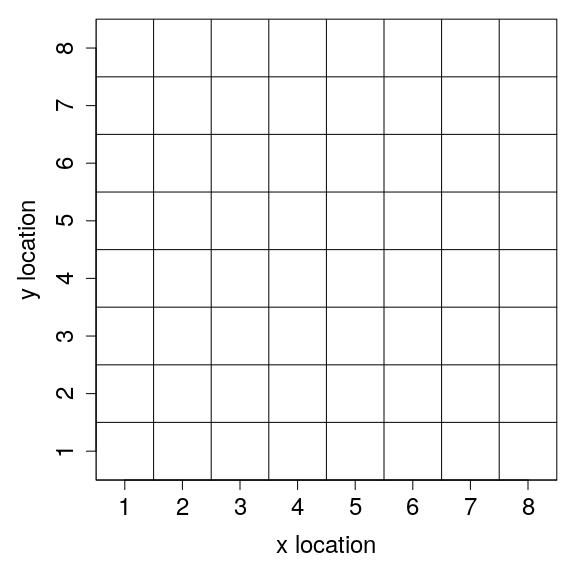
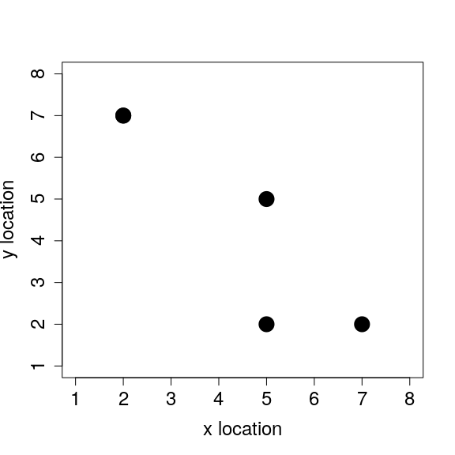
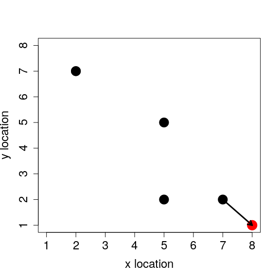
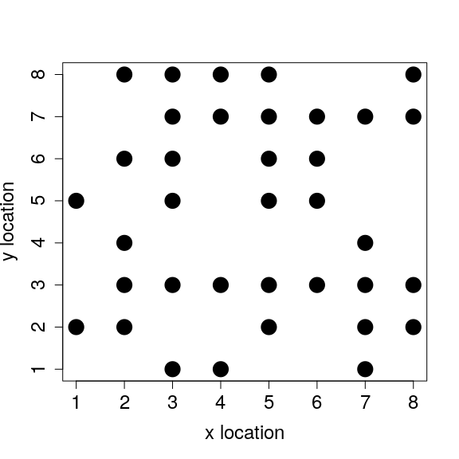
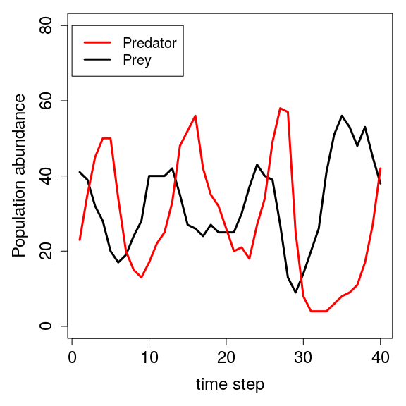

Individual-based models (IBMs; also called \`agent-based models') model systems of discrete individuals *in silico* (i.e., in a computer simulation, developed by writing and running code). The idea is to represent individuals (often, but not always, biological organisms) as discrete entities within within the code, and to simulate changes in individual composition and individual properties by modelling biological processes as algorithms within the code.

------------------------------------------------------------------------

1.  [Introduction: What is an individual-based model (IBM)?](#intro)
2.  [Getting started with IBMs in R](#Rstart)
3.  [Movement of individuals on a landscape](#move)
4.  [Simulating individual movement over time](#time)
5.  [Simulating individual birth](#birth)
6.  [Simulating individual death](#death)
7.  [Predator-prey dynamics](#predators)
8.  [Putting it all together](#synthesis)
9.  [Conclusions](#conclusions)
10. [Appendix with all code](#all)

------------------------------------------------------------------------

<a name="intro">1. Introduction: What is an individual-based model?</a>
=======================================================================

Biological models include a diverse set of tools that can be usefully applied to address a range of biological questions, from foundational principles of biological theory to more targeted questions about the dynamics of specific biological systems. In a forceful defence of theory and models in ecology, Caswell (1988) proposes the fundamental role of models in theory to be analogous to that of experiments in empirical biology. For more system-specific questions, complex modelling can be used with observational or experimental data to predict the dynamics of even highly complex systems (e.g., Aben et al. 2014). Whatever the question being asked, models help us to clarify the biological assumptions underlying our thinking, and to better understand the predictions that follow.

Unsurprisingly, the use of individual-based models has grown rapidly with the power and availability of computers (Grimm 1999; DeAngelis and Mooij 2005). Today, IBMs are widespread and well-established tools for all types of questions involving biological modelling. Two properties of IBMs stand out to make them especially advantageous. First, among-individual variation -- a highly important property for understanding biological populations -- is easy to model with an IBM. Whether it be variation among individuals in genotype, phenotype, or just spatial location, making individuals different in some relevant way is often a trivial matter of adding a bit more code. Second, because individuals are discrete, any biological processes being modelled are going to naturally include the kind of stochasticity that is inherent to all biological populations. There is often no need to explicitly model processes such as genetic drift, or demographic stochasticity underlying birth and death processes; these arise naturally from the structure of the model, and usually in a way that is biologically realistic. Hence, overall, IBMs are effective for addressing many (though, importantly, not all) questions relating to biological theory and predictive models.

My objective here is to get the reader started with writing their own IBMs. In particular, I hope to help the reader overcome one of the most challenging obstacles; where to start? Even for those who already have some programming experience, how to structure a model is not straightforward. In the text that follows, I will walk through the process of developing an IBM, step by step. By the end, we will have a fully working IBM of predator-prey dynamics. The code that follows is written, as much as possible, to be instructive and clear; it is not necessarily the most computationally efficient (i.e., fastest) way of coding a predator-prey IBM. It is written in [R](https://www.r-project.org/), which is not the best language for writing IBMs, but it *is* the language with which most biologists are probably familiar. Readers who get very interested in IBMs will eventually want to consider learning [C](https://en.wikipedia.org/wiki/C_(programming_language)) or [C++](https://en.wikipedia.org/wiki/C%2B%2B), which can improve computation speed by orders of magnitude. [NetLogo](https://ccl.northwestern.edu/netlogo/) is also a useful language to learn, as it was written specifically for individual-based modelling.

<a name="initialise">2. Getting started with IBMs in R</a>
==========================================================

In an IBM, discrete individuals are represented by some sort of data structure in code (e.g., a list, table, array, or potentially some type of customised structure). There are several possible ways to do this, and the way that works best is probably most often a matter of the modeller's preference and the coding language that they are using. In R, there are a few possibilities, but I usually find that the most intuitive way to model individuals is using a data table or array. For example, we can think about a two dimensional array as modelling a population of individuals, with rows representing discrete individuals and columns representing those individuals' characteristics ('characteristic' is not a technical term here; I am loosely defining it to mean anything that relates to the individual in some way). The code below creates a two dimensional data array (`inds`) to model five individuals that have three characteristics each.

``` r
inds           <- array(data = 0, dim = c(5, 3));
colnames(inds) <- c("characteristic_1", "characteristic_2", "characteristic_3");
rownames(inds) <- c("ind_1", "ind_2", "ind_3", "ind_4", "ind_5");
print(inds);
```

    ##       characteristic_1 characteristic_2 characteristic_3
    ## ind_1                0                0                0
    ## ind_2                0                0                0
    ## ind_3                0                0                0
    ## ind_4                0                0                0
    ## ind_5                0                0                0

The row and column names are not required, but I have included them to make it easier to refer back to individuals and their characteristics. I have initialised all individual characteristics with a value of zero because it is still undecided what characteristics are actually being modelled. Characteristics can be anything we want them to be, from phenotypic traits, to alleles, to spatial locations, to some sort of temporary status (e.g., feeding or not feeding). The whole `inds` array is like a data set in which some number of measurements (columns) have been taken for some number of individuals (rows), except that we can make these measurements up to be whatever we want them to be, and manipulate them according to whatever rules we want to model. The objective is to carefully choose a set of characteristics and rules that model whatever biological process it is that we are trying to better understand.

We can start with some very simple individual characteristics. Assume that we want to model a population of animals moving around a landscape, and we want to include animal body mass and location as characteristics. We can use 'characteristic\_1' in column 1 to randomly assign each individual a body mass according to some selected distribution, while 'characteristic\_2' in column 2 and 'characteristic\_3' in column 3 can be assigned random x and y locations, respectively. I will change the columns to reflect the new modelling decision for individual characteristics below.

``` r
colnames(inds) <- c("body_mass", "x_loc", "y_loc");
```

Let us say that body mass is normally distributed around a value of 23 with a standard deviation of 3. If it helps the reader to have a concrete example in mind to visualise, this is roughly the body mass distribution in kilograms of female [roe deer](https://en.wikipedia.org/wiki/Roe_deer) (Pettorelli et al. 2002). Nevertheless, it is usually not important to have any particular species in mind unless the model is being constructed to address a very targeted question. We can give each individual a body mass randomly sampled from 𝒩(23, 3) with the code below.

``` r
inds[, 1] <- rnorm(n = dim(inds)[1], mean = 23, sd = 3);
```

Note that `dim(inds)` returns the dimensions of the array `inds` where element 1 (i.e., `dim(inds)[1]`) is the number of rows (5 in this case) and element 2 is the number of columns (3 in this case). Also note that that in the code above, `inds[, 1]` includes all of the values in column 1; it is the same as if I had typed `inds[1:5, 1]`. Each individual in the array is now modelled with a unique body mass in the first column.

    ##       body_mass x_loc y_loc
    ## ind_1  27.45442     0     0
    ## ind_2  24.24773     0     0
    ## ind_3  20.96542     0     0
    ## ind_4  23.68664     0     0
    ## ind_5  21.95709     0     0

We can now give each individual its own location. Assume that these individuals all occupy some location on an 8 × 8 grid like the one shown below.



We do not actually need to code this grid to model individual locations or movement, but it might help to think of each individual in our model as occupying some square (i.e., 'cell') on the grid above. This is just one way to model individual position on a spatially explicit landscape, but it is often especially useful because it allows us to use natural numbers to define how far away individuals are from one another (number of cells away), and when individuals occupy the exact same location. We can now set individual x and y locations into columns 2 and 3, respectively, by sampling from a vector of numbers 1 to 8 with replacement (sampling with replacement ensures that more than one individual can occupy the same x or y location).

``` r
inds[, 2] <- sample(x = 1:8, size = dim(inds)[1], replace = TRUE);
inds[, 3] <- sample(x = 1:8, size = dim(inds)[1], replace = TRUE);
```

Each individual now occupies a location on the landscape, as shown now in columns 2 and 3.

    ##       body_mass x_loc y_loc
    ## ind_1  27.45442     7     2
    ## ind_2  24.24773     5     5
    ## ind_3  20.96542     2     7
    ## ind_4  23.68664     5     2
    ## ind_5  21.95709     2     7

We can even plot the individuals' x and y locations to see how they are spatially distributed.

``` r
plot(x = inds[,2], y = inds[,3], pch = 20, cex = 4, xlim = c(1, 8),
     ylim = c(1, 8), xlab = "x location", mar = c(5, 5, 1, 1),
     ylab = "y location", cex.lab = 1.5, cex.axis = 1.5);
```



This is really all that is needed to get started. It is, of course, possible to add any number of individuals (rows) or individual characteristics (columns). And it is not necessary to model body mass or even spatial location if these are not useful characteristics for modelling the system of interest. What matters is that we have a discrete number of individuals with some set of characteristics that are relevant for whatever question it is that we want to answer. These individuals and characteristics will change over the course of simulating an IBM according to whatever rules we specify. This can include rules for movement, birth, death, or anything else that we might think is important to model in the system. In the next section, I consider some simple rules for individual movement.

<a name="move">3. Movement of individuals on a landscape</a>
============================================================

Each of the individuals that we initialised in the [previous section](#initialise) has an x and y location on the landscape. To model individual movement, we need to come up with some rule for how these locations change. The simplest model of movement is to allow individuals to increase or decrease their x and y locations by 1 cell, so `ind_1` with an x location of 7 might move along the x axis to a new x location of 8 or 6. The individual might likewise move up or down one cell on the y axis. To model random movement to any of the eight cells surrounding a focal individual's current location (thereby also allowing diagonal movement), we can sample two random integer values from the set { − 1, 0, 1} with replacement and equal probability. One value is for the x location, and the other is for the y location. Movement is modelled by adding each value to the current x and y locations; the code below moves `ind_1` in the first row of `inds`.

``` r
x_move     <- sample(x = c(-1, 0, 1), size = 1);
y_move     <- sample(x = c(-1, 0, 1), size = 1);
inds[1, 2] <- inds[1, 2] + x_move;
inds[1, 3] <- inds[1, 3] + y_move;
```

We can see the new location in the table `inds`, and we can plot the individuals' locations again with the location of `ind_1` shown in red. The arrow below indicates the original cell from which `ind_1` moved.

    ##       body_mass x_loc y_loc
    ## ind_1  27.45442     8     1
    ## ind_2  24.24773     5     5
    ## ind_3  20.96542     2     7
    ## ind_4  23.68664     5     2
    ## ind_5  21.95709     2     7



This was only one individual, but we can move all of the individuals simultaneously according to our movement rule if we sample a vector of `x_move` and `y_move` that matches the number of individuals in the array. The code below samples two movement vectors that are the same length as the number of rows in `inds` (i.e., one value of -1, 0, or 1 sampled for each individual's x and y location).

``` r
x_move    <- sample(x = c(-1, 0, 1), size = dim(inds)[1], replace = TRUE);
y_move    <- sample(x = c(-1, 0, 1), size = dim(inds)[1], replace = TRUE);
inds[, 2] <- inds[, 2] + x_move;
inds[, 3] <- inds[, 3] + y_move;
```

We can now see their new positions in the data array columns 2 and 3, and compare the new values in these columns with the old one above to verify that individuals have indeed moved, at most, one cell in any direction.

    ##       body_mass x_loc y_loc
    ## ind_1  27.45442     7     2
    ## ind_2  24.24773     4     4
    ## ind_3  20.96542     2     6
    ## ind_4  23.68664     6     2
    ## ind_5  21.95709     2     8

We can see that the x and y locations have not changed by more than a single value. Double-checking code in this way is critical at every step of the modelling process. It is very easy to overlook a coding error that might cause a much different rule than the one intended. To be especially vigilant, it is often a good idea to give each unique process in an IBM its own function. There are at least three benefits of coding this way. First, it will later allow us to test each process in the IBM independently, so that if one part of the model does not appear to be working as it should, then we can narrow down the problem more easily by checking each function. Second, it makes it easier to change the order of operations in our IBM (e.g., whether movement happens before, or after, birth or death processes). Third, it makes the code easier to read; rather than having to scan through all of the code at once to understand a model, we can break things down piece by piece (this will become clearer later). Below, I write a function to move individuals on the landscape according to the movement rules described above. Note that the code is essentially the same as in the block above, but structured slightly differently to make it into a more readable function.

``` r
movement <- function(inds, xloc = 2, yloc = 3){
    total_inds   <- dim(inds)[1]; # Get the number of individuals in inds
    move_dists   <- c(-1, 0, 1);  # Define the possible distances to move
    x_move       <- sample(x = move_dists, size = total_inds, replace = TRUE);
    y_move       <- sample(x = move_dists, size = total_inds, replace = TRUE);
    inds[, xloc] <- inds[, xloc] + x_move;
    inds[, yloc] <- inds[, yloc] + y_move;
    return(inds);
}
```

We now have a function `movement`, which takes in three arguments (`inds`, `xloc`, and `yloc`) and returns an updated array of individuals with new x and y locations. The argument `inds` is the array of individuals that we want to move, while `xloc` and `yloc` are the column numbers where the x and y locations of individuals are stored, respectively (default values are set to 2 and 3). Of course, we could have not included `xloc` and `yloc` as function arguments, and instead just added 2s and 3s where `xloc` and `yloc` appear within the `movement` function. But specifying these arguments makes the function more flexible. Now if we want to change which of the individual array `inds` columns specify location, for whatever reason, we need only specify a different `xloc` and `yloc` when calling the `movement` function. We could do the same with `move_dists`, if we wanted to make `movement` even more flexible.

To move individuals in the array `inds`, we now only need to call the `movement` function. As a reminder, here is what `inds` looks like now.

    ##       body_mass x_loc y_loc
    ## ind_1  27.45442     7     2
    ## ind_2  24.24773     4     4
    ## ind_3  20.96542     2     6
    ## ind_4  23.68664     6     2
    ## ind_5  21.95709     2     8

Below moves the individuals with only one line of code using our new function. Note that we do not need to specify `xloc` and `yloc` arguments because we are happy with the default values of 2 and 3, respectively.

``` r
inds <- movement(inds);
```

The new `inds` array is below.

    ##       body_mass x_loc y_loc
    ## ind_1  27.45442     7     2
    ## ind_2  24.24773     3     3
    ## ind_3  20.96542     2     7
    ## ind_4  23.68664     5     2
    ## ind_5  21.95709     1     7

Now that we have some code that has been tested and works as intended, we can use it to simulate the movement of individuals over multiple time steps. I will show how to do this in the next section.

<a name="time">4. Simulating individual movement over time</a>
==============================================================

To simulate the movement of our individuals over time, we now need to call the `movement` function that we wrote in [the previous section](#move) multiple times. We can define the total number of time steps to simulate over below.

``` r
time_steps <- 20;
```

To run a simulation of individuals moving for twenty time steps, we now need to use [a loop](https://stirlingcodingclub.github.io/using_loops/loop_notes.html). A `while` loop in which some variable `ts` (indicating 'time step') increases from 0 to 19 is probably the easiest way to code the simulation.

``` r
ts <- 0;
while(ts < time_steps){
    inds <- movement(inds);
    ts   <- ts + 1; 
}
```

The code above first sets the starting time step to a value of 0. Within the `while` loop, individuals in the `inds` array are moved, then the time step value is increased by one. The loop continues calling `movement` to move individuals until the condition in the while loop (`ts < time_steps`) is satisfied. After the loop is finished, individuals have moved twenty times from their initial starting locations. Here is where they are located now.

    ##       body_mass x_loc y_loc
    ## ind_1  27.45442     0    -3
    ## ind_2  24.24773     9    -3
    ## ind_3  20.96542     3    14
    ## ind_4  23.68664     4    -2
    ## ind_5  21.95709     1     7

The code appears to have worked, but there is a problem that we have not yet considered. We originally defined our landscape as an 8 × 8 grid, but there is nothing in the movement rules preventing individuals from moving off of the landscape. This might not matter to us; perhaps we are happy to assume that some individuals will migrate outside of the area of interest. But often we want the population to be enclosed, and for individuals to not leave it by moving outside the bounds that we have set. If this is the case, then we need to decide what happens when individuals move past the edge of the landscape. There are several possibilities for what to do when individuals move outside of the landscape boundary.

1.  Place them back onto the boundary edge (i.e., a sticky landscape edge).
2.  Change their direction at the boundary edge (i.e., a reflecting landsacpe edge).
3.  Have them move to the opposite side of the landscape (i.e., a torus landscape with no edge)

In my experience, 3 is the most popular option, perhaps because it eliminates the problem of what to do with individuals that leave the edge of the landscape altogether by making it so that no edge exists. For now, I will demonstrate a reflecting edge instead because it is slightly easier to code. To make individuals that move one cell past the boundary of the landscape instead move back one cell toward the centre of the landscape, we can add some new code to the `movement` function.

``` r
movement <- function(inds, xloc = 2, yloc = 3, xmax = 8, ymax = 8){
    total_inds   <- dim(inds)[1]; # Get the number of individuals in inds
    move_dists   <- c(-1, 0, 1);  # Define the possible distances to move
    x_move       <- sample(x = move_dists, size = total_inds, replace = TRUE);
    y_move       <- sample(x = move_dists, size = total_inds, replace = TRUE);
    inds[, xloc] <- inds[, xloc] + x_move;
    inds[, yloc] <- inds[, yloc] + y_move;
    # =========   The reflecting boundary is added below
    for(i in 1:total_inds){               # For each individual i in the array
        if(inds[i, xloc] > xmax){         # If it moved passed the maximum xloc
            inds[i, xloc] <- xmax - 1;    # Then move it back toward the centre
        }
        if(inds[i, xloc] < 1){            # If it moved below 1 on xloc
            inds[i, xloc] <- 2;           # Move it toward the centre (2)
        }
        if(inds[i, yloc] > ymax){         # If it moved passed the maximum yloc
            inds[i, yloc] <- ymax - 1;    # Then move it back toward the centre
        }
        if(inds[i, yloc] < 1){            # If it moved below 1 on yloc
            inds[i, yloc] <- 2;           # Then move it toward the centre (2)
        }
    } 
    # =========  Now all individuals should stay on the landscape
    return(inds);
}
```

With the new `movement` function, let us first initialise a new population of `inds` in [the same way as before](#initialise).

``` r
inds           <- array(data = 0, dim = c(5, 3));
colnames(inds) <- c("body_mass", "x_loc", "y_loc");
rownames(inds) <- c("ind_1", "ind_2", "ind_3", "ind_4", "ind_5");
inds[,1]       <- rnorm(n = dim(inds)[1], mean = 23, sd = 3);
inds[,2]       <- sample(x = 1:8, size = dim(inds)[1], replace = TRUE);
inds[,3]       <- sample(x = 1:8, size = dim(inds)[1], replace = TRUE);
```

Here is what the newly initialised individuals in `inds` look like.

    ##       body_mass x_loc y_loc
    ## ind_1  26.47984     5     3
    ## ind_2  20.69655     7     7
    ## ind_3  15.76510     6     4
    ## ind_4  21.52540     8     1
    ## ind_5  25.15732     1     2

With our new movement function defined above, we can again simulate movement over twenty time steps. This time, though, we should not see any individuals leaving the 8 × 8 grid.

``` r
ts         <- 0;
time_steps <- 20;
while(ts < time_steps){
    inds <- movement(inds);
    ts   <- ts + 1; 
}
print(inds);
```

    ##       body_mass x_loc y_loc
    ## ind_1  26.47984     4     1
    ## ind_2  20.69655     8     4
    ## ind_3  15.76510     7     3
    ## ind_4  21.52540     6     2
    ## ind_5  25.15732     5     2

Individuals have now moved from their original locations after 20 time steps, but none of the individuals has an x or y location less than 1 or greater than 8, meaning that they are all still on the landscape. Hence, we now have a working IBM in which individuals move around randomly on an 8 × 8 grid. We have initialised five individuals with three characteristics, but as long as we have x and y locations stored in `inds` columns, we could always increase the number of individuals and characteristics in the model and add new rules (functions) within the above while loop. I will show how to do this in the next section, but before moving on, I want to first show some ways to keep track of what is already going on in our IBM.

Note that in using the loop immediately above, we have successfully modelled animal movement over 20 time steps, but we have not retained any information about where each individual was located *within* these 20 time steps. We only know the x and y locations where the individuals started at `time_step == 0`, and where each of them ended at `time_step == 19`. This might not be a problem; perhaps the intervening locations do not really matter to us. Or maybe this would be too much information to store[1]. But suppose that we actually wanted to record the locations of all of these individuals in each time step, and knew that storing these data would not be an issue. Doing so would allow us to reconstruct the movement patterns of each individual and see how the whole population moves from time step 0 to time step 20. In R, we can do this easily by creating a new list and storing the `inds` array as a list element in each time step.

``` r
ts         <- 0;
time_steps <- 20;
inds_hist  <- NULL; # Here's the list
while(ts < time_steps){
    inds            <- movement(inds);
    ts              <- ts + 1; 
    inds_hist[[ts]] <- inds; # Add to list
}
print(inds);
```

    ##       body_mass x_loc y_loc
    ## ind_1  26.47984     1     6
    ## ind_2  20.69655     5     6
    ## ind_3  15.76510     1     7
    ## ind_4  21.52540     6     4
    ## ind_5  25.15732     1     3

With the addition of the `inds_hist` list, we can see where every individual was in each time step. For example, we can look at individual movement in the first three time steps by printing `inds_hist` elements below (note that `inds_hist[[1:3]]` does not work in R -- we need to print line by line, or use a loop).

``` r
print(inds_hist[[1]]);
```

    ##       body_mass x_loc y_loc
    ## ind_1  26.47984     4     2
    ## ind_2  20.69655     7     3
    ## ind_3  15.76510     7     2
    ## ind_4  21.52540     6     2
    ## ind_5  25.15732     6     2

``` r
print(inds_hist[[2]]);
```

    ##       body_mass x_loc y_loc
    ## ind_1  26.47984     4     1
    ## ind_2  20.69655     6     3
    ## ind_3  15.76510     6     3
    ## ind_4  21.52540     6     1
    ## ind_5  25.15732     5     3

``` r
print(inds_hist[[3]]);
```

    ##       body_mass x_loc y_loc
    ## ind_1  26.47984     5     1
    ## ind_2  20.69655     6     2
    ## ind_3  15.76510     6     3
    ## ind_4  21.52540     5     1
    ## ind_5  25.15732     4     2

The `inds_hist` list essentially stores the entire history of the individuals moving over the course of the simulation. Storing this kind of information is very useful for reconstructing the history of a simulation to understand what is going on. As more biological processes are added (e.g., birth, death, predation, etc.), we can effectively take a perfect snapshot of each point in time in the system that we are modelling. Often the sheer size of an IBM prohibits a complete record of every individual's history, but as the IBM grows, we can choose what information is important to retain and analyse. For now, because the the model is small (few individuals and time steps), we can simply keep everything. Model analysis then becomes a process of extracting the relevant information that we have stored during the simulation and using it to make meaningful biological inferences. We could, for example, see where individual 1 has been over the 20 time steps by extracting the information from `inds_hist` and storing it in a new table.

``` r
ind1_locs <- array(data = NA, dim = c(20, 3));
for(i in 1:20){
    ind1_locs[i, 1] <- i                     # Save the time step
    ind1_locs[i, 2] <- inds_hist[[i]][1, 2]; # xloc for the time step
    ind1_locs[i, 3] <- inds_hist[[i]][1, 3]; # yloc for the time step
}
colnames(ind1_locs) <- c("time_step", "x_loc", "y_loc");
print(ind1_locs);
```

    ##       time_step x_loc y_loc
    ##  [1,]         1     4     2
    ##  [2,]         2     4     1
    ##  [3,]         3     5     1
    ##  [4,]         4     6     2
    ##  [5,]         5     5     2
    ##  [6,]         6     5     1
    ##  [7,]         7     4     2
    ##  [8,]         8     4     1
    ##  [9,]         9     4     2
    ## [10,]        10     3     3
    ## [11,]        11     3     4
    ## [12,]        12     3     5
    ## [13,]        13     2     6
    ## [14,]        14     2     6
    ## [15,]        15     3     6
    ## [16,]        16     2     7
    ## [17,]        17     2     8
    ## [18,]        18     2     7
    ## [19,]        19     2     7
    ## [20,]        20     1     6

The array above shows the full path of individual 1 from x location 4 and y location 2 to x location 1 and y location 6. We could do the same for any number of individuals in the model, if desired, and for any number of time steps. We therefore have a working model of individual movement within a confined area of landscape. In the next section, we will add some more biological realism by creating a new rule and function for modelling individual births in the population.

<a name="birth">5. Simulating individual birth</a>
==================================================

To simulate birth in our population of individuals, we need some rule to determine when an individual reproduces. As a simplifying assumption, let as assume that all individuals in our model are female, and that the number of birth events for an individual *B*<sub>*i*</sub> is sampled from a Poisson distribution with 0.5 expected offspring per time step (recall that a [Poisson distribution](https://en.wikipedia.org/wiki/Poisson_distribution) describes the number of events occurring over a fixed interval of time),

*B*<sub>*i*</sub> ∼ *P**o**i**s**s**o**n*(*λ* = 0.5).

In R, we can sample some number of values from a Poisson distribution with a given rate parameter (*λ*, defining both the mean and variance of the Poisson distribution) using the `rpois` function. If we wanted to sample for five individuals with *λ* = 0.5, we could therefore use the code below.

``` r
rpois(n = 5, lambda = 0.5);
```

    ## [1] 0 0 0 0 0

If we are simulating individual reproduction, however, there needs to be some place in the model to store these values. The simplest solution is to initialise our array of individuals (`inds`) with another column, representing the number of offspring an individual has produced at a given time step.

``` r
inds           <- array(data = 0, dim = c(5, 4));
colnames(inds) <- c("body_mass", "x_loc", "y_loc", "repr");
rownames(inds) <- c("ind_1", "ind_2", "ind_3", "ind_4", "ind_5");
inds[,1]       <- rnorm(n = dim(inds)[1], mean = 23, sd = 3);
inds[,2]       <- sample(x = 1:8, size = dim(inds)[1], replace = TRUE);
inds[,3]       <- sample(x = 1:8, size = dim(inds)[1], replace = TRUE);
```

    ##       body_mass x_loc y_loc repr
    ## ind_1  20.76323     4     7    0
    ## ind_2  22.48684     6     8    0
    ## ind_3  22.14153     1     1    0
    ## ind_4  21.69553     3     2    0
    ## ind_5  21.13485     6     4    0

We now have the added column `repr` for individual reproduction. We could add some reproduction for each individual immediately by sampling from `rpois` to add values to the fourth column, but for now I will instead create a new function `birth` to both sample births for each individual and add the new offspring at the same time. In the `birth` function, each individual will first be assigned a number of offspring with `rpois`, then these new offspring will be added to the array `inds`.

``` r
birth <- function(inds, lambda = 0.5, repr_col = 4){
    total_inds       <- dim(inds)[1]; # Get the number of individuals in inds
    ind_cols         <- dim(inds)[2]; # Total inds columns
    inds[, repr_col] <- rpois(n = total_inds, lambda = lambda); 
    total_off        <- sum(inds[, repr_col]);
    # ---- We now have the total number of new offspring; now add to inds
    new_inds     <- array(data = 0, dim = c(total_off, ind_cols));
    new_inds[,1] <- rnorm(n = dim(new_inds)[1], mean = 23, sd = 3);
    new_inds[,2] <- sample(x = 1:8, size = dim(new_inds)[1], replace = TRUE);
    new_inds[,3] <- sample(x = 1:8, size = dim(new_inds)[1], replace = TRUE);
    # ---- Our new offspring can now be attached in the inds array
    inds <- rbind(inds, new_inds);
    return(inds);
}
```

In the function above, we first get the dimensions of the `ind` array (`total_inds` and `ind_cols`). Next, we sample from a Poisson distribution using `rpois` to determine how many offspring each individual has produced. Next, we sum that number up to get `total_off`, which will be the total number of new individuals to be added to `inds`. A new array is made (`new_inds`) with `total_off` rows and `ind_cols` columns, and values are initialised for individual body mass and location. Finally, this `new_inds` array is combined with the old one `inds` using `rbind`[2] so that our working array of individuals now has both the old individuals and the newly born ones. We can see how this function runs now by running it below.

``` r
inds <- birth(inds = inds);
```

What has happend above is that we have read `inds` into the function `birth` and stored the output into an (overwritten) `inds` with the new individuals in the array.

    ##       body_mass x_loc y_loc repr
    ## ind_1  20.76323     4     7    0
    ## ind_2  22.48684     6     8    0
    ## ind_3  22.14153     1     1    1
    ## ind_4  21.69553     3     2    1
    ## ind_5  21.13485     6     4    1
    ##        24.28716     8     2    0
    ##        23.87505     1     8    0
    ##        17.86060     1     7    0

Note that the sum of the fourth column equals the number of new individuals added (3). The new individuals do not have row names, but this is okay; we do not really need them. Note that there are other ways that we could add to `births`. We might, for example, wish for new offspring to have similar body masses to their mothers', or for offspring to be initialised in the same locations as their mothers rather than being randomly placed on the landscape. I encourage the reader to try to think about these kinds of possibilities, and to try adding them to the code above.

For now, we can simulation both birth and movement of `inds` over time using the loop below (note that the code below is the same as that from the [previous section](#time), with some modifications). Instead of 20 time steps, I will only simulate 10 for now. I will also, arbitrarily, choose to model birth as occurring after movement in the population.

``` r
ts         <- 0;
time_steps <- 10;
inds_hist  <- NULL;
while(ts < time_steps){
    inds            <- movement(inds);
    inds            <- birth(inds);
    ts              <- ts + 1; 
    inds_hist[[ts]] <- inds;
}
```

The above has effectively simulated unrestricted population growth; individuals do not even die. Hence, even with a fairly low birth rate, by the end of the simulation there are 576 total individuals in the population. This is already too many individuals to print the entire array, but we can at least plot the abundance of individuals over time. Recall how we looped through the list `inds_hist` in [the previous section](#time) to pull out the location of the first individual in each time step. We can do the same for pulling out abundance of individuals (number of rows in the array) for each time step.

``` r
ind_abund <- array(data = NA, dim = c(10, 2));
for(i in 1:10){
    ind_abund[i, 1] <- i;                      # Save the time step
    ind_abund[i, 2] <- dim(inds_hist[[i]])[1]; # rows in inds_hist[[i]]
}
colnames(ind_abund) <- c("time_step", "abundance");
print(ind_abund);
```

    ##       time_step abundance
    ##  [1,]         1        14
    ##  [2,]         2        21
    ##  [3,]         3        34
    ##  [4,]         4        49
    ##  [5,]         5        70
    ##  [6,]         6       111
    ##  [7,]         7       173
    ##  [8,]         8       260
    ##  [9,]         9       386
    ## [10,]        10       576

We can see from the table above that the population size is increasing exponentially. If we were to run too many time steps, we might risk simulating more individuals than the memory of our computer can store, ultimately causing a crash. This is obviously a problem computationally, but it is also biologically unrealistic. We need some sort of density regulation in the population. In the next section, we will apply a new rule to model individual death.

<a name="death">6. Simulating individual death</a>
==================================================

We can simulate individual death similarly to individual birth. Here though, because we want death to be density dependent, the probability of individual death needs to somehow be related to total population abundance. There are several reasonable ways to do model death in this way. For example, we could a write function that checks population abundance, assigns the probability of individual death based on some carrying capacity, then realises death by a Bernoulli trial (sampling a 0 or 1) using that assigned probability (i.e., as total abundance increases, each individual's probability of dying also increases, and we sample each individual's survival versus mortality from this probability to see if they make it into the next time step using something like `rbinom`). Another, simpler, option is to relate mortality to the number of individuals on a landscape cell.

Suppose we assume that each landscape cell has enough resources to feed one individual for one time step. We might then write a function `death` that causes mortality whenever there is more than one individual on the same landscape cell. Because there are 8 × 8 = 64 total landscape cells, the maximum possible population size of would then be 64. This would control the population size in a biologically intuitive way. To get started, I will reinitialise some individuals below, this time with another column added, which will represent mortality.

``` r
inds           <- array(data = 0, dim = c(5, 5));
colnames(inds) <- c("body_mass", "x_loc", "y_loc", "repr", "death");
rownames(inds) <- c("ind_1", "ind_2", "ind_3", "ind_4", "ind_5");
inds[,1]       <- rnorm(n = dim(inds)[1], mean = 23, sd = 3);
inds[,2]       <- sample(x = 1:8, size = dim(inds)[1], replace = TRUE);
inds[,3]       <- sample(x = 1:8, size = dim(inds)[1], replace = TRUE);
```

    ##       body_mass x_loc y_loc repr death
    ## ind_1  24.18466     8     1    0     0
    ## ind_2  20.61052     3     3    0     0
    ## ind_3  23.91818     3     7    0     0
    ## ind_4  26.34729     3     4    0     0
    ## ind_5  27.03324     3     1    0     0

Writing a function for mortality will be a bit more challenging that writing a function for birth. The code here will need to loop through each landscape cell, check to see how many individuals are on the cell, and if there is more than one individual on the cell, to select only one individual to survive.

``` r
death <- function(inds, xlen = 8, ylen = 8, dcol = 5, xcol = 2, ycol = 3){
    for(xdim in 1:xlen){      # For each row `xdim` of the landscape...
        for(ydim in 1:ylen){  # For each col `ydim` of the landscape...
            # Get the total number of individuals on the landscape cell
            on_cell <- sum( inds[, xcol] == xdim & inds[, ycol]  == ydim);
            # Only do something if on_cell is more than one
            if(on_cell > 1){
                # Get all of the occupants (by row number) on the cell
                occupants <- which(inds[, xcol] == xdim & inds[, ycol] == ydim);
                # Sample all but one random occupant to die
                rand_occ  <- sample(x = occupants, size = on_cell - 1);
                # Then add their death to the last column of inds
                inds[rand_occ, dcol] <- 1;
            }
        }
    }
    return(inds);
}
```

I have used a few tricks of R to keep the code short here, but I want to walk the reader through what is happening. As already mentioned, the double four loop cycles through each cell of the landscape. The outer loop goes through each x location from 1 to `ylen` (default value of 8). For each x location, the inner loop goes through each y location (so first `x = 1` and `y = 1`, then `x = 1` and `y = 2`, and so forth until we get to `x = 2` and `y = 1`, then `x = 2` and `y = 2`, etc.). The line returning `on_cell` gets the total number of individuals that have an x location of `xdim` and a y location of `ydim`. If this number is more than one, then mortality needs to happen. The line returning `occupants` finds the individuals on the cell of interest using the `which` function in R, then the `sample` function is used to sample all but one of these individuals (sampling without replacement). In each case, `occupants` and `rand_occ` are vectors of numbers identifying individuals, and these numbers correspond to the individuals' rows. Hence individuals in the rows `rand_occ` will die, so we add a 1 to the death column.

To test this function, we can set individuals 2 and 3 to have the same location as individual 1. If the function is working, then only one of these three individuals should survive after running the function `death`.

``` r
inds[2, 2] <- inds[1, 2]; # Individiual 2 now in same x location as 1
inds[2, 3] <- inds[1, 3]; # Individiual 2 now in same x location as 1
inds[3, 2] <- inds[1, 2]; # Individiual 3 now in same x location as 1
inds[3, 3] <- inds[1, 3]; # Individiual 3 now in same x location as 1
```

    ##       body_mass x_loc y_loc repr death
    ## ind_1  24.18466     8     1    0     0
    ## ind_2  20.61052     8     1    0     0
    ## ind_3  23.91818     8     1    0     0
    ## ind_4  26.34729     3     4    0     0
    ## ind_5  27.03324     3     1    0     0

We can now run `death` below, then print `inds` again.

``` r
inds <- death(inds = inds);
print(inds);
```

    ##       body_mass x_loc y_loc repr death
    ## ind_1  24.18466     8     1    0     1
    ## ind_2  20.61052     8     1    0     1
    ## ind_3  23.91818     8     1    0     0
    ## ind_4  26.34729     3     4    0     0
    ## ind_5  27.03324     3     1    0     0

Note that two of the individuals above are dead (ones in column 5), and the rest have survived (zeros in column 5). We can retain the living individuals using the code below, which re-defines `inds` as only the subset of `inds` rows in which the value of column 5 is 0.

``` r
inds <- inds[inds[, 5] == 0,]; # Retains individuals that did not die
print(inds);
```

    ##       body_mass x_loc y_loc repr death
    ## ind_3  23.91818     8     1    0     0
    ## ind_4  26.34729     3     4    0     0
    ## ind_5  27.03324     3     1    0     0

We can now include the `death` function to simulate a population with movement, birth, and death. The code below simulates a population over 20 time steps.

``` r
# ----- Initialise individuals
inds           <- array(data = 0, dim = c(5, 5));
colnames(inds) <- c("body_mass", "x_loc", "y_loc", "repr", "death");
rownames(inds) <- c("ind_1", "ind_2", "ind_3", "ind_4", "ind_5");
inds[,1]       <- rnorm(n = dim(inds)[1], mean = 23, sd = 3);
inds[,2]       <- sample(x = 1:8, size = dim(inds)[1], replace = TRUE);
inds[,3]       <- sample(x = 1:8, size = dim(inds)[1], replace = TRUE);
# ---- Start the simulation as before
ts         <- 0;
time_steps <- 20;
inds_hist  <- NULL;
while(ts < time_steps){
    inds            <- movement(inds);
    inds            <- birth(inds);
    inds            <- death(inds);
    inds            <- inds[inds[, 5] == 0,]; # Retain living
    ts              <- ts + 1; 
    inds_hist[[ts]] <- inds;
}
```

This is now a working individual-based model. We have incorporated the biological processes of movement, births, and deaths to simulate a discrete population over time. We can use the same code as from the [previous section](#birth) to summarise how population abundance has changed over time.

``` r
ind_abund <- array(data = NA, dim = c(20, 2));
for(i in 1:20){
    ind_abund[i, 1] <- i;                      # Save the time step
    ind_abund[i, 2] <- dim(inds_hist[[i]])[1]; # rows in inds_hist[[i]]
}
colnames(ind_abund) <- c("time_step", "abundance");
print(ind_abund);
```

    ##       time_step abundance
    ##  [1,]         1         6
    ##  [2,]         2         8
    ##  [3,]         3        10
    ##  [4,]         4        10
    ##  [5,]         5        19
    ##  [6,]         6        22
    ##  [7,]         7        24
    ##  [8,]         8        26
    ##  [9,]         9        29
    ## [10,]        10        34
    ## [11,]        11        38
    ## [12,]        12        44
    ## [13,]        13        44
    ## [14,]        14        40
    ## [15,]        15        31
    ## [16,]        16        31
    ## [17,]        17        31
    ## [18,]        18        35
    ## [19,]        19        37
    ## [20,]        20        36

Compare the population abundances here with those from the [previous section](#birth). By adding death to our model, and allowing only one individual to survive per cell, the size of the simulated population is no longer increasing exponentially. We can take a look at the individuals on the simulated landscape below.



Notice that the entire landscape has not filled up. Since newly born individuals are placed at random on the landscape, and individuals also move randomly, it is unlikely that the landscape will become saturated with individuals. We have effectively simulated a process of intra-specific competition; that is, competition among individuals within the same species for a limiting resource (space, in this case, in the form of landscape cells). If we wanted to investigate intra-specific competition more closely, we could change some of the assumptions of our IBM. Such assumptions could include the size of the landscape, the number individuals that could survive on the same landscape cell, or perhaps how individuals move from cell to cell (e.g., to avoid competition). We could also add new biological processes using the current code as a starting point. For example, we might be interested in how body mass evolves as a consequence of intra-specific competition. To investigate this, we would need to make `body_mass` heritable in our model (i.e., make offspring `body_mass` more similar to parent `body_mass` than expected by chance, probably by adding some code in the `birth` function), and we would need to have some rule relating `body_mass` to the outcome of intra-specific competition (e.g., by making individuals with high `body_mass` more likely to survive than individuals with low `body_mass`, probably by adding some code in the `death` function). These are good exercises to try, and I encourage the reader to make modifications like this to practice coding IBMs.

Having a working population of individuals, there is one more exercise that I want to present. In the next section, I will demonstrate how we can use a second array to model a population of predators on `inds`. And by the end of the next section, we will have a working model of predator-prey dynamics on a spatially explicit landscape.

<a name="predators">7. Predator-prey dynamics</a>
=================================================

In this section, I will show how to write a simple model of predation. Much of the work has actually already been done. We already have data structures for individuals (an array), and functions for movement, birth, and death. We can use these same structures and functions for modelling predators, writing new code only where there is a meaningful difference between predators and prey. We can start with a new array `pred`, which is of the same format as `inds` and contains five predators.

``` r
pred           <- array(data = 0, dim = c(5, 5));
colnames(pred) <- c("body_mass", "x_loc", "y_loc", "repr", "death");
rownames(pred) <- c("pred_1", "pred_2", "pred_3", "pred_4", "pred_5");
pred[,1]       <- rnorm(n = dim(pred)[1], mean = 23, sd = 3);
pred[,2]       <- sample(x = 1:8, size = dim(pred)[1], replace = TRUE);
pred[,3]       <- sample(x = 1:8, size = dim(pred)[1], replace = TRUE);
```

    ##        body_mass x_loc y_loc repr death
    ## pred_1  27.90536     5     3    0     0
    ## pred_2  22.91469     7     4    0     0
    ## pred_3  29.35038     5     1    0     0
    ## pred_4  30.24029     8     4    0     0
    ## pred_5  24.48636     1     6    0     0

Note that because the `pred` array is of the same structure as the `inds` array, all of the functions that we wrote (`movement`, `birth`, and `death`) could equally well be used for our predators. But because we are modelling predation, this might not always make sense. We might, for example, be willing to assume that predators move similarly as their prey, but want to model birth and death processes differently. It would be reasonable to assume that birth and death are both affected by how successful a predator is at acquiring prey, so perhaps we only want predators to survive and breed if they have eaten some fixed number of times. For simplicity, I will assume that predators that eat at least one prey in `inds` survive to the next time step, while predators that eat two prey reproduce. I will further assume that predators cannot eat more than two prey in a time step, and that predators that fail to eat die. Note that given these assumptions, it is necessary to write new code to model predator birth and death, but before doing this, it is worth thinking about the order of operations in the code. That is, it will be useful to consider when predation will happen (e.g., at the start or end of a time step). Consider again the code from the previous section used to simulate individuals in the population.

``` r
# ----- Initialise individuals
inds           <- array(data = 0, dim = c(5, 5));
colnames(inds) <- c("body_mass", "x_loc", "y_loc", "repr", "death");
rownames(inds) <- c("ind_1", "ind_2", "ind_3", "ind_4", "ind_5");
inds[,1]       <- rnorm(n = dim(inds)[1], mean = 23, sd = 3);
inds[,2]       <- sample(x = 1:8, size = dim(inds)[1], replace = TRUE);
inds[,3]       <- sample(x = 1:8, size = dim(inds)[1], replace = TRUE);
# ---- Start the simulation as before
ts         <- 0;
time_steps <- 20;
inds_hist  <- NULL;
while(ts < time_steps){
    inds            <- movement(inds);
    inds            <- birth(inds);
    inds            <- death(inds);
    inds            <- inds[inds[, 5] == 0,]; # Retain living
    ts              <- ts + 1; 
    inds_hist[[ts]] <- inds;
}
```

In the code above, individuals (now prey) move, give birth, then die. And given the rules of individual mortality, only one individual, at most, is allowed per landscape cell at the end of a time step. Hence, if predation were to happen at the end of the time step, predators could not reproduce. Biologically, having predation happen after prey death as caused by density dependence might also not make much sense. A good argument could probably be made for having predators move and eat first in the time step (i.e., preceding individual movement, birth, and death within the `while` loop above), both on biological and modelling grounds. I do not want to dwell on this, but only point out that thinking about the order in which events occur in an IBM is important, and therefore should be considered carefully. It is often good to change the order of events to see how it affects simulation results. For now, I will assume that predators get to move, eat, and reproduce *after* prey give birth but *before* prey die. It is only at this point, between `birth` and `death` above, in which more than two individuals can exist on the same cell, so this is the only time that predators could possibly eat more than one prey item to reproduce.

Predator movement is easy because we already have the `movement` function, and are content to assume that predators move in the same way as prey, potentially moving one landscape cell in any random direction.

``` r
pred <- movement(pred);
```

Birth and death requires a bit more work. We need a function that checks to see how many prey are located on a predator's landscape cell. If that number is zero, then the predator should die. If that number is greater than zero, then the predator should survive. And if that number is greater than one, then the predator should reproduce. We also need to make sure that the eaten prey are removed from `inds` so that they do not reproduce, or are tagged in some way so that they can be removed in the `death` function.

``` r
predation <- function(pred, inds, xcol = 2, ycol = 3, rcol = 4, dcol = 5){
    predators   <- dim(pred)[1]; # Predator number
    pred[, dcol] <- 1;           # Assume dead until proven otherwise
    pred[, rcol] <- 0;           # Assume not reproducing until proven otherwise
    for(p in 1:predators){       # For each predator (p) in the array
        xloc   <- pred[p, xcol]; # Get the x and y locations
        yloc   <- pred[p, ycol];
        N_prey <- sum( inds[, xcol] == xloc & inds[, ycol] == yloc);
        # ----- Let's take care of the predator first below
        if(N_prey > 0){
            pred[p, dcol] <- 0;  # The predator lives
        }
        if(N_prey > 1){
            pred[p, rcol] <- 1;  # The predator reproduces
        }
        # ----- Now let's take care of the prey
        if(N_prey > 0){ # If there are some prey, find them
            prey <- which( inds[, xcol] == xloc & inds[, ycol] == yloc);
            if(N_prey > 2){ # But if there are more than 2, just eat 2
                prey <- sample(x = prey, size = 2, replace = FALSE);
            }
            inds[prey, dcol] <- 1; # Record the prey as dead
        }
    } # We now know which inds died, and which prey died & reproduced
    # ---- Below removes predators that have died
    pred         <- pred[pred[,dcol] == 0,] # Only survivors now left
    # ----- Below adds new predators based on the reproduction above    
    pred_off     <- sum(pred[, rcol]);
    new_pred     <- array(data = 0, dim = c(pred_off, dim(pred)[2]));
    new_pred[,1] <- rnorm(n = dim(new_pred)[1], mean = 23, sd = 3);
    new_pred[,2] <- sample(x = 1:8, size = dim(new_pred)[1], replace = TRUE);
    new_pred[,3] <- sample(x = 1:8, size = dim(new_pred)[1], replace = TRUE);
    pred         <- rbind(pred, new_pred);
    # ----- Now let's remove the prey that were eaten
    inds         <- inds[inds[,dcol] == 0,]; # Only living prey left
    # Now need to return *both* the predator and prey arrays
    pred_prey <- list(pred = pred, inds = inds);
    return(pred_prey);
}
```

That is a lot of code, but at the end of all of it, we should have what we want. Predator and prey arrays go into the function. Predators that do not feed and therefore die are removed from their array (`pred`), while predators that feed and reproduce add a new offspring to the array. Prey are removed from their array (`inds`) if they are eaten. Note that, for the first time, we need to return more than one array. Both the `inds` and the `pred` array are changed in the function above, so a list is returned with both arrays as list elements. To access each of these elements, we can use `pred_prey$pred` and `pred_prey$inds` for predators and prey, respectively.

To test the function written above, we can put some individuals and predators down in a known location, then check to see that predation has happened as intended. I will initialise a new `inds` with six total individuals: three individuals at *x* = 1, *y* = 1, two individuals at *x* = 2, *y* = 1, and one individual at *x* = 3, *y* = 1.

``` r
inds           <- array(data = 0, dim = c(6, 5));
colnames(inds) <- c("body_mass", "x_loc", "y_loc", "repr", "death");
inds[,1]       <- rnorm(n = dim(inds)[1], mean = 23, sd = 3);
inds[1:3, 2]   <- 1; # x location
inds[1:3, 3]   <- 1; # y location
inds[4:5, 2]   <- 2; 
inds[4:5, 3]   <- 1; 
inds[6, 2]     <- 3; 
inds[6, 3]     <- 1; 
```

    ##      body_mass x_loc y_loc repr death
    ## [1,]  20.06693     1     1    0     0
    ## [2,]  19.69997     1     1    0     0
    ## [3,]  16.50927     1     1    0     0
    ## [4,]  22.34860     2     1    0     0
    ## [5,]  26.93147     2     1    0     0
    ## [6,]  25.51669     3     1    0     0

Now, I will add a single predator to each of four locations.

``` r
pred           <- array(data = 0, dim = c(4, 5));
colnames(pred) <- c("body_mass", "x_loc", "y_loc", "repr", "death");
pred[,1]       <- rnorm(n = dim(pred)[1], mean = 23, sd = 3);
pred[1, 2]     <- 1; # x location
pred[1, 3]     <- 1; # y location
pred[2, 2]     <- 2;
pred[2, 3]     <- 1;
pred[3, 2]     <- 3;
pred[3, 3]     <- 1;
pred[4, 2]     <- 4;
pred[4, 3]     <- 1;
```

    ##      body_mass x_loc y_loc repr death
    ## [1,]  23.87095     1     1    0     0
    ## [2,]  14.50862     2     1    0     0
    ## [3,]  22.20024     3     1    0     0
    ## [4,]  24.83630     4     1    0     0

We now see that there are four occupied landscape cells, each with a single predator. Based on the rules that we specified in the function `predation` above, we can predict what will happen on each of these cells as a consequence of the local abundance of prey. The code below runs the function, then stores the new arrays back into `inds` and `prey`.

``` r
pred_prey <- predation(inds = inds, pred = pred);
inds      <- pred_prey$inds;
pred      <- pred_prey$pred;
```

Here is what the individual array now looks like.

    ## body_mass     x_loc     y_loc      repr     death 
    ##  16.50927   1.00000   1.00000   0.00000   0.00000

There is only one surviving prey. This is one of the prey on the landscape cell *x* = 1, *y* = 1, which started out with three individuals on which two other individuals were eaten by the predator. All other individuals were eaten because they occupied cells with two or fewer other individuals. Below is what the predator array now looks like.

    ##      body_mass x_loc y_loc repr death
    ## [1,]  23.87095     1     1    1     0
    ## [2,]  14.50862     2     1    1     0
    ## [3,]  22.20024     3     1    0     0
    ## [4,]  22.42758     3     3    0     0
    ## [5,]  21.47514     4     8    0     0

Note that two predators have reproduced; each of these predators was on a cell with two or more individuals that became prey. The predator on the cell with only one individual (*x* = 3, *y* = 1) survived but did not reproduce, while the predator on the cell with no individuals did not survive (*x* = 4, *y* = 1). Note that there are also newly born predators in `pred` above (rows 4 and 5), as was expected.

If we are confident that the `predation` function is working as intended, we can now include it into the simulation to model the dynamics of predators and prey over time.

<a name="synthesis">8. Putting it all together</a>
==================================================

Having coded functions for [movement](#move), [birth](#birth), [death](#death), and [predation](#predators), we can now put all of these processes together to simulate a predator-prey system. The code for simulating these processes will build off of some of the code above, as I introduced originally to [simulate individual movement over time](#time) and most recently used when considering the order of predation in the [previous section](#predators). All that we need to add is the initialisation of predators, the inclusion of predator movement and predation in each time step, and the recording of the predator array over time steps.

In the code below, 40 individuals are initialised; the high number ensures that there are enough prey to sustain the predator population. The predator abundance is initialised at five, and both prey and predators are randomly placed on the landscape. Within the `while` loop below, we now include predator movement (`movement(pred)`) and predation (`predation(pred = pred, inds = inds)`). The list `pred_hist` now stores the `pred` array in each time step, as is done for the `inds` array, so that we can reconstruct predator movement and abundances over time. Hence, by running the code below, we can analyses both `inds_hist` and `pred_hist` to understand predator-prey dynamics (note that the below code will sometimes lead to predator or prey extinction, causing an error in R; we do not have a rule for what happens if extinctions occurs, but it would be useful to think of one to avoid having to deal with error messages).

``` r
# ----- Initialise individuals (prey)
inds           <- array(data = 0, dim = c(40, 5));
inds[,1]       <- rnorm(n = dim(inds)[1], mean = 23, sd = 3);
inds[,2]       <- sample(x = 1:8, size = dim(inds)[1], replace = TRUE);
inds[,3]       <- sample(x = 1:8, size = dim(inds)[1], replace = TRUE);
# ----- Initialise individuals (predator)
pred           <- array(data = 0, dim = c(20, 5));
pred[,1]       <- rnorm(n = dim(pred)[1], mean = 23, sd = 3);
pred[,2]       <- sample(x = 1:8, size = dim(pred)[1], replace = TRUE);
pred[,3]       <- sample(x = 1:8, size = dim(pred)[1], replace = TRUE);
# ---- Start the simulation as before
ts         <- 0;
time_steps <- 40;
inds_hist  <- NULL;
pred_hist  <- NULL;
while(ts < time_steps){
    pred            <- movement(pred);
    inds            <- movement(inds); # Note: I increased prey birth rate
    inds            <- birth(inds, lambda = 1.5);
    pred_prey_res   <- predation(pred = pred, inds = inds);
    pred            <- pred_prey_res$pred;
    inds            <- pred_prey_res$inds;
    inds            <- death(inds);
    inds            <- inds[inds[, 5] == 0,]; # Retain living
    ts              <- ts + 1; 
    inds_hist[[ts]] <- inds;
    pred_hist[[ts]] <- pred;
}
```

We could look at any time step in `inds_hist` and `pred_hist`. For example, if we wanted to see predators in the tenth time step, then we could type `pred_hist[[10]]` in the R console. Instead, suppose what we are really interested in is how predator and prey population abundances change over time. We can loop through `inds_hist` and `pred_hist` in the same way that we did with just `inds_hist` before to gather population abundance prior to including predators. Now, however, we need to include a column in the summary array (`ind_abund`) that includes predator abundance. The code below will generate a new array with three columns. Column 1 will show the time step, column 2 will show prey abundance, and column 3 will show predator abundance.

``` r
ind_abund <- array(data = NA, dim = c(40, 3));
for(i in 1:40){
    ind_abund[i, 1] <- i;                      # Save the time step
    ind_abund[i, 2] <- dim(inds_hist[[i]])[1]; # rows in inds_hist[[i]]
    ind_abund[i, 3] <- dim(pred_hist[[i]])[1]; # rows in pred_hist[[i]]
}
colnames(ind_abund) <- c("time_step", "abundance", "predators");
print(ind_abund);
```

    ##       time_step abundance predators
    ##  [1,]         1        41        23
    ##  [2,]         2        39        35
    ##  [3,]         3        32        45
    ##  [4,]         4        28        50
    ##  [5,]         5        20        50
    ##  [6,]         6        17        34
    ##  [7,]         7        19        20
    ##  [8,]         8        24        15
    ##  [9,]         9        28        13
    ## [10,]        10        40        17
    ## [11,]        11        40        22
    ## [12,]        12        40        25
    ## [13,]        13        42        33
    ## [14,]        14        35        48
    ## [15,]        15        27        52
    ## [16,]        16        26        56
    ## [17,]        17        24        42
    ## [18,]        18        27        35
    ## [19,]        19        25        32
    ## [20,]        20        25        26
    ## [21,]        21        25        20
    ## [22,]        22        30        21
    ## [23,]        23        37        18
    ## [24,]        24        43        27
    ## [25,]        25        40        34
    ## [26,]        26        39        49
    ## [27,]        27        27        58
    ## [28,]        28        13        57
    ## [29,]        29         9        25
    ## [30,]        30        14         8
    ## [31,]        31        20         4
    ## [32,]        32        26         4
    ## [33,]        33        41         4
    ## [34,]        34        51         6
    ## [35,]        35        56         8
    ## [36,]        36        53         9
    ## [37,]        37        48        11
    ## [38,]        38        53        17
    ## [39,]        39        45        27
    ## [40,]        40        38        42

Note that there is an interesting pattern in the predator and prey dynamics. It seems that both the predator and prey oscillate from low abundance to high abundance. The plot below shows this oscillation more clearly



In the plot above, we see that predator and prey population abundances oscillate over time. As prey become more abundant, predator growth rate increases. As predators then become more common, prey abundance in turn starts to fall. Note that these oscillations are the same kinds of limit cycles [predicted by mathematical models](https://en.wikipedia.org/wiki/Lotka%E2%80%93Volterra_equations#Solutions_to_the_equations) using Lotka-Volterra equations describing the change in prey (*x*) and predator (*y*) densities over time (*t*).

**But we have not used either of these equations when building our individual-based model!** We have not even set parameters such as *α*, *β*, *δ*, or *γ* in the code. So what is going on here? The answer is that both models make similar biological assumptions -- similar enough to produce similar oscillating patterns of predator-prey abundances (at least, for a subset of parameter values). For example, in both models, the growth rate of one population is tied to the density of the other population. Using different modelling techniques is often a useful way to address theoretical questions from slightly different perspectives using different biological assumptions (Caswell 1988).

<a name="conclusions">9. Conclusions</a>
========================================

Individual-based models are highly flexible tools for modelling biological systems. These notes are only a starting point for developing and using them, and I hope that they provide a helpful foundation for anyone interested in coding their own IBMs. I have tried to make the code as readable as possible for newcomers to IBMs and coding in R, particularly in the first few sections. Consequently, some of the code is not as efficient as it could be in terms of computational efficiency. Nevertheless, I encourage interested readers to experiment with the code ([aggregated below](#all)), and to add new lines, functions, or data structures to try to model different biological processes. Some potentially interesing starting points might include the below.

1.  Modelling a torus landscape within `movement`, rather than a landscape with a reflecting boundary (i.e., make individuals that leave on one side of the landscape come back on the other side).
2.  Modelling the heritability of body mass by causing individuals to give birth to offspring have body masses similar to their parents.
3.  Modelling disturbance on the landscape to see how high mortality on a subset of landscape cells affects global predator-prey dynamics (this would likely require a new function).
4.  Modelling birth or death rate as dependent upon the quality of a landscape cell (this would likely require a new data structure to store landscape cell quality).

The ability to model biological processes such as the ones above can be very useful, and a lot of fun. IBMs can also be extremely helpful for clarifying how we think about biological systems, both to develop general theory and to predict the dynamics of specific complex systems (e.g., Uchmański and Grimm 1996; McLane et al. 2011; Benton 2012; Aben et al. 2014; Duthie et al. 2018; Bocedi and Reid 2017).

<a name="all">10. Appendix with all code</a>
============================================

It is useful to have all of the code in one place. Below, I have included all of the functions and code required to run the above predator-prey individual-based model. The code below can be highlighted, copied, and run in the R console to produce a simulation over 40 time steps.

``` r
# =============================================================================
# Movement function
# =============================================================================
movement <- function(inds, xloc = 2, yloc = 3, xmax = 8, ymax = 8){
    total_inds   <- dim(inds)[1]; # Get the number of individuals in inds
    move_dists   <- c(-1, 0, 1);  # Define the possible distances to move
    x_move       <- sample(x = move_dists, size = total_inds, replace = TRUE);
    y_move       <- sample(x = move_dists, size = total_inds, replace = TRUE);
    inds[, xloc] <- inds[, xloc] + x_move;
    inds[, yloc] <- inds[, yloc] + y_move;
    # =========   The reflecting boundary is added below
    for(i in 1:total_inds){               # For each individual i in the array
        if(inds[i, xloc] > xmax){         # If it moved passed the maximum xloc
            inds[i, xloc] <- xmax - 1;    # Then move it back toward the centre
        }
        if(inds[i, xloc] < 1){            # If it moved below 1 on xloc
            inds[i, xloc] <- 2;           # Move it toward the centre (2)
        }
        if(inds[i, yloc] > ymax){         # If it moved passed the maximum yloc
            inds[i, yloc] <- ymax - 1;    # Then move it back toward the centre
        }
        if(inds[i, yloc] < 1){            # If it moved below 1 on yloc
            inds[i, yloc] <- 2;           # Then move it toward the centre (2)
        }
    } 
    # =========  Now all individuals should stay on the landscape
    return(inds);
}

# =============================================================================
# Birth function
# =============================================================================
birth <- function(inds, lambda = 0.5, repr_col = 4){
    total_inds       <- dim(inds)[1]; # Get the number of individuals in inds
    ind_cols         <- dim(inds)[2]; # Total inds columns
    inds[, repr_col] <- rpois(n = total_inds, lambda = lambda); 
    total_off        <- sum(inds[, repr_col]);
    # ---- We now have the total number of new offspring; now add to inds
    new_inds     <- array(data = 0, dim = c(total_off, ind_cols));
    new_inds[,1] <- rnorm(n = dim(new_inds)[1], mean = 23, sd = 3);
    new_inds[,2] <- sample(x = 1:8, size = dim(new_inds)[1], replace = TRUE);
    new_inds[,3] <- sample(x = 1:8, size = dim(new_inds)[1], replace = TRUE);
    # ---- Our new offspring can now be attached in the inds array
    inds <- rbind(inds, new_inds);
    return(inds);
}

# =============================================================================
# Death function
# =============================================================================
death <- function(inds, xlen = 8, ylen = 8, dcol = 5, xcol = 2, ycol = 3){
    for(xdim in 1:xlen){      # For each row `xdim` of the landscape...
        for(ydim in 1:ylen){  # For each col `ydim` of the landscape...
            # Get the total number of individuals on the landscape cell
            on_cell <- sum( inds[, xcol] == xdim & inds[, ycol]  == ydim);
            # Only do something if on_cell is more than one
            if(on_cell > 1){
                # Get all of the occupants on the cell
                occupants <- which(inds[, xcol] == xdim & inds[, ycol] == ydim);
                # Sample all but one random occupants to die
                rand_occ  <- sample(x = occupants, size = on_cell - 1);
                # Then add their death to the last column of inds
                inds[rand_occ, dcol] <- 1;
            }
        }
    }
    return(inds);
}

# =============================================================================
# Predation function
# =============================================================================
predation <- function(pred, inds, xcol = 2, ycol = 3, rcol = 4, dcol = 5){
    predators   <- dim(pred)[1]; # Predator number
    pred[, dcol] <- 1;           # Assume dead until proven otherwise
    pred[, rcol] <- 0;           # Assume not reproducing until proven otherwise
    for(p in 1:predators){       # For each predator (p) in the array
        xloc   <- pred[p, xcol]; # Get the x and y locations
        yloc   <- pred[p, ycol];
        N_prey <- sum( inds[, xcol] == xloc & inds[, ycol] == yloc);
        # ----- Let's take care of the predator first below
        if(N_prey > 0){
            pred[p, dcol] <- 0;  # The predator lives
        }
        if(N_prey > 1){
            pred[p, rcol] <- 1;  # The predator reproduces
        }
        # ----- Now let's take care of the prey
        if(N_prey > 0){ # If there are some prey, find them
            prey <- which( inds[, xcol] == xloc & inds[, ycol] == yloc);
            if(N_prey > 2){ # But if there are more than 2, just eat 2
                prey <- sample(x = prey, size = 2, replace = FALSE);
            }
            inds[prey, dcol] <- 1; # Record the prey as dead
        }
    } # We now know which inds died, and which prey died & reproduced
    # ---- Below removes predators that have died
    pred         <- pred[pred[,dcol] == 0,] # Only survivors now left
    # ----- Below adds new predators based on the reproduction above    
    pred_off     <- sum(pred[, rcol]);
    new_pred     <- array(data = 0, dim = c(pred_off, dim(pred)[2]));
    new_pred[,1] <- rnorm(n = dim(new_pred)[1], mean = 23, sd = 3);
    new_pred[,2] <- sample(x = 1:8, size = dim(new_pred)[1], replace = TRUE);
    new_pred[,3] <- sample(x = 1:8, size = dim(new_pred)[1], replace = TRUE);
    pred         <- rbind(pred, new_pred);
    # ----- Now let's remove the prey that were eaten
    inds         <- inds[inds[,dcol] == 0,]; # Only living prey left
    # Now need to return *both* the predator and prey arrays
    pred_prey <- list(pred = pred, inds = inds);
    return(pred_prey);
}

# =============================================================================
# Simulate predator-prey dynamics
# =============================================================================
# ----- Initialise individuals (prey)
inds           <- array(data = 0, dim = c(40, 5));
inds[,1]       <- rnorm(n = dim(inds)[1], mean = 23, sd = 3);
inds[,2]       <- sample(x = 1:8, size = dim(inds)[1], replace = TRUE);
inds[,3]       <- sample(x = 1:8, size = dim(inds)[1], replace = TRUE);
# ----- Initialise individuals (predator)
pred           <- array(data = 0, dim = c(20, 5));
pred[,1]       <- rnorm(n = dim(pred)[1], mean = 23, sd = 3);
pred[,2]       <- sample(x = 1:8, size = dim(pred)[1], replace = TRUE);
pred[,3]       <- sample(x = 1:8, size = dim(pred)[1], replace = TRUE);
# ---- Start the simulation as before
ts         <- 0;
time_steps <- 40;
inds_hist  <- NULL;
pred_hist  <- NULL;
while(ts < time_steps){
    pred            <- movement(pred);
    inds            <- movement(inds); # Note: I increased prey birth rate
    inds            <- birth(inds, lambda = 1.5);
    pred_prey_res   <- predation(pred = pred, inds = inds);
    pred            <- pred_prey_res$pred;
    inds            <- pred_prey_res$inds;
    inds            <- death(inds);
    inds            <- inds[inds[, 5] == 0,]; # Retain living
    ts              <- ts + 1; 
    inds_hist[[ts]] <- inds;
    pred_hist[[ts]] <- pred;
}

# =============================================================================
# Print the results
# =============================================================================
ind_abund <- array(data = NA, dim = c(40, 3));
for(i in 1:40){
    ind_abund[i, 1] <- i;                      # Save the time step
    ind_abund[i, 2] <- dim(inds_hist[[i]])[1]; # rows in inds_hist[[i]]
    ind_abund[i, 3] <- dim(pred_hist[[i]])[1]; # rows in pred_hist[[i]]
}
colnames(ind_abund) <- c("time_step", "abundance", "predators");
print(ind_abund);

# =============================================================================
# Plot the results
# =============================================================================
par(mar = c(5, 5, 1, 1));
plot(x = ind_abund[,2], type = "l", lwd = 3, ylim = c(0, 80), 
     xlab = "time step", ylab = "Population abundance", cex.axis = 1.5, 
     cex.lab = 1.5);
points(x = ind_abund[,3], type = "l", lwd = 3, col = "red");
legend(x = 0, y = 80, legend = c("Predator", "Prey"), col = c("red", "black"),
       cex = 1.25, lty = c("solid", "solid"), lwd = c(3, 3));
```

References
==========

Aben, Job, Diederik Strubbe, Frank Adriaensen, Stephen C F Palmer, Justin M J Travis, Luc Lens, and Erik Matthysen. 2014. “Simple individual-based models effectively represent Afrotropical forest bird movement in complex landscapes.” *Journal of Applied Ecology* 51 (3): 693–702. doi:[10.1111/1365-2664.12224](https://doi.org/10.1111/1365-2664.12224).

Benton, T G. 2012. “Individual variation and population dynamics: lessons from a simple system.” *Philosophical Transactions of the Royal Society London B* 367 (1586): 200–210. doi:[10.1098/rstb.2011.0168](https://doi.org/10.1098/rstb.2011.0168).

Bocedi, Greta, and Jane M Reid. 2017. “Feed-backs among inbreeding, inbreeding depression in sperm traits and sperm competition can drive evolution of costly polyandry.” *Evolution*. doi:[10.1111/evo.13363](https://doi.org/10.1111/evo.13363).

Caswell, Hal. 1988. “Theory and models in ecology: a different perspective.” *Ecological Modelling* 43: 33–44.

DeAngelis, Donald L, and Wolf M Mooij. 2005. “Individual-based modeling of ecological and evolutionary processes.” *Annual Review of Ecology, Evolution, and Systematics* 36 (2005): 147–68. <http://www.jstor.org/stable/10.2307/30033800>.

Duthie, A Bradley, and Matthew R Falcy. 2013. “The influence of habitat autocorrelation on plants and their seed-eating pollinators.” *Ecological Modelling* 251: 260–70. doi:[10.1016/j.ecolmodel.2012.12.019](https://doi.org/10.1016/j.ecolmodel.2012.12.019).

Duthie, A Bradley, Greta Bocedi, Ryan R Germain, and Jane M Reid. 2018. “Evolution of pre-copulatory and post-copulatory strategies of inbreeding avoidance and associated polyandry.” *Journal of Evolutionary Biology*. doi:[10.1111/jeb.13189](https://doi.org/10.1111/jeb.13189).

Grimm, Volker. 1999. “Ten years of individual-based modelling in ecology: what have we learned and what could we learn in the future?” *Ecological Modelling* 115 (2-3): 129–48. doi:[10.1016/S0304-3800(98)00188-4](https://doi.org/10.1016/S0304-3800(98)00188-4).

McLane, Adam J., Christina Semeniuk, Gregory J. McDermid, and Danielle J. Marceau. 2011. “The role of agent-based models in wildlife ecology and management.” *Ecological Modelling* 222 (8). Elsevier B.V.: 1544–56. doi:[10.1016/j.ecolmodel.2011.01.020](https://doi.org/10.1016/j.ecolmodel.2011.01.020).

Pettorelli, Nathalie, Jean Michel Gaillard, Guy Van Laere, Patrick Duncan, Petter Kjellander, Olof Liberg, Daniel Delorme, and Daniel Maillard. 2002. “Variations in adult body mass in roe deer: The effects of population density at birth and of habitat quality.” *Proceedings of the Royal Society B* 269 (1492): 747–53. doi:[10.1098/rspb.2001.1791](https://doi.org/10.1098/rspb.2001.1791).

Uchmański, J, and Volker Grimm. 1996. “Individual-based modelling in ecology: what makes the difference?” *Trends in Ecology & Evolution* 11 (10): 437–41. <http://www.sciencedirect.com/science/article/pii/0169534796200916>.

[1] This has happened to me once, on accident, when coding [an IBM for plant-pollinator-exploiter interactions](https://github.com/bradduthie/Duthie_and_Falcy_2013) (Duthie and Falcy 2013). While testing my code, I had been printing off the locations of all individuals in the IBM to a plain text file. Later, upon running a large number of simulations, I noticed that my computer was slowing down quite a bit. Soon, a warning message came up that there was no more space to write to my hard drive. Because I had forgotten to stop printing all individual locations to the text file, every new location of millions of individuals was being recorded. The text file was well over 150 gigabytes when I forced the simulations to terminate, then removed the bit of code that printed individual locations.

[2] For large IBMs, I feel obliged to point out that `rbind` can be very slow due to the way that memory is managed in R. If simulations start slowing down too much, it is best to refactor the code to avoid using `rbind` (or `cbind`). I only use it in the example here because it is a very convenient single line solution for binding two rows of an array together, and I do not want to get overwhelmed in the details of coding techniques for maximising efficiency.
