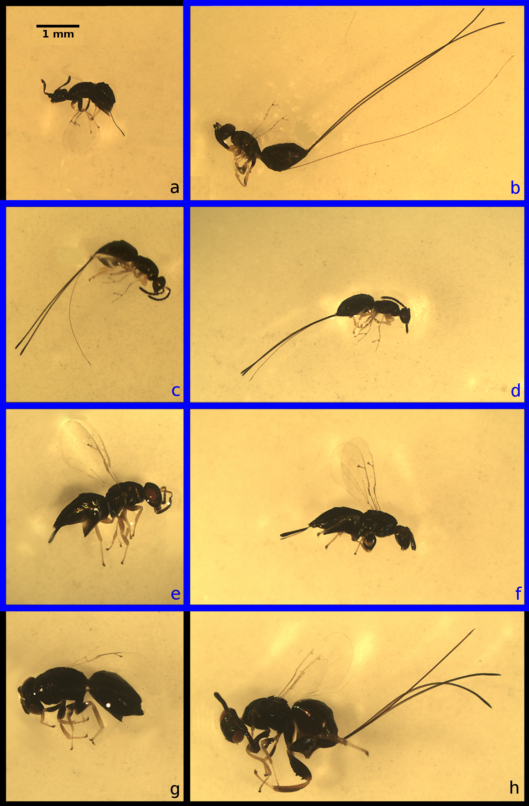

Ordination is a useful tool for visualising [multivariate data](https://en.wikipedia.org/wiki/Multivariate_analysis). This post focuses on explaining and demonstrating [principal component analysis](https://en.wikipedia.org/wiki/Principal_component_analysis) in the R programming language. Examples will use [morphological data](https://github.com/StirlingCodingClub/ordination/master/wing_loadings.csv) from [six species](http://bradduthie.github.io/DuthieEtAl2015_Appendix.pdf#page=3) of fig wasps in a community associated with the Sonoran Desert Rock Fig (*Ficus petiolaris*). These notes are also available as [PDF](https://stirlingcodingclub.github.io/ordination/index.pdf) and [DOCX](https://stirlingcodingclub.github.io/ordination/index.docx) documents.

Contents
================================================================================

- [Introduction: What is ordination?](#intro)
- [Principal Component Analysis: key concepts](#pca) 
- [Fig wasp morphological data](#wasps)
- [Principal Component Analysis in R](#Rcode)
- [Principal Component Analysis: matrix algebra](#maths) 
- [Conclusions](#conclusions)
- [Literature Cited](#refs)


<a name="intro">Introduction: What is ordination?</a>
================================================================================

Ordination is a method for investigating and visualising multivariate data. It allows us to look at and understand variation in a data set when there are too many dimensions to see everything at once. Imagine a data set with four different variables. I have [simulated one](https://StirlingCodingClub.github.io/simulating_data/index.html) below.

```{r, echo = FALSE}
get_dist <- function(dat, col1 = 1, col2 = 2){
  dist <- rep(x = NA, times = dim(dat)[1]);
  for(i in 1:dim(dat)[1]){
    dist[i] <- sqrt()
  }
}
library(knitr);
eg_dat     <- runif(n = 48, min = -4, max = 8);
eg_mat     <- matrix(data = eg_dat, ncol = 4);
eg_mat[,2] <- eg_mat[,1] + runif(n = 12, min = -2, max = 2);
rownames(eg_mat) <- c("Sample_1", "Sample_2",  "Sample_3",  "Sample_4",
                      "Sample_5", "Sample_6",  "Sample_7",  "Sample_8",
                      "Sample_9", "Sample_10", "Sample_11", "Sample_12");
colnames(eg_mat) <- c("Variable_1", "Variable_2", "Variable_3", "Variable_4");
kable(eg_mat);
```

We could look at the distribution of each variable in columns 1-4 individually using a histogram. Or we could use a scatterplot to look at two variables at the same time, with one variable plotted in one dimension (horizontal x-axis) and a second variable plotted [orthogonally](https://en.wikipedia.org/wiki/Orthogonality) (i.e., at a right angle) in another dimension (y-axis). I have done this below with a histogram for `Variable_1`, and with a scatterplot of `Variable_1` versus `Variable_2`. The numbers in the scatterplot points correspond to the sample number (i.e., rows 1-12).

```{r, fig.width = 10, fig.height = 5, echo = FALSE}
par(mfrow = c(1, 2), mar = c(5, 5, 1, 0.5), lwd = 2)
hist(x = eg_mat[,1], cex.lab = 1.25, cex.axis = 1.25, col = "blue", 
     xlab = "Variable 1", main = "");
par(mar = c(5, 5, 1, 1));
plot(x = eg_mat[,1], y = eg_mat[,2], ylim = c(-8, 10), xlim = c(-8, 10), 
     asp = 1, cex.lab = 1.25, cex.axis = 1.25, pch = 20, cex = 4, 
     xlab = "Variable 1", ylab = "Variable 2");
text(x = eg_mat[,1], y = eg_mat[,2], labels = 1:12, col = "white", 
       cex = 0.8);
```

Since we do not have four dimensions of space for plotting, we cannot put all four variables on a scatterplot that we can visualise with an axis for each variable. Hence, in the scatterplot to the right above, we are ignoring `Variable_3` and `Variable_4`. 

```{r, echo = FALSE}
eg_dis  <- dist(x = eg_mat[,1:2]);
dis_val <- eg_dis[1:11];
lowd    <- which(dis_val == min(dis_val)) + 1;
highd   <- which(dis_val == max(dis_val)) + 1;
lowd_n  <- rownames(eg_mat)[lowd];
highd_n <- rownames(eg_mat)[highd];
```

For variables 1 and 2, we can see that Sample_1 is similar to `r lowd_n` because the points are close together, and that Sample_1 is different from `r highd_n` because the points are relatively far apart. But it might be useful to see the distance between Sample_1, `r lowd_n`, and `r highd_n` while simultaneously taking into account Variables 3 and 4. More generally, it would be useful to see how distant different points are from one another given all of the dimensions in the data set. Ordination methods are a tools that try to do this, allowing us to visualise high-dimensional variation in data in a reduced number of dimensions (usually two).

It is important to emphasise that ordination is a tool for exploring data and reducing dimensionality; it is not a method of hypothesis testing (i.e., not a type of [linear model](https://stirlingcodingclub.github.io/linear_modelling/index.html)). Variables in ordinations are interpreted as response variables (i.e., $y$ variables in models where $y_{i} = \beta_{0} + \beta_{1}x_{i} + \epsilon_{i}$). Ordinations visualise the total variation in these variables, but do not test relationships between dependent ($x$) and independent ($y$) variables. 

These notes will focus entirely on Principal Component Analysis (PCA), which is just one of many ordination methods (perhaps the most commonly used). After reading these notes, you should have a clear [conceptual understanding](#pca) of how a PCA is constructed, and how to read one when you see one in the literature. You should also be able to [build your own PCA](#Rcode) in R using the code below. For most biologists and environmental sciences, this should be enough knowledge to allow you use PCA effectively in your own research. I have therefore kept the maths to a minimum when explaining the key ideas, putting all of the [matrix algebra](#maths) underlying PCA into a single section toward the end.  


<a name="pca">Principal Component Analysis: key concepts</a>
================================================================================

Imagine a scatterplot of data, with each variable getting its own axis representing some kind of measurement. If there are only two variables, as with the scatterplot above, then we would only need an x-axis and a y-axis to show the *exact* position of each data point in data space. If we add a third variable, then we would need a z-axis, which would be orthogonal to the x-axis and y-axis (i.e., three dimensions of data space). If we need to add a fourth variable, then we would need yet another axis along which our data points could vary, making the whole data space extremely difficult to visualise. As we add yet more variables and more axes, the position that our data points occupy in data space becomes impossible to visualise.

Principal Component Analysis (PCA) can be interpreted as a rotation of data in this multi-dimensional space. The distance between data points does not change at all; the data are just moved around so that the total variation in the data set is easier to see. If this verbal explanation is confusing, that is okay; a visual example should make the idea easier to understand. To make everything easy to see, I will start with only two dimensions using Variable_1 and Variable_2 from earlier (for now, just ignore the existence of Variables 3 and 4). Notice from the scatterplot that there is variation in both dimensions of the data; the variance of Variable_1 is `r round(var(eg_mat[,1]), digits = 2)`, and the variance of Variable_2 is `r round(var(eg_mat[,2]), digits = 2)`. But these variables are also clearly correlated. A sample for which Variable_1 is measured to be high is also very likely measure a high value of Variable_2 (perhaps these are measurements of animal length and width). 

What if we wanted to show as much of the total variation as possible just on the x-axis? In other words, rotate the data so that the maximimum amount of variance in the full data set (i.e., in the scatterplot) falls along the x-axis, with any variation remaining being left to fall along the y-axis? To do this, we need to draw a line that cuts through our two dimensions of space in the direction where the data are most stretched out (i.e., have the highest variance); **this direction is our first Principal component, PC1**. I have drawn it below in red (left panel).

```{r, fig.width = 10, fig.height = 5, echo = FALSE}
# Plotting the actual data
par(mfrow = c(1, 2), mar = c(5, 5, 1, 0.5), lwd = 2)
plot(x = eg_mat[,1], y = eg_mat[,2], ylim = c(-9, 11), xlim = c(-9, 11), 
     asp = 1, cex.lab = 1.25, cex.axis = 1.25, pch = 20, cex = 4, 
     xlab = "Variable 1", ylab = "Variable 2");
text(x = eg_mat[,1], y = eg_mat[,2], labels = 1:12, col = "white", 
       cex = 0.8);
mod <- lm(eg_mat[,2] ~ eg_mat[,1]);
b0  <- as.numeric(mod$coefficients[1]);
b1  <- as.numeric(mod$coefficients[2]);
abline(a = b0, b = b1, lwd = 2, col = "red");
points(x = eg_mat[,1], y = eg_mat[,2], pch = 20, cex = 4);
text(x = eg_mat[,1], y = eg_mat[,2], labels = 1:12, col = "white", 
       cex = 0.8);
# Principal component analysis
pc_eg <- prcomp(x = eg_mat[,1:2]);
par(mar = c(5, 5, 1, 1));
plot(x = pc_eg$x[,1], y = pc_eg$x[,2], ylim = c(-4, 4), xlim = c(-10, 10), 
     asp = 1, cex.lab = 1.25, cex.axis = 1.25, pch = 20, cex = 4, 
     xlab = "Principal Component 1", ylab = "Principal Component 2");
text(x = pc_eg$x[,1], y = pc_eg$x[,2], labels = 1:12, col = "white", 
       cex = 0.8);
abline(h = 0, lwd = 2, col = "red");
points(x = pc_eg$x[,1], y = pc_eg$x[,2], cex = 4, pch = 20);
text(x = pc_eg$x[,1], y = pc_eg$x[,2], labels = 1:12, col = "white", 
       cex = 0.8);
```

To build our PCA, all that we need to do is take this red line and drag it to the x-axis so that it overlaps with $y = 0$ (right panel). As we move Principal Component 1 (PC1) to the x-axis, we bring all of the data points with it, preserving their distances from PC1 and each other. Notice in the panel to the right above that the data have the same shape as they do in the panel to the left. The distances between points have not changed at all; everything has just been moved. Sample_1 and `r lowd_n` are just as close to each other as they were in the original scatterplot, and Sample_1 and `r highd_n` are just as far away. 

Principal Component 1 shows that maximum amount of variation that is possible to show in one dimension while preserving these distances between points. What little variation that remains is in PC2. Since we have maximised the amount of variation on PC1, there can be no additional covariation left between the x-axis and the y-axis. If any existed, then we would need to move the line again because it would mean that more variation could be still placed along the x-axis (i.e., more variation could be squeezed out of the covariation between variables). Hence, PC1 and PC2 are, by definition, uncorrelated. Note that this does not mean that Variable 1 and Variable 2 are not correlated (they obviously are!), but PC1 and PC2 are not. This is possible because PC1 and PC2 represent a mixture of Variables 1 and 2. They no longer represent a specific variable, but a linear combination of multiple variables.

This toy example with two variables can be extended to any number of variables and principal components. PCA finds the axis along which variation is maximised in any number of dimensions and makes that line PC1. In our example with two variables, this completed the PCA because we were only left with one other dimension, so all of the remaining variation had to go in PC2. But when there are more variables and dimensions, the data are rotated again around PC1 so that the maximum amount of variation is shown in PC2 after PC1 is fixed. For three variables, imagine a cloud of data points; first put a line through the most elonated part of the cloud and reorient the whole thing so that this most elongated part is the width of the cloud (x-axis), then spin it again along this axis so that the next widest part is the height of the cloud (y-axis). The same idea applies for data in even higher dimensional space; the data are rotated orthogonally around each additional Principal Component so that the amount of variation explained with each gets progressively smaller (in practice, however, all of this rotating is done simultaneously by the [matrix algebra](#maths)). 

There are a few additional points to make before moving on to some real data. First, PCA is not useful if the data are entirely uncorrelated. To see why, take a look at the plot of two hypothetical (albeit ridiculous) variables in the lower left panel. The correlation between the two variables is zero, and there is no way to rotate the data to increase the amount of variation shown on the x-axis. The PCA on the lower right is basically the same figure, just moved so that the centre is on the origin.


```{r, fig.width = 10, fig.height = 5, echo = FALSE}
A_comp <- NULL;
A_dat  <- rnorm(n = 400*400, mean = 0, sd = 0.4);
A_mat  <- matrix(data = A_dat, nrow = 400);
A0_e   <- eigen(A_mat)$values;
A0_r   <- Re(A0_e) + 8;
A0_i   <- Im(A0_e) + 8;
A0_meg <- cbind(A0_r, A0_i);
par(mfrow = c(1, 2), mar = c(5, 5, 1, 0.5), lwd = 2);
plot(x = A0_meg[,1], y = A0_meg[,2], ylim = c(-2, 18), xlim = c(-2, 18), 
     asp = 1, cex.lab = 1.25, cex.axis = 1.25, pch = 20, cex = 1, 
     xlab = "Variable 1", ylab = "Variable 2");
A0_pc <- prcomp(x = A0_meg[,1:2]);
par(mar = c(5, 5, 1, 1));
plot(x = A0_pc$x[,1], y = A0_pc$x[,2], ylim = c(-10, 10), xlim = c(-10, 10), 
     asp = 1, cex.lab = 1.25, cex.axis = 1.25, pch = 20, cex = 1, 
     xlab = "Principal Component 1", ylab = "Principal Component 2");
```


Second, if two variables are completely correlated, the maths underlying PCA does not work because a [singluar matrix](https://mathworld.wolfram.com/SingularMatrix.html) is created (this is the matrix algebra equivalent of dividing by zero). Here is what it looks like visually if two variables are completely correlated.

```{r, fig.width = 10, fig.height = 5, echo = FALSE}
ecrr1  <-  runif(n = 48, min = 2, max = 16);
ecrr2  <-  ecrr1 + 0.4;
ecorr  <- cbind(ecrr1, ecrr2);
par(mfrow = c(1, 2), mar = c(5, 5, 1, 0.5), lwd = 2);
plot(x = ecorr[,1], y = ecorr[,2], ylim = c(-2, 22), xlim = c(-2, 22), 
     asp = 1, cex.lab = 1.25, cex.axis = 1.25, pch = 20, cex = 1, 
     xlab = "Variable 1", ylab = "Variable 2");
ecorr <- prcomp(x = ecorr[,1:2]);
par(mar = c(5, 5, 1, 1));
plot(x = ecorr$x[,1], y = ecorr$x[,2], ylim = c(-12, 12), xlim = c(-12, 12), 
     asp = 1, cex.lab = 1.25, cex.axis = 1.25, pch = 20, cex = 1, 
     xlab = "Principal Component 1", ylab = "Principal Component 2");
```

The panel on the left shows two perfectly correlated variables. The panel on the right shows what the PCA would look like. Note that there is no variation on PC2. One hundred percent of the variation can be described using PC1, meaning that if we know the value of Variable_1, then we can certain about the value of Variable_2.

I will now move on to introduce a morphological data set collected in 2010 from a fig wasp community surrounding the Sonoran Desert rock fig (*Ficus petiolaris*). These data were originally published in @Duthie2015b, and they are publicly available [on GitHub](https://github.com/StirlingCodingClub/ordination/tree/master/data).


<a name="wasps">Fig wasp morphological data</a>
================================================================================

The association between fig trees and their pollinating and seed-eating wasps is a classic example of mutualism. The life-histories of figs and pollinating fig wasps are well-known and fascinating  [@Janzen1979; @Weiblen2002], but less widely known are the species rich communities of non-pollinating exploiter species of fig wasps [@Borges2015]. These non-pollinating fig wasps make use of resources within figs in a variety of ways; some lay eggs into developing fig ovules without pollinating, while others are parasitoids of other wasps. All of these wasps develop alongside the pollinators and seeds within the enclosed inflorescence of figs, and emerge as adults typically after several weeks. Part of my doctoral work focused on the community of fig wasps that lay eggs in the figs of *F. petiolaris* in Baja, Mexico [@Duthie2015b; @Duthie2016].


The community of non-pollinators associated with *F. petiolaris* includes five species of the genera *Idarnes* (3) and *Heterandrium* (2). Unlike pollinators, which climb into a small hole of the enclosed infloresence and pollinate and lay eggs from inside, these non-pollinators drill their ovipositors directly into the wall of the fig. The left panel below shows a fig sliced in half (which often results in hundreds of fig wasps emerging from the inside). The right panel shows a fig on a branch.


The whole fig wasp community is shown below. The pollinator is in panel 'a', while, panels 'b-h' show the non-pollinators (panels 'g' and 'h' show a host-parasitoid pair).


{width=50%}

As part of a test for evidence of a dispersal-fecundity tradeoff in the fig wasps in panels 'b-f', I estimated the mean wing loading of each species using body volume (body volume divided by wing surface area). This included 11 morphological measurements in total.

```{r}
fig_wasps    <- read.csv("../data/wing_loadings.csv", header = TRUE);
fig_cols     <- colnames(fig_wasps);
print(fig_cols);
```

Below, I will run a PCA in R to look at the total variation in non-pollinating fig wasp morphology. To keep things simple, I will focus just on the two species of *Heterandrium* (panels 'e, f' in the image above). 

<a name="Rcode">Principal Component Analysis in R</a>
================================================================================

First, I will trim down the data set in `fig_wasps` that I read in above to remove all species that are not in the genus *Heterandrium*. There are two species of *Heterandrium* that I will put into a single data set.

```{r}
het1 <- fig_wasps[fig_wasps[,1] == "Het1",] # Species in panel 'f' above
het2 <- fig_wasps[fig_wasps[,1] == "Het2",] # Species in panel 'e' above
het  <- rbind(het1, het2);
```

This leaves us with a data frame with `r dim(het)[1]` rows and `r dim(het)[2]` columns. In total, there are `r sum(het[,1] == "Het1")` measurements from samples of 'Het1' and `r sum(het[,1] == "Het2")` measurements from samples of 'Het2'.

Because PCA requires matrix manipulations, we need the R object holding the data to be a matrix. To do this, we can get rid of the first four columns of data. These columns include the species names, and the site, tree, and fruit from which the fig wasp was collected.

```{r}
dat <- het[,-(1:4)]; # Remove columns 1 through 4
```

We now need to define `dat` as a matrix.

```{r}
dat <- as.matrix(dat);
```

```{r, echo = FALSE}
rownames(dat) <- NULL;
```

This leaves us with the final version of the data set that we will use. It includes `r dim(dat)[2]` columns of morphological measurements.

```{r}
head(dat);
```

These `r dim(dat)[2]` columns are our variables 1-`r dim(dat)[2]`. Our fly measurements thereby occupy some position in `r dim(dat)[2]`-dimensional space on `r dim(dat)[2]` orthogonal axes, which is way too complex to visualise all at once. We can first take a look at all of the possible scatterplots using `pairs`.

```{r}
pairs(x = dat, gap = 0, cex.labels = 0.5);
```

There is not much that we can infer from this, except that most of the variables appear to be highly correlated. A PCA is therefore likely to be useful. Before building the PCA, it is probably a good idea to scale all of our variables. This would be especially important if we had variables measured in different units. If we do not scale the variables to have the same mean and standard deviation, then the PCA could potentially be affected by the units in which variables were measured, which does not make sense. If, for example, we had measured thorax length and width in $mm^2$, but abdomen length and width in $cm^{2}$, then we would get thorax measurements contributing more to PC1 just because the measured values would be larger (if you do not believe me, try multiplying all values in one column of the data by 10 or 100, then re-run the PCA below). For data sets that include measurements with much different unit scales (e.g., pH versus elevation in metres above sea level), this is especially problematic. I will therefore scale the data below.

```{r}
dat <- scale(dat);
```

Now every variable has a mean of zero and a standard deviation of one. We are finally ready to build our PCA, using only one line of code.

```{r}
pca_dat <- prcomp(dat);
```

That is it. Here is what the output looks like when printed out. Do not worry about the details. I will come back to explain it later.

```{r, echo = FALSE}
print(pca_dat);
```


If we want to plot the first two principle components, we can do so with the following code. Note that `pca_dat$x` is a matrix of the same size as our original data set, but with values that plot the data on the PC axes.

```{r}
par(mar = c(5, 5, 1, 1));
plot(x = pca_dat$x[,1], y = pca_dat$x[,2], asp = 1, cex.lab = 1.25, 
     cex.axis = 1.25, xlab = "PC1", ylab = "PC2");
```

Ignore the arguments that start with `cex`; these are just plotting preferences. But the argument `asp = 1` is important; it ensures that one unit along the x-axis is the same distance as one unit along the y-axis. If this were not set, then the distance between any two points might be misleading. If, for example, moving 100 pixels on the x-axis corresponded to one unit on PC1, but moving 100 pixels on the y-axis corresponded to two units in PC2, then the variation in PC1 would look larger relative to PC2 than it should.

Note that we are not at all restricted to comparing PC1 and PC2. We can look at any of the `r dim(pca_dat$x)[2]` PCs that we want. Below compares PC1 with PC3.

```{r}
par(mar = c(5, 5, 1, 1));
plot(x = pca_dat$x[,1], y = pca_dat$x[,3], asp = 1, cex.lab = 1.25, 
     cex.axis = 1.25, xlab = "PC1", ylab = "PC3");
```

Note that the points are in the same locations on the x-axis (PC1) as before, but not the y-axis (now PC3). We have just rotated 90 degrees in our `r dim(pca_dat$x)[2]`-dimensional space and are therefore looking at our cloud of data from a different angle.

Recall that we had two groups in these data; two species of the genus *Heterandrium*. Now that we have plotted the position of all wasp measurements, we can also fill in the PCA with colours representing each species. This allows us to visualise how individuals in different groups are separated in our data.

```{r}
par(mar = c(5, 5, 1, 1));
plot(x = pca_dat$x[,1], y = pca_dat$x[,2], asp = 1, cex.lab = 1.25, 
     cex.axis = 1.25, xlab = "PC1", ylab = "PC2");
h1_rw <- which(het[,1] == "Het1"); # Recall the original data set
h2_rw <- which(het[,1] == "Het2"); # Recall the original data set
points(x = pca_dat$x[h1_rw,1], y = pca_dat$x[h1_rw,2], pch = 20, col = "red");
points(x = pca_dat$x[h2_rw,1], y = pca_dat$x[h2_rw,2], pch = 20, col = "blue");
legend("topleft", fill = c("red", "blue"), cex = 1.5, 
       legend = c( expression(paste(italic("Heterandrium "), 1)), 
                   expression(paste(italic("Heterandrium "), 2))));
```

From the groups overlaid onto the PCA, it is clear that these two species of *Heterandrium* differ in their morphological measurements. Often groups are not so clearly distinguished (i.e., data are usually more messy), and it is important to again remember that the PCA is not actually testing any statistical hypothesis. It is just plotting the data. If we wanted to test whether or not the difference between species measurements was statistically significant, then we would need to use some sort of appropriate multivariate test, such as a [MANOVA](https://en.wikipedia.org/wiki/Multivariate_analysis_of_variance) (that is, a [linear model](https://stirlingcodingclub.github.io/linear_modelling/) with multiple continuous dependent variables and a single categorical independent variable), or an appropriate [randomisation approach](https://stirlingcodingclub.github.io/randomisation/randomisation_notes.html). 

We can look at the amount of variation explained by each PC by examining `pca_dat$sdev`, which reports the standard deviations of the principal components.

```{r}
pca_variance      <- (pca_dat$sdev) * (pca_dat$sdev); # Get variance
print(pca_variance);
```


To make it more easy to interpret the variances along each PC, we can use a [screeplot](https://en.wikipedia.org/wiki/Scree_plot). There is a function for this in base R, which takes the direct output of the `prcomp` function.

```{r}
screeplot(pca_dat, npcs = 11, main = "", type = "lines", cex.lab = 1.5);
```

The screeplot above provides a useful indication of how much variation explained decreases per PC (or how much variation is explained by the first $n$ axes). To make things even easier to visualise, it might help to present the above in terms of per cent of the variance explained on each axis.

```{r}
pca_pr_explained  <- pca_variance / sum(pca_variance);
print(pca_pr_explained);
```

Note that all of the values above sum to `r sum(pca_pr_explained)`. It appears that about `r round(100 * sum(pca_pr_explained[1:2]), digits = 2)` per cent of the total variation is explained by PC1 and PC2, so we are looking at a lot of variation in the PCA showed above. We can plot the proportion of the variation explained by each PC in a bar plot.

```{r}
pc_names <- paste("PC", 1:length(pca_pr_explained), sep = "");
barplot(height = pca_pr_explained * 100, names = pc_names, cex.names = 0.8,
        ylab = "Per cent of total variation explained", cex.lab = 1.25);
```


Notice that the general pattern of the barplot above is the same as the screeplot.

We can also look at a biplot (i.e., a loading plot). The biplot below shows the first two principal components (data points are now numbers 1 to `r dim(pca_dat$x)[1]`, indicating the sample or row number of the fig wasp from the original scaled data set, `dat`), but also the direction of each of our original variables (morphological measurements) in relation to these principal components. 

```{r, fig.width = 8, fig.height = 8}
biplot(pca_dat, cex = 0.8, asp = 1);
```

The direction of the red arrows shows the relationships among the `r dim(pca_dat$x)[2]` different variables. Intuitively, variables with arrows pointing in similar directions are positively correlated, while those pointing in opposite directions are negatively correlated (more technically, the cosine of the angle between arrows, in radians, actually equals the correlation between them; e.g., cos(0) = `r cos(0)` and cos($\pi$) = `r cos(pi)`; recall that $\pi$ radians equals 180 degrees). In the above example, wasp head width and thorax width are highly correlated because the two arrows are pointing in very similar directions. In contrast, ovipositor length and ovipositor width appear to be pointing in very different directions on PC1 and PC2, suggesting that the two variables are negatively correlated.

The direction of these arrows is determined by the loading of each variable on PC1 and PC2. The loading is the value that you would need to multiply each variable by to get the score of a data point on the principal component. The loadings can be found in the `pca_dat` results as `pca_dat$rotation`. I will just show the loadings for the first two principle components below.

```{r}
print(pca_dat$rotation[,1:2]); # Note: 11 total columns; one for each PC
```

We can see how the loadings of each variable match up with each arrows by going back to the output of `pca_dat`. To get the direction of the arrows, we need to multiply the loadings in `pca_dat$rotation` above by the standard deviation of each principle component in `pca_dat$sdev`. I do this below to show how we can manually reproduce the position of the red arrows from the `pca_dat` output.

```{r, fig.width = 8, fig.height = 8}
biplot(pca_dat, cex = 0.8, asp = 1);
# Note that the arrows are scaled by a factor of ca 4.5, hence the scaling below
points(x = 4.5 * pca_dat$sdev[1] * pca_dat$rotation[,1],
       y = 4.5 * pca_dat$sdev[2] * pca_dat$rotation[,2],
       col = "blue", pch = 20, cex = 1.5);
```

I hope that this clarifies how to produce and interpret a PCA, a screeplot, and a biplot in R. I also hope that the output that I showed earlier generated generated from `prcomp(dat)` is now clear. For one last illustration to further connect this output with the PCA, I will reproduce a PCA just from the original data points in `dat` and the loadings for PC1 and PC2 found in the output of `prcomp(dat)`, `pca_dat`. For each fly, we take the sum of each measurement times its corresponding loading on PC1 and PC2. Hence, the position of the first wasp in `dat` (first row) on PC1 would be found by multipling `dat[1,]` times `pca_dat$rotation[,1]`. Here is a reminder of what `dat[1,]` looks like.

```{r, echo = FALSE}
print(dat[1,]);
```

Here are the loadings for PC1 (`pca_dat$rotation[,1]`).

```{r, echo = FALSE}
print(pca_dat$rotation[,1]);
```


We calculate the sum of each element multiplied together:  (`r dat[1,1]` $\times$ `r pca_dat$rotation[1,1]`) + (`r dat[1,2]` $\times$ `r pca_dat$rotation[2,1]`) + $...$ + (`r dat[1,11]` $\times$ `r pca_dat$rotation[11,1]`). This gives a value of `r sum(dat[1,] * pca_dat$rotation[,1])`, which is the location of the first data point on PC1. When we do this calculation for PC1 and PC2 for all of the data, we can get the coordinates to plot on our PCA. I do this with the code below. Note that the `for` [loop](https://stirlingcodingclub.github.io/using_loops/loop_notes.html) is just cycling through each individual wasp sample (do not worry about this if the code is unfamiliar). 


```{r, fig.width = 8, fig.height = 8}
plot(x = 0, y = 0, type = "n", xlim = c(-6.2, 4.2), ylim = c(-4, 3), asp = 1,
     xlab = "PC1", ylab = "PC2", cex.axis = 1.25, cex.lab = 1.25);
for(i in 1:dim(dat)[1]){ # Take the sum of the measurements times PC loadings
  pt_PC1 <- sum(dat[i,] * pca_dat$rotation[,1]); # measurements times loadings 1
  pt_PC2 <- sum(dat[i,] * pca_dat$rotation[,2]); # measurements times loadings 2
  points(x = pt_PC1, y = pt_PC2, cex = 4, col = "black", pch = 20);
  text(x = pt_PC1, y = pt_PC2, col = "white", labels = i, cex = 0.8);
}
```


Those who are satisfied with their conceptual understanding of PCA, and the ability to use PCA in R, can stop here. In the next section, I will explain how PCA works mathematically.


<a name="maths">Principal Component Analysis: matrix algebra</a>
================================================================================

A Principal Component Analysis is basically just an [eigenanalysis](https://en.wikipedia.org/wiki/Eigenvalues_and_eigenvectors) of a [covariance matrix](https://en.wikipedia.org/wiki/Covariance_matrix). I will present the maths underlying this and show the calculations in some detail, but a full explanation of matrix algebra, and [eigenvalues and eigenvectors](https://en.wikipedia.org/wiki/Eigenvalues_and_eigenvectors) is beyond the scope of these notes. Following my approach in the [key concepts](#pca) section above, I am going to try to present the key calculations and some of the key mathematical ideas using two dimensions to make everything easier to calculate and visualise. First, a reminder of what our simulated data look like from the first section.

```{r, echo = FALSE}
print(eg_mat);
```

Again, I am just going to use the first two columns of data, so I will create a truncated data set `eg_m` using just two of the columns from above.

```{r}
eg_m <- eg_mat[,1:2]; # Now we have an R object with just two columns
```

We can start by just running a PCA as we did in the [section above](#Rcode) with `pr_comp`.

```{r}
prcomp(eg_m);
```

Here is our starting point, with standard deviations and loadings for each PC that we know are correct. Now we can attempt to do this whole analysis manually, without the `prcomp` function. To start, we need to get the covariance matrix of the data. A covariance matrix is just a square matrix in which off-diagonal elements hold the covariance between variable $X_{i}$ and $X_{j}$ in row $i$ and column $j$. Diagonal elements (upper left to lower right) hold the variance of variable $X_{i}$ (i.e., the covariance between $X_{i}$ and itself, where $i$ is both the row and column),

$$
V = \begin{bmatrix}
  Var(X_{1}), & Cov(X_{1}, X_{2}) \\
  Cov(X_{2}, X_{1}), & Var(X_{2}) \\
\end{bmatrix}.
$$

[Covariance](https://en.wikipedia.org/wiki/Covariance) and [variance](https://en.wikipedia.org/wiki/Variance) are calculated as usual. In R, we can easily get the covariance matrix using the `cov` function.

```{r}
V <- cov(eg_m); # Variance covariance matrix of two simulated measurements
print(V);
```

Note that the matrix is [symmetric](https://en.wikipedia.org/wiki/Symmetric_matrix), meaning that the $\textbf{V}$ equals its own transpose (i.e., we can swap the elements in row $i$ column $j$ for the elements in row $j$ column $i$ and get the same matrix). What we need now are the eigenvalues and eigenvectors of $\textbf{V}$. R will calculate these with the function `eigen`, which I will do below.

```{r}
eigen(V); # Eigenvalues and eigenvectors of V
```

Notice that the eigenvectors are identical to the loadings from our `prcomp(eg_m)` above. This is because our principle components are just the eigenvectors of the covariance matrix. Similarly, the eigenvalues printed above are just the variances of each principal component, equal to the standard deviations output from `prcomp(eg_m)` squared. If we take the square root of them, we get the standard devations back.

What are eigenvectors and eigenvalues, really? I will try to explain without being too formal with the mathematics. First, a very quick review of vectors. We can imagine a vector $\textbf{x}$ as an arrow pointing to some point in multidimensional space, and represented by a list of numbers that indicate how far from the origin it points in each dimension. For a really simple example, we can take the vector $\textbf{x} = (2, 1)$, and visualise it on a plane.

```{r}
u <- c(2, 1);
plot(x = 0, y = 0, type = "n", xlim = c(-1, 3), ylim = c(-1, 3), xlab = "",
     ylab = "");
arrows(x0 = 0, y0 = 0, x1 = u[1], y1 = u[2], length = 0.1, lwd = 3);
abline(h = 0, lty = "dotted", lwd = 0.8);
abline(v = 0, lty = "dotted", lwd = 0.8);
```

An *eigenvector* ($u$) is a vector that can be multiplied by its corresponding *eigenvalue* ($\lambda$) to give the same vector as you would get by multiplying a matrix $\textbf{V}$ by the same eigenvector,

$$\textbf{Vu} = \lambda \textbf{u}.$$

It is important to remember that matrix multiplication is different from scalar multiplication. When we multiply two matrices, we do not just multiply the element in row $i$ and column $j$ in one matrix by row $i$ and column $j$ in the other matrix. Matrix multiplication is a series of multiplying row elements of one matrix by the column elements of another, and summing these products between elements. It will be easier to illustrate with an example. Take our covariance matrix $\textbf{V}$ and the example vector $\textbf{x}$. By multiplying row 1 by the column vector $\textbf{x}$, then row 2 by the column vector $\textbf{x}$, we get the following vector,

```{r, echo = FALSE}
x  <- matrix(data = c(2, 1), ncol = 1); 
Vx <- V %*% x;
```

$$
\begin{bmatrix}
  `r round(V[1, 1], digits = 2)`, & `r round(V[1, 2], digits = 2)` \\
  `r round(V[2, 1], digits = 2)`, & `r round(V[2, 2], digits = 2)`
\end{bmatrix}
\begin{bmatrix}
  2 \\
  1
\end{bmatrix} = 
\begin{bmatrix}
  `r round(Vx[1], digits = 2)` \\
  `r round(Vx[2], digits = 2)`
\end{bmatrix}
$$

We can confirm this the long way by getting the first element of the product, $(`r round(V[1, 1], digits = 2)` \times 2) + (`r round(V[2, 1], digits = 2)` \times 1) =$ `r round(V[1, 1], digits = 2) * 2 + round(V[2, 1], digits = 2) * 1`. Likewise, we get the second element,  $(`r round(V[2, 1], digits = 2)` \times 2) + (`r round(V[2, 2], digits = 2)` \times 1) =$ `r round(V[2, 1], digits = 2) * 2 + round(V[2, 2], digits = 2) * 1`. Now, note that if we take our covariance matrix $\textbf{V}$ and multiply it by one of our eigenvectors calculated with `eigen` above ($\textbf{Vu}$), we get the same answer as if we mutliplied our single eigenvalue by the eigenvector,


$$
\begin{bmatrix}
  `r round(V[1, 1], digits = 2)`, & `r round(V[1, 2], digits = 2)` \\
  `r round(V[2, 1], digits = 2)`, & `r round(V[2, 2], digits = 2)`
\end{bmatrix} 
\begin{bmatrix}
  `r round(eigen(V)$vectors[1, 1], digits = 2)` \\
  `r round(eigen(V)$vectors[2, 1], digits = 2)`
\end{bmatrix} = `r round(eigen(V)$values[1], digits = 2)`
\begin{bmatrix}
  `r round(eigen(V)$vectors[1, 1], digits = 2)` \\
  `r round(eigen(V)$vectors[2, 1], digits = 2)`
\end{bmatrix}
$$

Try confirming for yourself that the two sides of this equation are in fact equal (note that for the right side, you just multiply the scalar `r round(eigen(V)$values[1], digits = 2)` to each element as normal, so the first element in the product vector would be (`r round(eigen(V)$values[1], digits = 2)` $\times$ `r round(eigen(V)$vectors[1, 1], digits = 2)`) = `r round(eigen(V)$values[1], digits = 2) * round(eigen(V)$vectors[1, 1], digits = 2)`. Mathematically, multiplying the covariance matrix by one of its eigenvectors changes the size of that vector (but, critically, *not* its direction) by the same amount as multiplying it by its corresponding eigenvalue. The eigenvector associated with the leading eigenvalue (i.e., the largest eigenvalue) is therefore the direction along which most of the total variation lies in multidimensional space (PC1), and the eigenvalue itself is the variance in this direction.

I will not go through the algebra of solving for the eigenvalues and eigenvectors here (but I could probably be convinced to do given sufficient demand). But I will point out one more equation that might help clarify the mathematics a bit further. Note that we can recreate the the covariance matrix ($\textbf{V}$) just using the eigenvalues and eigenvectors,

$$\textbf{V} = \textbf{U}\Lambda\textbf{U}^{-1}.$$

In the above, $\textbf{V}$ is our covariance matrix, $\textbf{U}$ is a matrix of our eigenvectors, and $\Lambda$ is a [diagonal matrix](https://en.wikipedia.org/wiki/Diagonal_matrix) of our eigenvalues (i.e., a matrix where all off-diagonal elements are zero). The negative one exponent at the end tells us to find the inverse of $\textbf{U}$; this is just the matrix that we need to multiply $\textbf{U}$ by to get back to the identity matrix (a matrix with ones in the diagonal and zeros everywhere else). We can see what this looks like using the eigenvalues that we calculated above from `eigen(V)`.

```{r}
U <- eigen(V)$vectors;
print(U);
```

We can get the inverse using `solve` in R.

```{r}
U_inv <- solve(U);
print(U_inv);
```

Matrix multiplication in R is performed using `%*%` instead of `*`, so we can see the relationship between `U` and `U_inv` below.

```{r}
U %*% U_inv; # Identity matrix, with a bit of a rounding error.
```

Mathematically, here is what that looks like.

$$
\begin{bmatrix}
  1, & 0 \\
  0, & 1
\end{bmatrix}
 =  
\begin{bmatrix}
  `r round(U[1, 1], digits = 2)`, & `r round(U[1, 2], digits = 2)` \\
  `r round(U[2, 1], digits = 2)`, & `r round(U[2, 2], digits = 2)` 
\end{bmatrix} 
\begin{bmatrix}
  `r round(U_inv[1, 1], digits = 2)`, & `r round(U_inv[1, 2], digits = 2)` \\
  `r round(U_inv[2, 1], digits = 2)`, & `r round(U_inv[2, 2], digits = 2)`
\end{bmatrix} 
$$

Hence, the inverse of a matrix is the scalar equivalent of $1 = x(1/x)$. We just have a value of one in each dimension. Putting this all together, we can get back to our original covariance matrix by inserting our eigenvalues into the right side of the equation.

```{r, echo = FALSE}
L       <- matrix(data = 0, nrow = 2, ncol = 2);
L[1, 1] <- eigen(V)$values[1];
L[2, 2] <- eigen(V)$values[2];
```

$$
\begin{bmatrix}
  `r round(V[1, 1], digits = 2)`, & `r round(V[1, 2], digits = 2)` \\
  `r round(V[2, 1], digits = 2)`, & `r round(V[2, 2], digits = 2)`  
\end{bmatrix}
\begin{bmatrix}
  `r round(U[1, 1], digits = 2)`, & `r round(U[1, 2], digits = 2)` \\
  `r round(U[2, 1], digits = 2)`, & `r round(U[2, 2], digits = 2)`  
\end{bmatrix} 
\begin{bmatrix}
  `r round(L[1, 1], digits = 2)`, & `r round(L[1, 2], digits = 2)` \\
  `r round(L[2, 1], digits = 2)`, & `r round(L[2, 2], digits = 2)`  
\end{bmatrix} 
\begin{bmatrix}
  `r round(U_inv[1, 1], digits = 2)`, & `r round(U_inv[1, 2], digits = 2)` \\
  `r round(U_inv[2, 1], digits = 2)`, & `r round(U_inv[2, 2], digits = 2)`  
\end{bmatrix}
$$

We can confirm all of this in R using our matrices `V`, `U`, and `U_inv`, and creating a new square diagonal matrix holiding the eigenvalues, `L`.

```{r}
L       <- matrix(data = 0, nrow = 2, ncol = 2);
L[1, 1] <- eigen(V)$values[1];
L[2, 2] <- eigen(V)$values[2];
# We can print these matrices below.
print(V); print(U); print(U_inv); print(L);
```

Finally, we can replicate the right hand side of the equation above to get back our original covariance matrix from the eigenvalues and eigenvectors.

```{r}
U %*% L %*% U_inv;
```

We have now shown the mathematical relationship between our covariance matrix and its associated eigenvectors and eigenvalues.


<a name="conclusions">Conclusions</a>
================================================================================

Ordination is a useful tool for visualising and thinking about the variation of multivariate data. Principal Components Analysis is one method of ordination, but there are others such as Non-metric Multidimensional Scaling (NMDS), Principal Coordinates Analysis (PCoA), and Canonical Variates Analysis (CVA). These different types of ordination are useful for different purposes and different data sets, so it is worth learning a bit about them before deciding what type of ordination is most appropriate for your own data. My hope is that this detailed breakdown of PCA will help you understand the general objectives of ordination, give you the ability to use PCA in your own research, and make it easier to learn new ordination methods.


<a name="refs">Literature cited</a>
================================================================================

